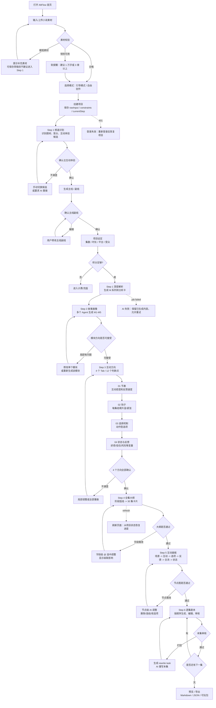

# AltFlow 式互动剧本生成流程 PRD

> 基于 `https://altflow.cn/` 内部浏览器实测与本仓库既有 AltFlow V2 逆向报告整理。
> 实测项目：`公主大作战`，项目 ID：`p_sw59p9nx`。
> 目标：把 AltFlow 的「小说/故事素材 -> 互动剧本」流程拆成可在逐梦 Creator Studio 中复建的产品方案。

## 1. 一句话说明

用户把小说、短故事或题材想法放进系统，系统先判断它适合做成哪种互动体验，再让用户一步步确认故事画像、互动方向、全集大纲、互动画板和逐集剧本，最后得到一套可以预览、审核、导出的互动影游脚本。

这里不要把它理解成「AI 一次性生成一份剧本」。它更像一个有多个检查点的创作流水线：

1. 先确认故事方向，防止后面跑偏。
2. 再确认互动规则，防止变成普通线性短剧。
3. 再生成 30 集大纲，保证每集有功能。
4. 再把每集大纲变成选择节点和状态变化。
5. 最后逐集生成可编辑剧本，并要求用户审核通过。

## 2. 这次实测覆盖

| 项目 | 结果 |
|---|---|
| 首页输入与项目创建 | 已实测。短素材和长一点的素材都能创建项目。 |
| Step 1 频道识别 | 已完整实测。包括主互动体验识别、主线副线确认、项目设定、分析卡生成。 |
| Step 2 故事画像 | 已完整实测。包括 5 个模块、多个 Agent 流式分析、进入 Step 3。 |
| Step 3 互动方向 | 已完整实测。4 个 Tab、12 个判断点都已按默认推荐确认。 |
| Step 4 全集大纲 | 已进入并观察到骨架和分集生成。后续因浏览器自动化句柄不稳定，没有完整等到 Step 5 按钮可点。 |
| Step 5 互动画板 | 来自已有完成项目 `p_nnbnuvy7` 与本仓库 V2 逆向报告。 |
| Step 6 互动剧本 | 已从旧项目实测过页面：脚本编辑器、集数 Dock、预览、导出、重写、打回、审核通过。 |

## 3. 面向新手的关键概念

| 概念 | 通俗解释 | 在产品里的作用 |
|---|---|---|
| 素材包 | 用户输入的小说、故事梗概或章节文本。 | 后面所有 AI 分析都从这里来。 |
| 主互动体验 | 观众主要在做哪类选择，例如情感抉择、命运逆转。 | 锁定后，后面的大纲和选项都围绕这个体验写。 |
| Agent | 一个专门负责某项工作的 AI 小助手。 | 比如梗概编辑、结构师、人物档案等各做一部分。 |
| 流式生成 | AI 不是等全部做完才显示，而是一边做一边把进度和内容显示出来。 | 用户能看到系统正在工作，也能判断哪里卡住。 |
| 确认/锁定 | 用户点确认后，该步骤的核心结果成为下一步输入。 | 防止后面 AI 随意改掉前面已确认的设定。 |
| 热力图 | 用 30 集格子显示每集互动密度、钩子类型、反馈变量。 | 让用户一眼看到全集互动节奏是否均衡。 |
| 合流 | A/B 选择后剧情最终回到主线。 | 保证互动剧本可控，不会无限分叉。 |
| 状态变量 | 好感、信任、误会、风险等可追踪数值。 | 后续集要承接选择后果，避免选择没有影响。 |

## 4. 产品目标

### 4.1 用户目标

1. 不懂游戏策划的小说作者，也能把一个故事做成互动影游。
2. 用户不用自己先设计复杂节点图，系统先给出默认方案。
3. 用户保留关键控制权，可以确认、局部修改、重做或打回。
4. 最终输出不是散文，而是有集数、分支、反馈、状态和审核流程的剧本资产。

### 4.2 系统目标

1. 把长文本拆成结构化项目数据。
2. 每一步都产出可保存、可回滚、可继续生成的数据。
3. AI 生成必须有进度、成本、失败恢复和人工确认。
4. 后续实现要复用当前仓库已有技术：TanStack Start、Zustand、React Flow、TipTap、AI 多 Agent、导出系统。

## 5. 用户场景、系统行为与边界情况

| 用户场景 | 用户操作 | 系统行为 | 页面反馈 | 边界情况 | 重构要点 |
|---|---|---|---|---|---|
| 新用户打开首页 | 访问首页 | 加载登录态、积分、项目列表入口 | 显示输入框、上传按钮、模式切换、开始创作 | 未登录时应跳登录或显示登录按钮 | 首页不要做营销页，首屏就是创作入口 |
| 输入一句题材 | 输入 `公主大作战` | 允许创建项目，但素材太短 | 显示字数很少，开始按钮可用 | 实测 5 字项目创建成功，但进入 Step 1 提示素材没有带进来 | 创建前应拦截极短素材，或创建后引导补充 |
| 输入短篇素材 | 粘贴 5 章、约 1230 字 | 创建项目并进入 Step 1 | 警告「建议至少补到 1 万字或 3 章以上」 | 字数不到推荐值但仍可继续 | 校验分为硬限制和软提醒 |
| 选择引导模式 | 点「引导模式」后开始创作 | 创建 `intent: guided` 项目 | 进入 `/workspace/step1?projectId=...` | 自由创作模式未深入实测 | MVP 先做引导模式，自由模式后置 |
| 创建项目 | 点「开始创作」 | `POST /api/v1/projects`，保存 rawInput、constraints、currentStep | 项目名自动取用户输入主题 | 创建成功但路由失败时要能从项目列表恢复 | 项目创建必须和素材保存原子化 |
| Step 1 识别互动体验 | 等待 AI 分析 | 识别标签、置信度、故事驱动力、候选玩法 | 显示 `情感抉择`、`命运逆转` 等候选 | 置信度低时需要让用户手选 | 候选体验要可解释，不只是标签 |
| 确认主互动体验 | 点「确认主互动体验」 | 调用 story-line extractor，生成主线和副线 | 显示主线文本和 3 条副线 | 用户可编辑主线/副线 | 保存用户编辑后的版本，不要只保存 AI 原文 |
| 确认主线副线 | 点「确认主线副线，进入项目设定」 | 解锁项目设定卡 | 显示集数、时长、平台、目标受众 | 实测摘要里出现「男 18-25」，但设置区是女性选项，需 QA | 设置值必须单一来源，避免摘要和真实值不一致 |
| 锁定项目设定 | 点「确认设定，开始解析整部小说」 | 创建 Step 1 digest job，SSE 推送进度，更新项目 | 进度文案、暂停按钮、最终分析卡 | 积分不足或任务失败要可恢复 | 后端任务要可重入，刷新后继续读取 job/project 状态 |
| 查看 Step 1 分析卡 | 浏览 10 张卡 | 展示故事类型、主角困境、情绪爽点、关键对象等 | 卡片上有「采用」「修改」「重新生成」 | 局部重做消耗积分 | 每张卡要有独立字段 ID，支持局部重生 |
| 进入 Step 2 | 点「进入 Step 2 · 故事画像」 | 保存 Step 1 完成状态，打开 Step 2 | 多 Agent 分析流式展开 | 直接访问 Step 2 会被守卫带回 Step 1 | 路由守卫按 completedSteps 判断 |
| Step 2 生成故事画像 | 等待 AI 小助手工作 | 体验设计、梗概编辑、空间制图、结构师、人物档案等 Agent 产出模块 | M1-M5 依次完成 | 单个 Agent 失败时应允许重试该模块 | 不要让一个 Agent 失败导致整步全废 |
| 确认 Step 2 模块 | 点「方向对」或「有问题」 | 记录用户对模块的认可或修改需求 | 每个模块有独立反馈按钮 | 用户不点也可进入下一步？实测可直接进入 | MVP 可要求至少一次总确认，后续做模块级必选 |
| Step 2 M5 机会点 | 切换角色 Tab | 展示每个角色的互动机会、集数、原因、压力、按钮文案 | 如艾琳、诺亚、莉娅、守卫长等 Tab | 机会点只是候选，不锁定 | 文案要明确「这里只标机会，不最终定稿」 |
| 进入 Step 3 | 点「进入互动方向调整」 | 保存 Step 2，跳转 Step 3 | 按钮先变「正在进入互动方向」再跳转 | 自动化中路由稍有延迟 | 按钮应防重复提交 |
| Step 3 生成节奏 | 默认生成 01 Tab | 生成 30 集互动密度和 3 个判断题 | 「确认 01 · 节奏」 | 用户可改每集密度 | 热力图值应写入 `step3GridMaps` |
| Step 3 生成钩子 | 确认 01 后生成 02 | 生成每集结尾关系升温/紧张 | 「确认 02 · 钩子」 | 结尾钩子要能切换类型 | 每集钩子会影响 Step 4 endingHook |
| Step 3 生成选择机制 | 确认 02 后生成 03 | 决定每集是关系动作型、态度回应型、修罗场站位等 | 「确认 03 · 选择机制」 | 选项不能写成选 A/选 B | 后续 prompt 要强制使用动作型选项 |
| Step 3 生成状态反馈 | 确认 03 后生成 04 | 决定好感、信任、风险、嫉妒等状态承接 | 「确认 04 · 状态与反馈」 | 状态过多会增加剧本复杂度 | MVP 先做好感/信任/风险，嫉妒/占有可后置 |
| Step 3 全部完成 | 确认 04 | 解锁「生成全集大纲」 | 显示 4 个方向完成、12 个判断点完成 | 全部重做消耗较多积分 | 默认建议局部改，不鼓励全重做 |
| Step 4 生成全集大纲 | 点「生成全集大纲」 | 按阶段推断弧线骨架，再生成 30 集卡片 | 先显示第 1-5、6-10 等阶段，再出现分集摘要 | 生成慢，刷新后要恢复 | 分阶段保存，不要等 30 集全完才写库 |
| Step 4 编辑分集 | 展开某集卡片，点字段调整 | 修改剧情推进、本集功能、状态变化、互动节点等字段 | 字段上出现 @ 选中调整 | 改一处可能影响后续集 | 需要级联影响预览 |
| Step 5 互动画板 | 进入 Step 5 | 把分集大纲转成节点图 | 场景节点 -> 互动节点 -> 选项 -> 反馈 -> 合流 -> 状态承接 | 节点太多会卡 | 用 React Flow，只渲染当前集或当前阶段 |
| Step 5 节点调整 | 点节点「让 AI 调整」 | 打开局部编辑弹窗，只修改当前节点 | 提供「加强代价」「提高爽点」等快捷指令 | 删除节点可能断链 | 删除前做连通性检查 |
| Step 6 逐集剧本 | 进入 Step 6，选择 Ep.01 | 按顺序生成剧本 | Dock 显示 01 可生成，02-30 被锁 | 实测 Ep02 可选但生成受锁限制 | 顺序锁按审核通过状态判断 |
| 生成单集剧本 | 点「生成 Ep.01 剧本」 | 调用 AI 生成 2-3 分钟脚本，写入脚本版本 | 显示预计 token/积分、生成状态 | 生成失败可重试 | 每集脚本要有版本历史 |
| 审核单集 | 点「审核通过」或「打回 · 需重写」 | 通过后解锁下一集；打回后创建 rewrite task | Dock 状态变化 | 用户直接编辑后也应能审核 | 直接编辑需要 diff 记录 |
| 预览和导出 | 点预览/导出 | 根据已通过脚本和互动配置生成预览或导出包 | 导出数量如 0/30、30/30 | 未全通过时导出要提示 | MVP 可先导出 JSON/Markdown，再做可玩包 |
| 积分/计费 | 每次生成或重做 | 扣积分并刷新账户积分 | 顶部显示账户积分 | 积分不足停止生成 | 每个生成动作都要预估成本 |
| 登录失效 | token 过期 | API 返回 401 | 跳转登录或弹窗重新登录 | 生成中登录失效要保留 job | 任务和用户身份分离，恢复登录后继续 |
| AI 任务失败 | 后端 job 报错 | 保存错误和可重试状态 | 显示失败原因、重试按钮 | 不要清空已生成内容 | job 状态要有 failed、retryable、partial |

## 6. 完整业务流程图



## 7. 页面与交互原型（ASCII）

### 7.1 首页

```text
+--------------------------------------------------------------------------------+
| AltFlow                                                                        |
|                                                  [账户积分] [项目列表] [用户]   |
|                                                                                |
|  把小说变成互动影游                                                            |
|  +------------------------------------------------------------------------+    |
|  | 粘贴小说、章节、故事梗概...                                             |    |
|  |                                                                        |    |
|  | 公主大作战...                                                           |    |
|  +------------------------------------------------------------------------+    |
|                                                                                |
|  字数：1,230 字 · 5 章      素材偏短，建议 1 万字或 3 章以上                  |
|                                                                                |
|  [上传小说文件]     模式：[引导模式] [自由创作]        [开始创作]              |
|                                                                                |
|  最近项目                                                                       |
|  +------------------+  +------------------+  +------------------+              |
|  | 公主大作战        |  | 咖啡测试项目       |  | ...              |              |
|  | Step 1            |  | Step 6            |  |                  |              |
|  +------------------+  +------------------+  +------------------+              |
+--------------------------------------------------------------------------------+
```

### 7.2 Step 1：频道识别与项目设定

```text
+--------------------------------------------------------------------------------+
| Step 1 / 6  频道识别与项目设定                         项目：公主大作战        |
+-----------------------------+--------------------------------------------------+
| 左侧：小 Alt 对话/进度       | 右侧：确认区                                      |
|                              |                                                  |
| 小Alt：正在识别互动体验...   | 互动体验识别 · 跨维度候选                         |
| 置信度：90%                 | [情感抉择 推荐] [命运逆转]                        |
| 标签：古言 / 权谋 / 大女主   |                                                  |
|                              | 理由：核心是朋友、王位、信任之间的选择。           |
|                              |                                                  |
| [暂停分析]                  | [确认主互动体验]                                  |
|                              |                                                  |
| 确认后：                     | 主线：艾琳在皇冠危机中...                         |
| - 生成主线/副线              | 副线1：友谊与忠诚的考验                           |
| - 进入项目设定              | 副线2：权力与责任的觉醒                           |
|                              | 副线3：阴谋背后的信任试炼                         |
|                              | [确认主线副线，进入项目设定]                       |
|                              |                                                  |
|                              | 项目设定                                          |
|                              | 集数：[16] [30*] [60] [80] [100]                  |
|                              | 时长：[1分钟] [2-3分钟*] [5分钟]                  |
|                              | 平台：[抖音*] [快手] [红果] [番茄] [其他]          |
|                              | [确认设定，开始解析整部小说]                      |
+-----------------------------+--------------------------------------------------+
```

### 7.3 Step 2：故事画像

```text
+--------------------------------------------------------------------------------+
| Step 2 / 6  故事画像                                      情感抉择 · 30集       |
+-----------------------------+--------------------------------------------------+
| 左侧：Agent 过程            | 右侧：5 个模块                                    |
|                              |                                                  |
| 体验设计 Agent：...          | M1 故事概览     [方向对] [有问题]                 |
| 梗概编辑 Agent：...          | 一句话：公主艾琳在皇冠失踪的绝境中...             |
| 空间制图 Agent：...          | 标签：女频 / 古言权谋 / 大女主 / 情感抉择          |
| 结构师 Agent：...            |                                                  |
| 人物档案 Agent：...          | M2 叙事弧       [方向对] [有问题]                 |
|                              | [初始牵引] [试探靠近] [误会加深] ...              |
| 分析完啦，可以进入 Step 3。  |                                                  |
|                              | M3 核心体验画像                                  |
|                              | 情绪拉扯 ****  被选择 ****  关系代价 ****          |
|                              |                                                  |
|                              | M4 人物关系网                                    |
|                              | 艾琳 / 诺亚 / 莉娅 / 守卫长 ...                   |
|                              |                                                  |
|                              | M5 互动机会点                                    |
|                              | Tab: [艾琳2] [诺亚3] [莉娅3] [守卫长1]            |
|                              | - Ep21-25 是否向诺亚摊牌换取帮助                  |
|                              | - Ep26-30 是否让莉娅离开获得自由                  |
|                              |                                                  |
|                              | [进入互动方向调整]                                |
+-----------------------------+--------------------------------------------------+
```

### 7.4 Step 3：互动方向

```text
+--------------------------------------------------------------------------------+
| Step 3 / 6  互动方向                                      已确认 Step 2         |
+-----------------------------+--------------------------------------------------+
| 左侧：顺序引导             | 右侧：当前 Tab                                    |
|                              |                                                  |
| 01 节奏：已确认             | [01 节奏 当前] [02 钩子] [03 选择机制] [04 状态]  |
| 02 钩子：等待确认           |                                                  |
| 03 选择机制：未开始         | 标题：节奏                                        |
| 04 状态反馈：未开始         | 说明：关系抉择什么时候出现、出现多少、反馈多快。 |
|                              |                                                  |
|                              | 全集互动密度                                      |
|                              | Ep01 [1][2*][3]  Ep02 [1][2][3*] ... Ep30 [1][2] |
|                              |                                                  |
|                              | 判断题 1：每集建议几个情绪节点？                  |
|                              | ( ) 1 个克制型   (*) 2 个标配   ( ) 3 个密集型    |
|                              |                                                  |
|                              | 判断题 2：分支反馈周期？                          |
|                              | (*) 即时反馈     ( ) 当集兑现   ( ) 1-3集内       |
|                              |                                                  |
|                              | 剧情化选择题：黎明前的选择                        |
|                              | [先回应莉娅] [先观察诺亚] [暂时保持沉默]          |
|                              |                                                  |
|                              | [确认 01 · 节奏]                                  |
+-----------------------------+--------------------------------------------------+
```

### 7.5 Step 4：全集大纲

```text
+--------------------------------------------------------------------------------+
| Step 4 / 6  全集大纲                                      主互动体验已锁定       |
+-----------------------------+--------------------------------------------------+
| 左侧：AI 生成/修改          | 右侧：阶段 + 分集卡片                             |
|                              |                                                  |
| 正在推断弧线骨架...         | 阶段： [1-5] [6-10] [11-15] [16-20] [21-25] [26-30]|
| 弧线骨架已完成              |                                                  |
| 正在生成分集...             | Ep.01 皇冠失踪                                    |
|                              | +----------------------------------------------+ |
| @Ep.01/状态变化 已选中       | | 剧情推进：艾琳发现皇冠失踪...        [选中调整] | |
| 输入：把这里的代价加重       | | 本集功能：建立王位危机...            [选中调整] | |
| [发送给 AI]                 | | 角色状态：艾琳 / 莉娅 / 诺亚         [选中调整] | |
|                              | | 场景承接：王宫 / 训练场              [选中调整] | |
|                              | | 状态变化：莉娅信任+1，王室风险+2     [选中调整] | |
|                              | | 互动节点：A公开承认 / B私下营救      [选中调整] | |
|                              | | 结尾钩子：诺亚递来第二封信           [选中调整] | |
|                              | | 原文映射：第1章、第2章片段           [选中调整] | |
|                              | +----------------------------------------------+ |
|                              |                                                  |
|                              | [进入 Step 5 · 互动大纲]                          |
+-----------------------------+--------------------------------------------------+
```

### 7.6 Step 5：互动画板

```text
+--------------------------------------------------------------------------------+
| Step 5 / 6  互动大纲画板                                  Ep.01                 |
+-----------------------------+--------------------------------------------------+
| 左侧：节点调整对话         | 右侧：React Flow / SVG 节点画布                   |
|                              |                                                  |
| 当前选中：互动节点          |  [场景节点]                                      |
| Ep.01 / 是否公开承认        |       |                                          |
|                              |       v                                          |
| 快捷指令：                  |   <互动节点>  是否公开承认皇冠未找回？            |
| [加强代价] [提高爽点]       |      /  \                                        |
| [合流后挪] [改成3选1]       |     v    v                                       |
| [增加隐藏分支]              | [选项A] [选项B]                                  |
|                              |     |      |                                      |
| 输入修改要求...             |     v      v                                      |
| [提交 ->]                   | [反馈A] [反馈B]                                  |
|                              |      \    /                                       |
|                              |       v  v                                        |
|                              | [合流锁定] -> [状态承接节点]                      |
|                              |                                                  |
|                              | 顶部控制：[横向布局] [竖向布局] [适应画布]        |
|                              | 底部集数：[Ep01] [Ep02] ... [Ep30]                |
+-----------------------------+--------------------------------------------------+
```

### 7.7 Step 6：互动剧本

```text
+--------------------------------------------------------------------------------+
| Step 6 / 6  互动剧本                         [预览] [导出 0/30]                 |
+-----------------------------+--------------------------------------+-------------+
| 左侧：写作规则 / AI 对话     | 中间：脚本编辑器                      | 右侧：集数Dock |
|                              |                                      |             |
| 规则：                       | Ep.01 皇冠失踪                        | 01 当前 可生成 |
| 1. 强调眼神/停顿/误会        | 状态：待生成                          | 02 锁定       |
| 2. 互动表达情绪回应          | 预计：约 6.4k tokens / 2 积分          | 03 锁定       |
| 3. 分支数值必须延续          |                                      | ...          |
| 4. 钩子分爽/虐/修罗场        | [生成 Ep.01 剧本]                     | 30 锁定       |
|                              |                                      |             |
| @Ep.01 已选中                | 生成后：                              |             |
| 输入：把结尾更悬疑一点       | +----------------------------------+ |             |
| [发送]                       | | 场景：王宫长廊...                 | |             |
|                              | | 互动：                           | |             |
|                              | | A. 当众承认                       | |             |
|                              | | B. 私下营救                       | |             |
|                              | +----------------------------------+ |             |
|                              |                                      |             |
|                              | [重写本集] [打回 · 需重写] [审核通过] |             |
+-----------------------------+--------------------------------------+-------------+
```

## 8. 逐步实现说明

### 8.1 首页与项目创建

首页负责收集素材和创建项目。项目一旦创建，就要保存这些基础字段：

```ts
type Project = {
  id: string
  name: string
  intent: "guided" | "free"
  rawInput: string
  sourceOriginalCharCount: number
  constraints: {
    platform: "douyin" | "kuaishou" | "hongguo" | "fanqie" | "other"
    episodeCount: 16 | 30 | 60 | 80 | 100
    episodeDuration: "1m" | "2-3m" | "5m"
    targetAudience?: string
  }
  currentStep: 1 | 2 | 3 | 4 | 5 | 6
  completedSteps: number[]
}
```

实现重点：

1. 创建项目前先做素材校验。
2. 极短素材不要直接进入 Step 1，至少要求用户补充一句故事梗概。
3. 项目创建和素材保存必须同时成功，否则后面会出现「项目有了，但素材没带进去」的问题。

### 8.2 Step 1：频道识别

Step 1 的目标不是写剧本，而是确定「这个故事适合做成什么互动体验」。

主要产物：

```ts
type Step1Result = {
  dimensionCandidates: Array<{
    id: string
    name: string
    confidence: number
    reason: string
  }>
  selectedDimension: string
  storyDrivers: string[]
  mainLine: string
  subLines: string[]
  analysisCards: Array<{
    id: string
    title: string
    content: string
    editable: boolean
  }>
}
```

实测 `公主大作战` 的 Step 1 结果：

1. 主互动体验选中 `情感抉择`。
2. 标签包含古言、权谋、大女主、无 CP、悬疑、成长。
3. 关键驱动力包括皇冠失踪、挚友背叛疑云、敌国将军试探、王室内部倾轧。
4. 主线是公主艾琳在王位危机和朋友清白之间做选择。

### 8.3 Step 2：故事画像

Step 2 把 Step 1 的方向展开为故事画像。这里适合用多 Agent，但对用户来说只需要理解为「多个 AI 小助手分工分析」。

5 个模块：

| 模块 | 作用 | 输出 |
|---|---|---|
| M1 故事概览 | 用一句话说清项目定位 | logline、标签、模式、人物列表 |
| M2 叙事弧 | 把 30 集拆成阶段 | 6 个阶段、每阶段集数和情绪走势 |
| M3 核心体验画像 | 说明观众爽点 | 情绪拉扯、被选择、关系代价等评分 |
| M4 人物关系网 | 角色之间如何影响 | 好感、信任、风险等关系指标 |
| M5 互动机会点 | 标出哪些地方适合做互动 | 角色 Tab、集数、压力、按钮文案 |

注意：M5 只标机会点，不最终锁定互动设计。真正锁定发生在 Step 3。

### 8.4 Step 3：互动方向

Step 3 是 AltFlow 最值得复建的部分之一。它把「故事适合互动」变成「每集应该怎么互动」。

4 个 Tab：

| Tab | 用户看到的问题 | 系统保存的数据 | 后续影响 |
|---|---|---|---|
| 01 节奏 | 关系抉择什么时候出现、每集几个、反馈多快 | 每集互动密度、反馈周期 | Step 4 的每集互动数量 |
| 02 钩子 | 每集结尾是升温还是紧张 | 每集结尾钩子类型 | Step 4 的 endingHook |
| 03 选择机制 | 用户做具体动作，还是选角色/选阵营 | 每集选项类型 | Step 5 的互动节点和选项文案 |
| 04 状态与反馈 | 哪些状态要承接 | 好感、信任、风险、嫉妒等变量 | Step 5/6 的状态变化和后续承接 |

建议数据结构：

```ts
type Step3Questionnaire = {
  tabs: Array<{
    key: "pace" | "hook" | "choiceMechanism" | "stateFeedback"
    confirmed: boolean
    judgments: Array<{
      question: string
      options: Array<{
        id: string
        label: string
        recommended: boolean
        selected: boolean
        explanation: string
      }>
    }>
  }>
  gridMaps: {
    interactionDensityByEpisode: Record<number, 1 | 2 | 3>
    endingHookByEpisode: Record<number, "warmUp" | "tension">
    choiceTypeByEpisode: Record<number, "relationshipAction" | "attitudeResponse" | "forgivenessBoundary" | "triangleChoice">
    feedbackTypeByEpisode: Record<number, "affection" | "trust" | "risk" | "jealousy" | "possessiveness">
  }
}
```

### 8.5 Step 4：全集大纲

Step 4 把 Step 3 的规则铺到 30 集。它不是普通章节大纲，而是每集都要带上互动相关字段。

每集建议 8 个字段：

| 字段 | 含义 |
|---|---|
| 剧情推进 | 本集发生什么事 |
| 本集功能 | 本集在整部作品里承担什么作用 |
| 角色状态 | 本集涉及哪些角色，他们处于什么状态 |
| 场景承接 | 发生在哪里，承接哪些前文场景 |
| 状态变化 | 选择后好感/信任/风险等如何变化 |
| 互动节点 | 本集的互动问题、A/B 选项、反馈、合流 |
| 结尾钩子 | 本集结尾如何吊起下一集 |
| 原文映射 | 这些内容来自原文哪些段落 |

数据结构：

```ts
type EpisodeOutline = {
  id: string
  number: number
  title: string
  stageId: string
  summary: string
  episodeFunction: string
  characters: string[]
  scenes: string[]
  stateChanges: Array<{
    dimension: "affection" | "trust" | "risk" | "misunderstanding" | "jealousy"
    optionA?: string
    optionB?: string
    delta?: number
  }>
  interactionNode?: {
    question: string
    optionA: string
    optionB: string
    feedbackA: string
    feedbackB: string
    convergence: string
  }
  endingHook?: {
    text: string
    type: "warmUp" | "tension" | "reversal" | "suspense"
  }
  sourceMapping: Array<{
    chapter?: string
    excerpt: string
  }>
}
```

实现重点：

1. 先生成阶段骨架，再生成分集卡片。
2. 每生成一批就保存一批，刷新后可恢复。
3. 字段级修改要能自动带入上下文，例如 `@Ep.03 / 互动节点`。
4. 修改前要告诉用户可能影响哪些后续集。

### 8.6 Step 5：互动画板

Step 5 把文本大纲变成可视化节点图。当前仓库已有 `@xyflow/react`，适合直接使用。

节点类型：

| 节点 | 形状 | 说明 |
|---|---|---|
| scene | 圆角矩形 | 场景描述 |
| interaction | 菱形 | 用户要做的选择 |
| option | 圆角矩形 | A/B 或更多选项 |
| feedback | 圆角矩形 | 选择后的情绪反馈和状态变化 |
| convergence | 圆角矩形 | 分支合流 |
| state | 圆角矩形 | 状态承接到后续集 |

数据结构：

```ts
type CanvasNode = {
  id: string
  episodeId: string
  type: "scene" | "interaction" | "option" | "feedback" | "convergence" | "state"
  position: { x: number; y: number }
  data: Record<string, unknown>
}

type CanvasEdge = {
  id: string
  source: string
  target: string
  label?: string
  condition?: string
}
```

实现重点：

1. 一次只展示当前集或当前阶段，避免 30 集全图卡顿。
2. 节点修改用弹窗，默认只改当前节点。
3. 删除或断开连线前要检查是否会造成死路。
4. 提供快捷修改芯片：加强代价、提高爽点、改成 3 选 1、增加隐藏分支、合流后挪。

### 8.7 Step 6：逐集剧本

Step 6 是最终交付页面。它的关键不是一次生成 30 集，而是逐集生成、逐集审核、顺序解锁。

数据结构：

```ts
type ScriptEpisode = {
  id: string
  episodeId: string
  number: number
  title: string
  status: "pending" | "generating" | "generated" | "approved" | "rejected"
  content?: string
  versions: Array<{
    id: string
    content: string
    createdAt: string
    reason: "initial" | "rewrite" | "manualEdit"
  }>
  reviewStatus: "not_started" | "pending_review" | "approved" | "needs_rewrite"
  rewriteTasks: Array<{
    id: string
    instruction: string
    status: "pending" | "running" | "done" | "failed"
  }>
}
```

实现重点：

1. Ep01 通过后才解锁 Ep02。
2. 用户直接编辑脚本时保留 diff 或版本。
3. 「打回 · 需重写」不删除旧稿，而是创建 rewrite task。
4. 预览和导出基于已审核版本。

## 9. API 与任务流设计

### 9.1 实测到的接口

| 接口 | 用途 |
|---|---|
| `GET /api/v1/auth/me` | 获取当前登录用户 |
| `GET /api/v1/projects?limit=50&offset=0` | 获取项目列表 |
| `POST /api/v1/projects` | 创建项目 |
| `GET /api/v1/projects/:id` | 获取项目详情 |
| `PATCH /api/v1/projects/:id` | 保存步骤结果或项目状态 |
| `DELETE /api/v1/projects/:id` | 删除项目 |
| `GET /api/v1/credits` | 获取积分 |
| `POST /api/v1/agents/story-line-extractor/invoke` | Step 1 生成主线/副线 |
| `POST /api/v1/agents/step1-source-digest/jobs` | Step 1 深度解析任务 |
| `POST /api/v1/agents/story-element-extractor/invoke` | Step 1 抽取故事元素 |
| `POST /api/v1/step2/agents` | Step 2 多 Agent 分析任务 |
| `GET /api/v1/jobs/:jobId/stream` | SSE 流式任务进度 |
| `POST /api/v1/payments/create` | 创建支付 |
| `GET /api/v1/payments/list` | 支付记录 |
| `GET /api/v1/usage/logs` | 使用记录 |
| `GET /api/v1/skus` | 商品/套餐 |

### 9.2 建议后端任务模型

```ts
type AiJob = {
  id: string
  userId: string
  projectId: string
  step: 1 | 2 | 3 | 4 | 5 | 6
  type: string
  status: "queued" | "running" | "partial" | "succeeded" | "failed" | "cancelled"
  progress: number
  currentLabel?: string
  inputSnapshot: unknown
  outputPatch?: unknown
  error?: {
    message: string
    retryable: boolean
  }
  creditCostEstimate?: number
  creditCostFinal?: number
  createdAt: string
  updatedAt: string
}
```

SSE 事件建议：

```ts
type JobStreamEvent =
  | { type: "progress"; progress: number; label: string }
  | { type: "message"; agent?: string; text: string }
  | { type: "partial"; patch: unknown }
  | { type: "done"; result: unknown }
  | { type: "error"; message: string; retryable: boolean }
```

### 9.3 前端状态拆分

逐梦当前已有 Zustand。建议新增或扩展 pipeline store：

```ts
type PipelineState = {
  projectId: string | null
  currentStep: number
  completedSteps: number[]
  jobsByStep: Record<number, AiJob | null>
  step1?: Step1Result
  step2?: Step2Profile
  step3?: Step3Questionnaire
  step4?: { stages: Stage[]; episodes: EpisodeOutline[] }
  step5?: { nodes: CanvasNode[]; edges: CanvasEdge[] }
  step6?: { scripts: ScriptEpisode[] }
}
```

## 10. 当前仓库落地方式

### 10.1 路由建议

当前仓库是 TanStack Start + 文件式路由，建议把 AltFlow 式流程作为 `/studio` 下的新工作流，而不是恢复旧多页 Screen。

建议路径：

```text
/studio
/studio/pipeline
/studio/pipeline/step-1
/studio/pipeline/step-2
/studio/pipeline/step-3
/studio/pipeline/step-4
/studio/pipeline/step-5
/studio/pipeline/step-6
```

也可以先做单页 Studio 内 Tab，等状态稳定后再拆路由。

### 10.2 组件拆分

```text
src/components/studio/pipeline/
  pipeline-shell.tsx
  pipeline-sidebar.tsx
  pipeline-progress.tsx
  project-source-input.tsx
  step1-channel-recognition.tsx
  step2-story-profile.tsx
  step3-interaction-direction.tsx
  step4-episode-outline.tsx
  step5-interaction-board.tsx
  step6-script-review.tsx
  ai-job-stream.tsx
  scoped-edit-composer.tsx
  episode-dock.tsx
```

### 10.3 复用现有能力

| 仓库已有能力 | 用在 AltFlow 式流程哪里 |
|---|---|
| `src/lib/ai/agent-orchestrator.ts` | Step 2 多 Agent 分析 |
| `src/lib/ai/agent-chat-loop.ts` | 左侧对话和工具调用循环 |
| `src/lib/reactflow/` | Step 5 互动画板 |
| `@xyflow/react` | 节点画布 |
| TipTap | Step 6 脚本编辑器 |
| Zustand stores | 保存项目、步骤、脚本、版本 |
| `src/lib/export/` | 导出互动配置、H5 或 JSON |
| `StoreHydrator` | 持久化流程状态恢复 |

## 11. MVP 范围建议

### 必须做

1. 首页素材输入和项目创建。
2. Step 1 主互动体验识别、主线副线、项目设定。
3. Step 2 故事画像 M1-M5。
4. Step 3 四个互动方向 Tab。
5. Step 4 30 集大纲卡片。
6. Step 6 简化版逐集脚本生成、编辑、审核。
7. 项目保存、刷新恢复、路由守卫、积分预估。

### 可以第二阶段做

1. Step 5 完整 React Flow 节点画布。
2. 节点级级联影响分析。
3. 完整 Diff 编辑。
4. 多人协作和权限。
5. 支付/套餐页。
6. 自由创作模式。

### 不建议一开始做

1. 一次生成 30 集完整剧本。
2. 所有互动类型同时支持。
3. 复杂运行时渲染和视频资产管理。
4. 实时多人协作。

## 12. 质量与验收标准

| 模块 | 验收标准 |
|---|---|
| 项目创建 | 输入 1000 字以上素材后能创建项目，刷新后项目仍存在。 |
| Step 1 | 能输出至少 2 个互动体验候选，用户确认后生成主线/副线。 |
| Step 2 | 能生成 M1-M5，至少 M1/M2/M5 可读且和素材相关。 |
| Step 3 | 4 个 Tab 可逐一确认，确认后按钮状态变完成。 |
| Step 4 | 能生成 30 集，每集至少有标题、剧情推进、互动节点、结尾钩子。 |
| Step 5 | 当前集能显示节点图，节点点击可打开编辑弹窗。 |
| Step 6 | Ep01 可生成、编辑、审核；审核通过后 Ep02 解锁。 |
| 错误恢复 | 刷新页面、任务失败、积分不足、登录失效都有明确提示和恢复路径。 |

## 13. 已发现的产品问题和 QA 点

1. 5 字短素材也能创建项目，但进入 Step 1 后提示「入口页没有把素材带进来」。建议创建前硬拦截极短素材。
2. 1230 字素材会提示偏短，但仍可进入完整流程，这是合理的软提醒。
3. Step 2 摘要中目标受众显示过 `男 18-25`，而 Step 1 设置区展示的是女性受众选项，疑似字段默认值或摘要映射问题。
4. Step 3 的「确认」流程体验清晰，但 4 个 Tab 全部重做成本较高，应该默认引导用户局部修改。
5. Step 4 生成时间较长，必须支持刷新恢复和部分保存。
6. Step 6 的顺序锁能保证质量，但批量生成效率较低，后续可允许「审核通过后自动生成下一集」。

## 14. 推荐实现顺序

1. 先把 `Project + PipelineState` 数据模型定下来。
2. 做首页创建项目和 `/studio/pipeline` 壳。
3. 接 Step 1，先用 mock AI 保证状态机跑通。
4. 接 Step 2/3，重点做确认流和热力图。
5. 接 Step 4，先生成结构化 30 集 JSON。
6. 接 Step 6 简化脚本编辑器，先跳过完整 Step 5。
7. 最后补 Step 5 React Flow 画布。

这样做的原因很简单：Step 5 是视觉上最复杂的部分，但它依赖 Step 4 的结构化大纲。先做 Step 4/6，能更快验证「用户真的能拿到逐集剧本」这个核心价值。

