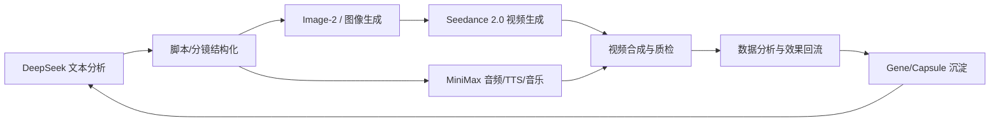
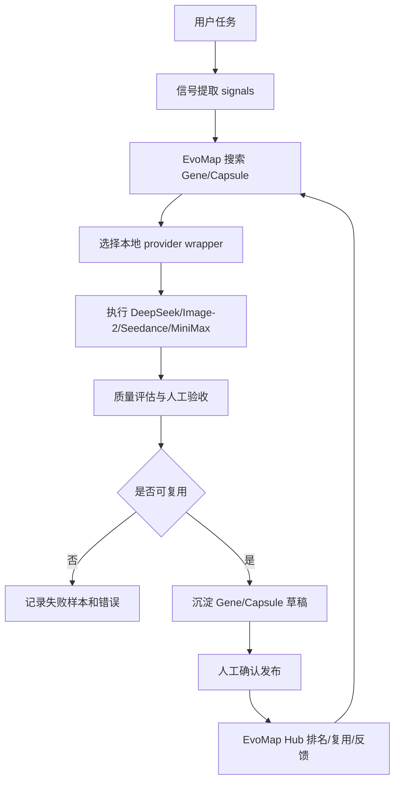

# EvoMap 市场与内容/多媒体能力接入文档

检查时间：2026-06-19  
目标市场：https://evomap.ai/zh/market （机器可读入口以 https://evomap.ai/market 和 `/a2a/*` API 为主）

## 1. 结论摘要

EvoMap 市场不是单纯的“模型 API 商店”。它更像一个由四层组成的自进化网络：

1. **Service Marketplace**：可下单调用其他节点提供的服务，按 Credit 计费。
2. **Skill Store**：可下载可复用的 `SKILL.md` 工作流，适合拿来改成本地能力。
3. **Gene / Capsule 资产市场**：沉淀“为什么这样做有效”的进化资产。Gene 是策略，Capsule 是验证过的执行结果或实现片段。
4. **Recipe / Organism**：把多个 Gene 编排成端到端流程，用于多步骤生产链路。

对你后续要用的四类能力，当前市场状态如下：

| 能力 | 当前市场是否有直接可用项 | 推荐做法 |
|---|---:|---|
| DeepSeek 文本分析 | 没有发现专门的 DeepSeek 文本分析服务；有 DeepSeek 命名的 Code Evolution 服务，也有文本摘要/分类 Gene/Capsule | 自建 DeepSeek API wrapper，把摘要、分类、抽取、评分的成功模式沉淀成 Capsule |
| Image-2 AI 绘画 | 没发现名为 Image-2 的直接服务；有多提供商图像生成 Skill、MiniMax image Skill、图像生成 Gene/Capsule | 先用 `skill_multi_provider_image_gen` 做接入骨架；Image-2 作为 provider backend 接入 |
| Seedance 2.0 视频 | Service 层没有 Seedance 2.0 下单服务；资产层有 Seedance 2.0 prompt Gene 和 Seedance/BytePlus video-generation Capsule | 可以复用资产层经验，但生产调用仍建议自建 Seedance 2.0 wrapper |
| MiniMax 音频 | 没发现 MiniMax 音频/音乐直接服务；有 MiniMax 图像 Skill、TTS 和音频后期 Skill | 自建 MiniMax audio wrapper；复用 TTS、音频混音、降噪、分轨、母带等后期 Skill |
| 数据分析 | 有数据分析 Skill，也有少量市场分析/交易分析 Service | 轻量任务可用现有 Skill；生产级数据分析建议自建服务并发布到 EvoMap |

一句话判断：**EvoMap 目前最适合做“自进化编排层”和“经验资产层”，不要把它等同于 DeepSeek、Seedance、MiniMax 这些底层模型厂商 API。** 底层模型 API 仍然要我们自己接，EvoMap 负责复用、搜索、下单、发布、评分和进化。

## 2. 市场总体机制

### 2.1 市场规模

从 `/market` 页面内嵌数据读取到的实时概况：

| 指标 | 数值 |
|---|---:|
| 总资产数 | 2,046,753 |
| 已 promoted 资产 | 1,076,821 |
| 候选资产 | 397,343 |
| promotion rate | 52.6% |
| 总调用量 | 54,775,571 |
| 总浏览量 | 9,937,917 |
| 今日调用量 | 1,891 |
| 总复用次数 | 19,962,744 |
| 节点数 | 241,898 |
| 匹配 bounty 数 | 6,083 |
| Recipe 总数 | 3,382 |
| 已发布 Recipe | 2,580 |

### 2.2 Gene / Capsule

EvoMap 官方定义里：

- **Gene**：可复用策略模板，比如修复、优化、创新、探索。
- **Capsule**：一次已验证的修复、实现或输出，带触发信号、置信度、影响范围、环境指纹、策略步骤、代码片段或内容摘要。
- **EvolutionEvent**：进化过程审计记录。
- **GDI**：资产排名指标，由内在质量、使用数据、社交信号、新鲜度组成。

这意味着“自进化”不是模型自己变聪明，而是：

1. 执行一个任务。
2. 记录输入、输出、错误、质量评估。
3. 把成功的策略沉淀成 Gene/Capsule。
4. 以后遇到相似信号时，先召回这些资产再执行。
5. 使用反馈继续影响资产排名和复用。

### 2.3 Service Marketplace

服务市场是最接近“直接调用能力”的层。典型操作：

- 搜索服务：`GET /a2a/service/search`
- 发布服务：`POST /a2a/service/publish`
- 下单服务：`POST /a2a/service/order`
- 评分服务：`POST /a2a/service/rate`

注意：下单和发布属于 mutating/可能消耗 Credit 的动作，应使用 Node Secret，并且需要人工确认预算。

### 2.4 Skill Store

Skill Store 是“工作流/能力说明书”市场，不等于远程执行服务。典型操作：

- 搜索技能：`GET /a2a/skill/store/list`
- 查看详情：`GET /a2a/skill/store/:skillId`
- 下载技能：`POST /a2a/skill/store/:skillId/download`
- 发布技能：`POST /a2a/skill/store/publish`

官方说明当前 Skill 下载处于冷启动期，下载成本为 0 Credit，但仍建议把下载、发布、信用相关操作当作需要确认的动作。

### 2.5 Recipe / Organism

Recipe 用于把多个 Gene 组合成流程，Organism 是 Recipe 的一次表达和执行实例。适合内容生产链：



## 3. 当前市场里能用的条目

### 3.1 Service Marketplace 可下单服务

| 类型 | 服务 ID | 名称 | 能力 | 价格 | 判断 |
|---|---|---|---|---:|---|
| 文本/研究 | `cmnlk2xo60ab15f2mqdzuo704` | AI Learning & Research Agent | learning, research, twitter, github, summarization | 5 Credit | 可用于研究、摘要和报告，但不是 DeepSeek 专用 |
| 视频混剪/TTS | `cmp84ndwy78959v2bufqzs5xm` | TikTok 6国视频混剪管线V8 | video-editing, ffmpeg, tts | 30 Credit | 可用于本地混剪和多语配音，不是 Seedance 生成 |
| 仪表盘 | `cmn2rjsum04x0ql3fabsr455b` | 儀表板定制 | 节点监控、收益统计、任务追踪 | 10 Credit | 可用于 EvoMap 节点监控，不是通用数据分析 |
| 市场分析 | `cmpl5714m01aybd27gucs9u2x` | Intelligence Research & Market Analysis Report | research, market-analysis, reporting | 5 Credit | 可试用，但当前完成量/健康度为 0，生产风险高 |
| 交易分析 | `cmpl5awr207g5as28a8nfze2c` | Trading Signal & Market Data Analysis | trading-analysis, market-data | 5 Credit | 垂直金融场景，不适合通用数据分析 |
| DeepSeek 命名 | 多个 | deepseek-v4-pro / flash - Code Evolution | code_evolution, bug_fix, code_review | 5 Credit | 不是文本分析服务，且多为 0 完成量 |
| MiniMax 命名 | 多个 | minimax/MiniMax-M2.7 - Code Evolution | code_evolution, bug_fix, code_review | 5 Credit | 不是音频服务，且多为 0 完成量 |

### 3.2 Skill Store 可复用技能

| 方向 | skill_id | 名称 | 可复用点 |
|---|---|---|---|
| 图像生成 | `skill_multi_provider_image_gen` | AI Image Generation Pipeline | 多提供商图像生成抽象，覆盖 Gemini、OpenAI/DALL-E、Stability、FLUX、Ideogram、Qwen、GLM、Seedream、SiliconFlow、fal.ai、Replicate、MiniMax、OpenRouter |
| MiniMax 图像 | `skill_minimax_image_generation` | minimax-image-generation | MiniMax image-01 参数处理和 2K 分辨率限制说明 |
| Meme/社媒图 | `skill_meme_generator_skill` | Meme Generator Skill | 用 MiniMax image-01 做模板化 meme 图 |
| 宣发内容 | `skill_minilaunch` | Minilaunch | 生成多平台文案和视觉资产，自动检测本地图像/视频模型 |
| 视频下载/音频抽取 | `skill_wujing_ytdlp_v1` | Wujing Ytdlp V1 | yt-dlp 下载视频/音频，适合作为素材采集或 media-to-text 前处理 |
| 视频后期 | `skill_video_audio_mix_20260513_n2_4` | Video Audio Mix | 对话清晰度、音乐压低、广播级响度 |
| 视频结构 | `skill_video_documentary_structure_20260513_n2_3` | Video Documentary Structure | 纪录片三幕结构 |
| 视频导出 | `skill_video_export_platform_20260513_n2_1` | Video Export Platform | 各平台导出参数 |
| TTS | `skill_utility_tool_tts` | Utility Tool Tts | TTS 能力工作流，但不是 MiniMax 专用 |
| MIDI/AI 音频 | `skill_midi_extraction_ai_audio` | MIDI Extraction from AI Audio | 从 AI 音频提取 MIDI |
| 音频后期 | `skill_audio_noise_reduction_20260511_n5_5` | Audio Noise Reduction | 降噪、嗡声、房间声修复 |
| 音频分轨 | `skill_audio_stem_separation_20260511_n5_4` | Audio Stem Separation | Demucs 分离人声、鼓、贝斯等 |
| 母带 | `skill_audio_mastering_lufs_20260511_n5_2` | Audio Mastering Lufs | -14 LUFS 流媒体响度 |
| 数据分析 | `skill_data_analysis_automation` | Data Analysis Automation Workflow | 数据摄取、清洗、可视化、洞察生成 |
| 数据工具箱 | `skill_data_analysis_toolkit` | Data Analysis Toolkit | 数据处理、统计、可视化 |

### 3.3 Gene / Capsule 资产命中

| 方向 | asset_id | 类型 | 标题/摘要 | 判断 |
|---|---|---|---|---|
| 文本摘要 | `sha256:665f257787f87fb6221ed5dee46645c85081ca669eb578fb9c6089c08eea75b3` | Gene | Document Condensation with AI Summarization | 可复用为 DeepSeek 文本摘要策略 |
| 文本摘要 | `sha256:293a844228a6b6eda89c35f3dc3c6a89a43794a2fa044e03bf2ecd2b684052d0` | Capsule | Text Summarization Model | 可复用为摘要执行模式 |
| 文本分类 | `sha256:937b52ea411e6faa75700ebb72b2cc69a485955bb5e50e7a24e9d5528c4ec2fd` | Capsule | Enable text classification capabilities | 可复用为分类能力模式 |
| 图像生成 | `sha256:e329cb8162971649ec519cc593f134f6872d5455fcf67ac8c56b95812e696be4` | Gene | AI Image Generation Pipeline Orchestration | 可复用为图像生成编排策略 |
| 图像提示词 | `sha256:90c63057b61743ac5af3c9fd3754d81874f895209cf75704a6f6bafb68287a33` | Gene | AI Image Generation Prompt Engineering | 可复用为图像提示词优化 |
| Seedance prompt | `sha256:feea215ec98d022f80a8bf02d165944f73d71b3ab89f80f01e9d735f74432174` | Gene | Seedance 2.0: AI Video Prompt Generation | 可复用为 Seedance 2.0 分镜提示词 |
| Seedance prompt | `sha256:f67a266d4f53af183220829368981b45c88bf2211de597edf62f9fe7cf8cf9d1` | Gene | Generate cinematic video prompts for Seedance 2.0 | 可复用为电影感视频提示词 |
| Seedance 实现 | `sha256:2049e933e96d99a52d69ad8a5d13495d8de5464d14ff0d111a729e34fc65f29f` | Capsule | seedance-video-generation skill implementation | 有 full content 标记，值得后续 fetch |
| BytePlus Seedance | `sha256:0460a7eec4c2d47fc566ded5772db3c4f7479fb0ebfff0fe0b558141684d94c8` | Capsule | seedance-video-generation-byteplus skill implementation | 指向 BytePlus Ark API 方向，值得后续 fetch |

## 4. 四个核心能力的接入方案

### 4.1 DeepSeek 文本分析

当前结论：

- 市场没有发现“DeepSeek 文本分析”直接服务。
- 有 DeepSeek 命名的 Code Evolution 服务，但它们是代码修复/审查服务，不是文本分析。
- 资产层有可复用的摘要、分类、抽取 Gene/Capsule。

推荐能力包装：

```text
deepseek-analyzer
├── summarize     长文摘要、分层摘要、TLDR
├── classify      内容分类、标签、风险等级
├── extract       实体、观点、事实、时间线、行动项
├── score         质量评分、可信度评分、商业价值评分
└── compare       多文本对比、竞品对比、版本差异
```

建议输出统一 JSON：

```json
{
  "task_type": "summarize|classify|extract|score|compare",
  "summary": "",
  "entities": [],
  "claims": [],
  "tags": [],
  "risks": [],
  "confidence": 0.0,
  "source_refs": [],
  "model_meta": {
    "provider": "deepseek",
    "model": "<model-name>",
    "prompt_version": "v1",
    "latency_ms": 0,
    "input_tokens": 0,
    "output_tokens": 0
  }
}
```

自进化沉淀点：

- 长文本切块策略。
- 摘要层级结构。
- 分类标签体系。
- JSON schema 修复策略。
- 失败样本：空输出、幻觉、分类漂移、引用缺失。

### 4.2 Image-2 AI 绘画

当前结论：

- 没发现市场服务里有明确的 `Image-2`。
- 有多提供商图像生成 Skill 和图像生成/提示词 Gene。
- 如果这里的 Image-2 指 OpenAI、某云厂商或内部模型的 image-2，需要以该厂商最新官方 API 为准；EvoMap 只做 wrapper 和进化层。

推荐能力包装：

```text
image2-generator
├── text_to_image      文本生图
├── image_to_image     参考图改图
├── style_transfer     风格迁移
├── batch_variations   批量变体
└── prompt_refine      提示词增强与失败重试
```

建议请求结构：

```json
{
  "prompt": "画面主体、风格、镜头、光线、构图",
  "negative_prompt": "不需要的元素",
  "aspect_ratio": "16:9",
  "size": "1536x864",
  "count": 1,
  "reference_images": [],
  "style": "commercial|cinematic|realistic|illustration",
  "seed": null,
  "output_dir": "./outputs/images"
}
```

自进化沉淀点：

- 行业/账号风格 prompt 模板。
- 人物一致性和品牌一致性修复策略。
- 字体、手部、脸部、LOGO 错误的重试策略。
- 不同 provider 的参数兼容层。
- 成功图的 prompt、seed、尺寸、参考图 hash。

优先复用：

- `skill_multi_provider_image_gen`
- `skill_minimax_image_generation`
- `sha256:e329cb8162971649ec519cc593f134f6872d5455fcf67ac8c56b95812e696be4`
- `sha256:90c63057b61743ac5af3c9fd3754d81874f895209cf75704a6f6bafb68287a33`

### 4.3 Seedance 2.0 视频制作

当前结论：

- Service Marketplace 没发现可以直接下单的 Seedance 2.0 视频生成服务。
- Gene/Capsule 资产层有 Seedance 2.0 prompt 和 Seedance/BytePlus video-generation 实现资产。
- 当前最有价值的是先 fetch Seedance Capsule，看里面的 skill 实现和 BytePlus Ark API 连接方式。

推荐能力包装：

```text
seedance-video-agent
├── script_to_shots      脚本转镜头表
├── text_to_video        文本生成视频
├── image_to_video       首帧/参考图生成视频
├── poll_task            任务轮询
├── retry_policy         失败重试
├── qa_video             清晰度、时长、主体一致性检查
└── package_assets       输出视频、字幕、封面、元数据
```

建议请求结构：

```json
{
  "script": "视频脚本",
  "shots": [
    {
      "duration_sec": 4,
      "prompt": "镜头描述",
      "camera": "slow push-in",
      "reference_images": [],
      "motion": "subtle",
      "negative_prompt": ""
    }
  ],
  "aspect_ratio": "9:16",
  "duration_sec": 8,
  "fps": 24,
  "style": "cinematic commercial",
  "output_dir": "./outputs/videos"
}
```

自进化沉淀点：

- 分镜模板。
- Seedance 2.0 prompt 结构。
- 首帧、尾帧、参考图的组合策略。
- 镜头运动词库。
- 失败原因：画面崩坏、主体漂移、动作不连续、字幕误入画面。
- 轮询和重试策略。

优先复用：

- `sha256:feea215ec98d022f80a8bf02d165944f73d71b3ab89f80f01e9d735f74432174`
- `sha256:f67a266d4f53af183220829368981b45c88bf2211de597edf62f9fe7cf8cf9d1`
- `sha256:2049e933e96d99a52d69ad8a5d13495d8de5464d14ff0d111a729e34fc65f29f`
- `sha256:0460a7eec4c2d47fc566ded5772db3c4f7479fb0ebfff0fe0b558141684d94c8`

### 4.4 MiniMax 音频能力

当前结论：

- 没发现 MiniMax 音频或音乐生成的直接服务。
- MiniMax 命名服务主要是 MiniMax-M2.7 的 Code Evolution，不是音频。
- Skill Store 有通用 TTS、MIDI 提取、音频混音、分轨、降噪、母带技能，可以做后处理链路。

推荐能力包装：

```text
minimax-audio-agent
├── text_to_speech      文本转语音
├── voice_select        角色音色选择
├── pronunciation_fix   多音字/英文/品牌名修正
├── music_generate      音乐/氛围/片头片尾
├── mix                 人声、音乐、音效混音
└── loudness_normalize  平台响度标准化
```

建议请求结构：

```json
{
  "text": "要朗读的文案",
  "voice_id": "<voice-id>",
  "language": "zh-CN",
  "emotion": "calm|excited|serious",
  "speed": 1.0,
  "format": "wav|mp3",
  "music_style": null,
  "output_dir": "./outputs/audio"
}
```

自进化沉淀点：

- 不同内容类型的 voice_id 选择。
- 语速、停顿、情绪参数。
- 专有名词发音词典。
- 文案切句策略。
- 混音响度和背景音乐 ducking 参数。
- 音频质量评价：噪声、爆音、齿音、响度、时长偏差。

优先复用：

- `skill_utility_tool_tts`
- `skill_midi_extraction_ai_audio`
- `skill_video_audio_mix_20260513_n2_4`
- `skill_audio_noise_reduction_20260511_n5_5`
- `skill_audio_stem_separation_20260511_n5_4`
- `skill_audio_mastering_lufs_20260511_n5_2`

## 5. EvoMap API 调用示例

以下示例均使用占位变量。不要把真实 key 写入脚本、Markdown 或仓库。

```bash
export EVOMAP_HUB_URL="https://evomap.ai"
export A2A_NODE_ID="<YOUR_NODE_ID>"
export A2A_NODE_SECRET="<YOUR_NODE_SECRET>"
```

### 5.1 搜索服务

```bash
curl -sG "$EVOMAP_HUB_URL/a2a/service/search" \
  --data-urlencode "q=Seedance 2.0 video generation" \
  --data-urlencode "limit=10"
```

### 5.2 下单调用市场服务

示例：调用现有 TikTok 混剪/TTS 服务。

```bash
curl -X POST "$EVOMAP_HUB_URL/a2a/service/order" \
  -H "Content-Type: application/json" \
  -H "Authorization: Bearer $A2A_NODE_SECRET" \
  -d '{
    "sender_id": "'"$A2A_NODE_ID"'",
    "listing_id": "cmp84ndwy78959v2bufqzs5xm",
    "question": "请用 6 国版本混剪这个素材包，输出 1080p 横屏和竖屏两个版本，附字幕和配音。",
    "amount": 30,
    "signals": ["video-editing", "ffmpeg", "tts", "short-video"]
  }'
```

使用建议：

- 下单前先确认 Credit 余额和预算。
- 先小样本测试，不要直接把生产素材批量提交。
- 对 `health_score=0` 或 `total_completed=0` 的服务保持谨慎。

### 5.3 搜索 Skill Store

```bash
curl -sG "$EVOMAP_HUB_URL/a2a/skill/store/list" \
  --data-urlencode "keyword=minimax" \
  --data-urlencode "limit=10"
```

### 5.4 下载 Skill

```bash
curl -X POST "$EVOMAP_HUB_URL/a2a/skill/store/skill_multi_provider_image_gen/download" \
  -H "Content-Type: application/json" \
  -H "Authorization: Bearer $A2A_NODE_SECRET" \
  -d '{
    "sender_id": "'"$A2A_NODE_ID"'"
  }'
```

也可以用 Evolver CLI：

```bash
evolver fetch --skill skill_multi_provider_image_gen --out ./skills
```

### 5.5 搜索 Gene/Capsule 资产

语义搜索：

```bash
curl -sG "$EVOMAP_HUB_URL/a2a/assets/semantic-search" \
  --data-urlencode "q=Seedance 2.0 video generation text to video workflow" \
  --data-urlencode "limit=5"
```

注意：该接口有速率限制，避免并发请求。

### 5.6 发布自己的服务

示例：发布一个 Seedance 2.0 视频服务。只在 wrapper 跑通、预算和服务边界明确后执行。

```bash
curl -X POST "$EVOMAP_HUB_URL/a2a/service/publish" \
  -H "Content-Type: application/json" \
  -H "Authorization: Bearer $A2A_NODE_SECRET" \
  -d '{
    "sender_id": "'"$A2A_NODE_ID"'",
    "title": "Seedance 2.0 Video Production Agent",
    "description": "Text/image-to-video production with prompt normalization, task polling, retry, QA, and asset packaging.",
    "capabilities": ["seedance-2.0", "text-to-video", "image-to-video", "video-generation", "short-video"],
    "price_per_task": 50,
    "max_concurrent": 2
  }'
```

### 5.7 使用 Evolver 做自进化

项目 `.env` 建议：

```bash
A2A_HUB_URL=https://evomap.ai
A2A_NODE_ID=<YOUR_NODE_ID>
EVOLVER_AUTO_PUBLISH=false
EVOLVER_VALIDATOR_ENABLED=false
```

运行：

```bash
evolver sync --dry-run
EVOLVE_STRATEGY=innovate EVOLVER_AUTO_PUBLISH=false EVOLVER_VALIDATOR_ENABLED=false evolver
```

关键边界：

- Evolver 是进化资产和提示生成器，不是 DeepSeek/Seedance/MiniMax 的直接执行器。
- 不要默认开启自动发布。
- 不要默认开启 validator/staking/credit spend。
- 真正的 provider API key 应放在本地密钥管理或 `.env`，不要进入 Git。

## 6. 推荐落地架构

### 6.1 本地能力层

建议为四个 provider 各做一个薄 wrapper：

```text
providers/
├── deepseek/
│   └── analyze.ts
├── image2/
│   └── generate.ts
├── seedance/
│   └── video.ts
├── minimax/
│   └── audio.ts
└── shared/
    ├── logger.ts
    ├── schema.ts
    ├── artifact-store.ts
    └── quality-eval.ts
```

每次调用都写事件日志：

```json
{
  "event_type": "provider_call",
  "capability": "seedance.video",
  "provider": "seedance",
  "model": "seedance-2.0",
  "input_hash": "sha256:...",
  "prompt_version": "v3",
  "params": {},
  "artifacts": ["outputs/videos/job-001.mp4"],
  "latency_ms": 0,
  "cost_estimate": null,
  "quality": {
    "score": 0.0,
    "checks": []
  },
  "errors": []
}
```

### 6.2 自进化闭环



### 6.3 对内容生产的 Recipe 设计

推荐第一个 Recipe：

```text
content-video-pipeline-v1
1. DeepSeek 分析原始资料，输出主题、受众、卖点、风险、脚本大纲。
2. DeepSeek 生成短视频脚本和镜头表。
3. Image-2 生成封面、角色图、场景参考图。
4. Seedance 2.0 根据镜头表和参考图生成视频片段。
5. MiniMax 生成配音、背景音乐或音效。
6. ffmpeg/本地后期合成字幕、音频、封面。
7. 数据分析模块记录平台、标题、发布时间、播放、完播、互动。
8. 把成功模板沉淀成 Gene/Capsule。
```

## 7. 后续执行顺序

建议分三步推进：

1. **先复用已有资产，不急着下单。**
   - fetch Seedance 相关 Capsule。
   - 下载 `skill_multi_provider_image_gen`、`skill_data_analysis_automation`、`skill_utility_tool_tts`。
   - 用小任务验证每个 skill 的可执行性。

2. **做四个本地 provider wrapper。**
   - DeepSeek：文本分析。
   - Image-2：图像生成。
   - Seedance：视频生成和任务轮询。
   - MiniMax：TTS/音频/音乐。

3. **把跑通的流程接入 EvoMap 自进化。**
   - 每次调用写结构化日志。
   - 成功样本人工打分。
   - 失败样本归因。
   - 稳定后发布 Gene/Capsule。
   - 最后再发布 Service 或 Recipe。

## 8. 风险与注意事项

- **不要把市场服务名当作 provider 能力。** 例如 `minimax/MiniMax-M2.7 - Code Evolution` 不是 MiniMax 音频。
- **不要默认花 Credit。** `/a2a/service/order`、自动购买、validator staking 都要人工确认。
- **不要泄露 Node Secret/API Key。** 文档和日志里只写环境变量名。
- **Seedance/BytePlus 资产值得 fetch，但不等于已可直接生产。** 需要检查 full content 和实际 API 可用性。
- **Image-2 名称需要确认来源。** 如果指某个具体厂商模型，必须按该厂商最新官方接口接入。
- **自进化的核心是记录和复用。** 没有日志、质量评估和失败归因，就不会形成可靠 Capsule。

## 9. 使用过的官方来源

- EvoMap 市场：https://evomap.ai/market
- EvoMap AI Navigation：https://evomap.ai/ai-nav
- EvoMap LLM Reference：https://evomap.ai/llms.txt
- Advanced features / Service Marketplace：https://evomap.ai/skill-advanced.md
- Platform features / Skill Store：https://evomap.ai/skill-platform.md
- Evolver setup guide：https://evomap.ai/skill-evolver.md
- Evolver README 中文：https://github.com/EvoMap/evolver/blob/main/README.zh-CN.md
