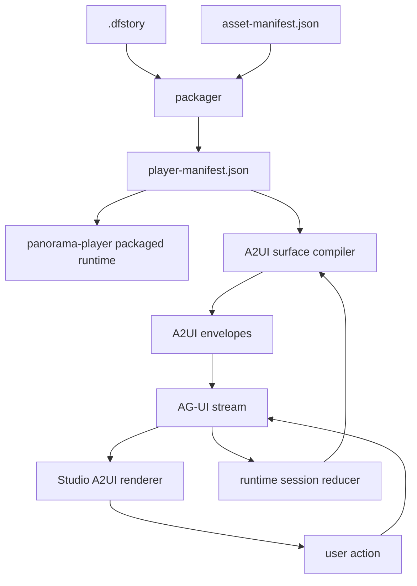

# A2UI/AG-UI Game Runtime Implementation Plan

> **For agentic workers:** REQUIRED SUB-SKILL: Use superpowers:subagent-driven-development (recommended) or superpowers:executing-plans to implement this plan task-by-task. Steps use checkbox (`- [ ]`) syntax for tracking.

**Goal:** Build a second runtime path for ChaseDream Creator Studio where confirmed node canvas data, media assets, and game state can be streamed as safe A2UI surfaces over AG-UI without replacing the deterministic `panorama-player` packaging path.

**Architecture:** `.dfstory` remains the authoring truth source, `asset-manifest.json` remains the media truth source, and `player-manifest.json` remains the deterministic player contract. A2UI renders safe declarative UI surfaces derived from that manifest; AG-UI transports run lifecycle, text, tool, state, action, and custom A2UI events between Studio and the agent/runtime session.

**Tech Stack:** TanStack Start, React 19, TypeScript, Zustand, zod, AG-UI event model, A2UI v0.9.1-style surface envelopes, existing `.dfstory`, existing media-service, existing `packages/panorama-player`.

---

## 0. Source Context

This plan extends `docs/superpowers/plans/2026-06-19-panorama-interactive-film-pipeline.md`.

The base pipeline already defines:

- Studio is the authoring app.
- `packages/panorama-player` is the deterministic packaged runtime.
- `.dfstory` is the authoring truth source.
- `asset-manifest.json` records stable media URLs and provider metadata.
- `player-manifest.json` records the player-ready node graph, character, variable, theme, and asset configuration.
- Node canvas confirmation is the gate before publishable runtime output.

Current repository facts:

- `.dfstory` exists at `src/lib/dfstory/types.ts`.
- Internal AG-UI-like events exist at `src/lib/ai/ag-ui-events.ts`.
- Media generation already routes through `src/lib/ai/media-service.ts`.
- `PlayableNode` is narrow and only carries text, background image, choices, and ending fields.
- `packages/panorama-player/src/types.ts` still hardcodes character ids and metric keys.
- `packages/packager` is not present yet.

## 1. Positioning

### 1.1 What This Builds

This creates a second runtime option:



The packaged runtime remains the stable public sharing path. The A2UI/AG-UI runtime is for:

- Studio live preview with protocol-level observability.
- Agent-assisted playtest sessions.
- Human-in-the-loop review of generated UI surfaces.
- Future remote agent clients that can render the same A2UI catalog.

### 1.2 What This Does Not Build

- It does not let an LLM emit arbitrary React, HTML, scripts, CSS, or executable code.
- It does not replace `.dfstory`, `asset-manifest.json`, or `player-manifest.json`.
- It does not make A2UI responsible for game rules.
- It does not make AG-UI responsible for media storage.
- It does not change `panorama-player` deployment semantics.

## 2. Protocol Boundary

| Layer | Owns | Does not own |
|---|---|---|
| `.dfstory` | Authoring data: graph, script, world, variables, assets, cinematic directions | Runtime UI layout |
| `asset-manifest.json` | Stable URLs, provider metadata, status, cost, media dimensions | Story logic |
| `player-manifest.json` | Runtime graph, starting node, characters, variables, choices, assets, theme | Transport |
| A2UI | Safe surface description: components, data model, user action names | Game state mutation |
| AG-UI | Ordered event transport, lifecycle, state snapshots/deltas, custom payloads, action return channel | Component rendering |
| Studio renderer | White-listed local React components mapped from A2UI catalog | Arbitrary generated UI |

## 3. File Structure

Create or modify these files.

### 3.1 Runtime Manifest Contracts

- Create: `src/lib/player-manifest/types.ts`
  - Defines `PlayerManifest`, `PlayerStoryNode`, `PlayerChoice`, `PlayerEffect`, `PlayerCondition`, `PlayerMetric`, `PlayerAssetIndex`.
- Create: `src/lib/player-manifest/validate.ts`
  - Validates graph reachability, missing `choice.next`, missing media URLs, duplicate ids, and missing `startNodeId`.
- Create: `src/lib/player-manifest/from-dfstory.ts`
  - Converts `.dfstory + asset-manifest` into `PlayerManifest`.
- Create: `src/lib/player-manifest/index.ts`
  - Barrel exports.

### 3.2 Asset Manifest Contracts

- Create: `src/lib/asset-manifest/types.ts`
  - Defines the asset manifest contract from the base pipeline plan.
- Create: `src/lib/asset-manifest/validate.ts`
  - Validates media URLs, node/line ownership, media type consistency, and storage mode.
- Create: `src/lib/asset-manifest/index.ts`
  - Barrel exports.

### 3.3 A2UI Runtime Layer

- Create: `src/lib/a2ui/types.ts`
  - Defines minimal A2UI v0.9.1-compatible envelope types used by ChaseDream.
- Create: `src/lib/a2ui/catalog.ts`
  - Defines the ChaseDream white-listed catalog.
- Create: `src/lib/a2ui/validate.ts`
  - Validates component ids, child references, data paths, action names, and catalog membership.
- Create: `src/lib/a2ui/player-surface-compiler.ts`
  - Compiles a `PlayerStoryNode` and runtime state into `createSurface`, `updateDataModel`, and `updateComponents` envelopes.
- Create: `src/lib/a2ui/index.ts`
  - Barrel exports.

### 3.4 AG-UI Runtime Layer

- Create: `src/lib/agui/event-types.ts`
  - Defines the subset of official AG-UI events consumed by this app.
- Create: `src/lib/agui/internal-adapter.ts`
  - Maps official-style AG-UI events to existing `src/lib/ai/ag-ui-events.ts` store events.
- Create: `src/lib/agui/a2ui-events.ts`
  - Wraps A2UI envelopes in AG-UI `custom` events with stable names.
- Create: `src/lib/agui/runtime-session.ts`
  - Reducer for run state, current node, line index, choices, flags, variables, and emitted A2UI updates.
- Create: `src/lib/agui/index.ts`
  - Barrel exports.

### 3.5 Studio Renderer

- Create: `src/components/studio/a2ui/a2ui-renderer.tsx`
  - Renders A2UI envelopes using local white-listed React components.
- Create: `src/components/studio/a2ui/a2ui-components.tsx`
  - Implements `GameStage`, `DialogueBox`, `ChoiceList`, `StatusMeters`, `MediaPanel`, `HotspotList`, `SaveControls`, `AssetProgress`.
- Create: `src/components/studio/a2ui/use-a2ui-surface.ts`
  - Maintains current surface, data model, and dispatches actions.
- Create: `src/components/studio/a2ui/index.ts`
  - Barrel exports.
- Modify: `src/components/studio/canvas-area.tsx`
  - Adds an A2UI/AG-UI preview panel after the deterministic simulator is stable.

### 3.6 Server Functions

- Create: `src/server/functions/agui-runtime.ts`
  - Starts or resumes an AG-UI runtime session.
  - Emits ordered events and A2UI custom payloads.
  - Accepts player actions and returns the next stream chunk or session snapshot.

### 3.7 Tests

- Create: `src/lib/player-manifest/from-dfstory.test.ts`
- Create: `src/lib/player-manifest/validate.test.ts`
- Create: `src/lib/asset-manifest/validate.test.ts`
- Create: `src/lib/a2ui/player-surface-compiler.test.ts`
- Create: `src/lib/a2ui/validate.test.ts`
- Create: `src/lib/agui/runtime-session.test.ts`
- Create: `src/lib/agui/internal-adapter.test.ts`

## 4. Data Contracts

### 4.1 Player Manifest

Use this contract as the bridge between the deterministic player and the A2UI compiler.

```ts
export interface PlayerManifest {
  schemaVersion: "1.0";
  gameId: string;
  title: string;
  startNodeId: string;
  defaultVisualMode: "flat" | "panorama";
  defaultProjection: "planar" | "equirectangular";
  characters: PlayerCharacter[];
  metrics: PlayerMetric[];
  globals: PlayerMetric[];
  nodes: PlayerStoryNode[];
  theme: PlayerTheme;
  assets: PlayerAssetIndex;
}

export interface PlayerStoryNode {
  id: string;
  chapter: string;
  episodeNumber?: number;
  title: string;
  location: string;
  visualMode: "flat" | "panorama";
  projection: "planar" | "equirectangular";
  media: {
    kind: "image" | "video";
    url: string;
    fit: "cover" | "contain";
    loop?: boolean;
  };
  palette: {
    from: string;
    via: string;
    to: string;
  };
  synopsis: string;
  lines: PlayerDialogueLine[];
  hotspots: PlayerHotspot[];
  choices: PlayerChoice[];
  ending?: {
    title: string;
    subtitle: string;
    type: "good" | "bad" | "neutral" | "secret";
  };
}

export interface PlayerDialogueLine {
  id: string;
  speaker: string;
  text: string;
  mood?: string;
  voiceSrc?: string;
  focusYaw?: number;
  focusPitch?: number;
}

export interface PlayerChoice {
  id: string;
  label: string;
  caption?: string;
  next: string;
  effect?: PlayerEffect;
  condition?: PlayerCondition;
  major?: boolean;
}

export interface PlayerEffect {
  variables?: Record<string, number | string | boolean>;
  variableDeltas?: Record<string, number>;
  flags?: string[];
  memories?: string[];
  route?: string | null;
}

export interface PlayerCondition {
  flags?: string[];
  missingFlags?: string[];
  minVariables?: Array<{ key: string; value: number }>;
  maxVariables?: Array<{ key: string; value: number }>;
}
```

### 4.2 A2UI Envelope Subset

The app only supports these envelope keys:

```ts
export type A2UIEnvelope =
  | { createSurface: A2UICreateSurface }
  | { updateComponents: A2UIUpdateComponents }
  | { updateDataModel: A2UIUpdateDataModel }
  | { deleteSurface: A2UIDeleteSurface };

export interface A2UICreateSurface {
  surfaceId: string;
  rootComponentId: string;
  theme?: {
    primaryColor?: string;
    iconUrl?: string;
  };
}

export interface A2UIUpdateComponents {
  surfaceId: string;
  components: A2UIComponent[];
}

export interface A2UIUpdateDataModel {
  surfaceId: string;
  path: string;
  value: unknown;
}

export interface A2UIDeleteSurface {
  surfaceId: string;
}

export interface A2UIComponent {
  id: string;
  component: ChaseDreamA2UIComponentName;
  props?: Record<string, unknown>;
  children?: string[];
  action?: {
    name: ChaseDreamA2UIActionName;
    payload?: Record<string, unknown>;
  };
}

export type ChaseDreamA2UIComponentName =
  | "GameStage"
  | "DialogueBox"
  | "ChoiceList"
  | "ChoiceButton"
  | "StatusMeters"
  | "MediaPanel"
  | "HotspotList"
  | "SaveControls"
  | "AssetProgress";

export type ChaseDreamA2UIActionName =
  | "advanceLine"
  | "chooseChoice"
  | "revealHotspot"
  | "rollback"
  | "saveSnapshot"
  | "loadSnapshot";
```

### 4.3 AG-UI Custom Event Names

Wrap A2UI in AG-UI custom events:

```ts
export const CHASEDREAM_AGUI_EVENTS = {
  a2uiEnvelope: "chasedream.a2ui.envelope",
  playerAction: "chasedream.player.action",
  playerSnapshot: "chasedream.player.snapshot",
  manifestWarning: "chasedream.manifest.warning",
} as const;
```

## 5. Implementation Tasks

### Task 1: Add Manifest Contracts

**Files:**
- Create: `src/lib/player-manifest/types.ts`
- Create: `src/lib/player-manifest/index.ts`
- Create: `src/lib/asset-manifest/types.ts`
- Create: `src/lib/asset-manifest/index.ts`

- [ ] **Step 1: Create player manifest types**

Create `src/lib/player-manifest/types.ts` with the interfaces from section 4.1 plus:

```ts
export interface PlayerCharacter {
  id: string;
  name: string;
  shortName?: string;
  role?: string;
  color?: string;
  accent?: string;
}

export interface PlayerMetric {
  key: string;
  label: string;
  initialValue: number;
  min: number;
  max: number;
}

export interface PlayerTheme {
  primaryColor: string;
  backgroundColor: string;
  textColor: string;
  surfaceColor: string;
}

export interface PlayerAssetIndex {
  byNodeId: Record<string, string[]>;
  byLineId: Record<string, string[]>;
}

export interface PlayerHotspot {
  id: string;
  label: string;
  description: string;
  yaw?: number;
  pitch?: number;
  effect?: PlayerEffect;
}
```

- [ ] **Step 2: Create asset manifest types**

Create `src/lib/asset-manifest/types.ts`:

```ts
export interface AssetManifest {
  schemaVersion: "1.0";
  projectId: string;
  generatedAt: string;
  storage: AssetManifestStorage;
  assets: AssetManifestItem[];
}

export interface AssetManifestStorage {
  mode: "bundled" | "remote";
  provider: "local-build" | "vercel-static-bundle" | "oss" | "r2" | "vercel-blob" | "external-url";
  bundleBasePath?: string;
  publicBaseUrl?: string;
}

export interface AssetManifestItem {
  id: string;
  nodeId: string;
  lineId?: string;
  mediaType: "flat-image" | "panorama-image" | "flat-video" | "panorama-video" | "voice" | "bgm" | "sfx";
  visualMode?: "flat" | "panorama";
  projection?: "planar" | "equirectangular";
  aspectRatio?: "16:9" | "9:16" | "2:1" | "auto";
  status: "ready" | "failed" | "skipped" | "fallback";
  source: "ai-generated" | "manual-upload" | "external-url" | "template-demo" | "fallback";
  url?: string;
  localPath?: string;
  mimeType?: string;
  width?: number;
  height?: number;
  durationSeconds?: number;
  sizeBytes?: number;
  provider?: "deepseek" | "image2" | "minimax" | "seedance" | "manual" | "external-url" | "fallback";
  model?: string;
  prompt?: string;
  promptHash?: string;
  cost?: number;
  originalFileName?: string;
  replacedAssetId?: string;
  deletedAt?: string;
  error?: string;
}
```

- [ ] **Step 3: Create barrel exports**

Create `src/lib/player-manifest/index.ts`:

```ts
export type * from "./types";
```

Create `src/lib/asset-manifest/index.ts`:

```ts
export type * from "./types";
```

- [ ] **Step 4: Run typecheck**

Run:

```bash
bunx tsc --noEmit
```

Expected: existing project type errors may remain, but these new files should not introduce parser errors or unresolved imports.

- [ ] **Step 5: Commit**

```bash
git add src/lib/player-manifest src/lib/asset-manifest
git commit -m "feat: add runtime manifest contracts"
```

### Task 2: Validate Player and Asset Manifests

**Files:**
- Create: `src/lib/player-manifest/validate.ts`
- Create: `src/lib/player-manifest/validate.test.ts`
- Create: `src/lib/asset-manifest/validate.ts`
- Create: `src/lib/asset-manifest/validate.test.ts`
- Modify: `src/lib/player-manifest/index.ts`
- Modify: `src/lib/asset-manifest/index.ts`

- [ ] **Step 1: Write player manifest validation tests**

Create `src/lib/player-manifest/validate.test.ts`:

```ts
import { describe, expect, test } from "bun:test";
import { validatePlayerManifest } from "./validate";
import type { PlayerManifest } from "./types";

const baseManifest: PlayerManifest = {
  schemaVersion: "1.0",
  gameId: "game-1",
  title: "Test Game",
  startNodeId: "n1",
  defaultVisualMode: "flat",
  defaultProjection: "planar",
  characters: [],
  metrics: [],
  globals: [],
  theme: {
    primaryColor: "#ff7a1a",
    backgroundColor: "#111111",
    textColor: "#ffffff",
    surfaceColor: "#1f1f1f",
  },
  assets: { byNodeId: {}, byLineId: {} },
  nodes: [
    {
      id: "n1",
      chapter: "序章",
      title: "Start",
      location: "Room",
      visualMode: "flat",
      projection: "planar",
      media: { kind: "image", url: "/assets/n1.jpg", fit: "cover" },
      palette: { from: "#111111", via: "#333333", to: "#555555" },
      synopsis: "Start node",
      lines: [{ id: "l1", speaker: "旁白", text: "Hello" }],
      hotspots: [],
      choices: [{ id: "c1", label: "Continue", next: "n2" }],
    },
    {
      id: "n2",
      chapter: "序章",
      title: "End",
      location: "Room",
      visualMode: "flat",
      projection: "planar",
      media: { kind: "image", url: "/assets/n2.jpg", fit: "cover" },
      palette: { from: "#111111", via: "#333333", to: "#555555" },
      synopsis: "End node",
      lines: [{ id: "l2", speaker: "旁白", text: "Done" }],
      hotspots: [],
      choices: [],
      ending: { title: "End", subtitle: "Done", type: "good" },
    },
  ],
};

describe("validatePlayerManifest", () => {
  test("accepts a reachable manifest", () => {
    expect(validatePlayerManifest(baseManifest)).toEqual({
      ok: true,
      errors: [],
      warnings: [],
    });
  });

  test("rejects a choice that points to a missing node", () => {
    const manifest = structuredClone(baseManifest);
    manifest.nodes[0].choices[0].next = "missing";
    const result = validatePlayerManifest(manifest);
    expect(result.ok).toBe(false);
    expect(result.errors).toContain("choice n1:c1 points to missing node missing");
  });
});
```

- [ ] **Step 2: Implement player manifest validation**

Create `src/lib/player-manifest/validate.ts`:

```ts
import type { PlayerManifest } from "./types";

export interface ManifestValidationResult {
  ok: boolean;
  errors: string[];
  warnings: string[];
}

export function validatePlayerManifest(manifest: PlayerManifest): ManifestValidationResult {
  const errors: string[] = [];
  const warnings: string[] = [];
  const nodeIds = new Set(manifest.nodes.map((node) => node.id));

  if (!nodeIds.has(manifest.startNodeId)) {
    errors.push(`startNodeId ${manifest.startNodeId} does not exist`);
  }

  for (const node of manifest.nodes) {
    if (!node.media.url) {
      errors.push(`node ${node.id} is missing media.url`);
    }
    for (const line of node.lines) {
      if (!line.id || !line.text) {
        errors.push(`node ${node.id} has an invalid dialogue line`);
      }
    }
    if (!node.ending && node.choices.length === 0) {
      warnings.push(`node ${node.id} is not an ending and has no choices`);
    }
    for (const choice of node.choices) {
      if (!nodeIds.has(choice.next)) {
        errors.push(`choice ${node.id}:${choice.id} points to missing node ${choice.next}`);
      }
    }
  }

  if (nodeIds.has(manifest.startNodeId)) {
    const reachable = collectReachable(manifest);
    for (const node of manifest.nodes) {
      if (!reachable.has(node.id)) {
        warnings.push(`node ${node.id} is unreachable from startNodeId`);
      }
    }
  }

  return { ok: errors.length === 0, errors, warnings };
}

function collectReachable(manifest: PlayerManifest): Set<string> {
  const byId = new Map(manifest.nodes.map((node) => [node.id, node]));
  const visited = new Set<string>();
  const queue = [manifest.startNodeId];

  while (queue.length > 0) {
    const id = queue.shift()!;
    if (visited.has(id)) continue;
    visited.add(id);
    const node = byId.get(id);
    if (!node) continue;
    for (const choice of node.choices) queue.push(choice.next);
  }

  return visited;
}
```

- [ ] **Step 3: Write asset manifest validation tests**

Create `src/lib/asset-manifest/validate.test.ts`:

```ts
import { describe, expect, test } from "bun:test";
import { validateAssetManifest } from "./validate";
import type { AssetManifest } from "./types";

const manifest: AssetManifest = {
  schemaVersion: "1.0",
  projectId: "p1",
  generatedAt: "2026-06-19T00:00:00.000Z",
  storage: { mode: "bundled", provider: "vercel-static-bundle", bundleBasePath: "/assets" },
  assets: [
    {
      id: "a1",
      nodeId: "n1",
      mediaType: "flat-image",
      visualMode: "flat",
      projection: "planar",
      status: "ready",
      source: "manual-upload",
      url: "/assets/n1.jpg",
    },
  ],
};

describe("validateAssetManifest", () => {
  test("accepts ready asset with url", () => {
    expect(validateAssetManifest(manifest)).toEqual({ ok: true, errors: [], warnings: [] });
  });

  test("rejects ready asset without url", () => {
    const copy = structuredClone(manifest);
    delete copy.assets[0].url;
    const result = validateAssetManifest(copy);
    expect(result.ok).toBe(false);
    expect(result.errors).toContain("asset a1 is ready but has no url");
  });
});
```

- [ ] **Step 4: Implement asset manifest validation**

Create `src/lib/asset-manifest/validate.ts`:

```ts
import type { AssetManifest } from "./types";

export interface AssetManifestValidationResult {
  ok: boolean;
  errors: string[];
  warnings: string[];
}

export function validateAssetManifest(manifest: AssetManifest): AssetManifestValidationResult {
  const errors: string[] = [];
  const warnings: string[] = [];
  const ids = new Set<string>();

  for (const asset of manifest.assets) {
    if (ids.has(asset.id)) errors.push(`duplicate asset id ${asset.id}`);
    ids.add(asset.id);

    if (asset.status === "ready" && !asset.url) {
      errors.push(`asset ${asset.id} is ready but has no url`);
    }

    if (asset.mediaType === "voice" && !asset.lineId) {
      warnings.push(`voice asset ${asset.id} is not bound to a lineId`);
    }

    if (asset.mediaType.includes("panorama") && asset.projection !== "equirectangular") {
      warnings.push(`panorama asset ${asset.id} should use equirectangular projection`);
    }
  }

  if (manifest.storage.mode === "bundled" && !manifest.storage.bundleBasePath) {
    warnings.push("bundled storage should set bundleBasePath");
  }

  if (manifest.storage.mode === "remote" && !manifest.storage.publicBaseUrl) {
    warnings.push("remote storage should set publicBaseUrl");
  }

  return { ok: errors.length === 0, errors, warnings };
}
```

- [ ] **Step 5: Export validators**

Add to `src/lib/player-manifest/index.ts`:

```ts
export * from "./validate";
```

Add to `src/lib/asset-manifest/index.ts`:

```ts
export * from "./validate";
```

- [ ] **Step 6: Run tests**

```bash
bun test src/lib/player-manifest/validate.test.ts src/lib/asset-manifest/validate.test.ts
```

Expected: all tests pass.

- [ ] **Step 7: Commit**

```bash
git add src/lib/player-manifest src/lib/asset-manifest
git commit -m "feat: validate runtime manifests"
```

### Task 3: Compile `.dfstory + asset-manifest` to Player Manifest

**Files:**
- Create: `src/lib/player-manifest/from-dfstory.ts`
- Create: `src/lib/player-manifest/from-dfstory.test.ts`
- Modify: `src/lib/player-manifest/index.ts`

- [ ] **Step 1: Write conversion tests**

Create a fixture in `src/lib/player-manifest/from-dfstory.test.ts` that serializes a minimal `.dfstory`, binds a flat image asset to each node, and expects a `PlayerManifest` with:

```ts
expect(result.startNodeId).toBe("n1");
expect(result.nodes[0].media.url).toBe("/assets/n1.jpg");
expect(result.nodes[0].choices[0].next).toBe("n2");
expect(result.nodes[1].ending?.type).toBe("good");
```

- [ ] **Step 2: Implement converter**

Create `src/lib/player-manifest/from-dfstory.ts`:

```ts
import type { DfStory } from "@/lib/dfstory";
import type { AssetManifest } from "@/lib/asset-manifest";
import type { PlayerManifest, PlayerStoryNode } from "./types";

export function playerManifestFromDfStory(story: DfStory, assets: AssetManifest): PlayerManifest {
  const assetByNode = new Map<string, string>();
  for (const asset of assets.assets) {
    if (asset.status === "ready" && asset.url && !asset.lineId) {
      assetByNode.set(asset.nodeId, asset.url);
    }
  }

  const firstNodeId = story.graph.nodes[0]?.id ?? "";
  const nodes: PlayerStoryNode[] = story.graph.nodes.map((node) => {
    const outgoing = story.graph.edges.filter((edge) => edge.from === node.id);
    const scene = story.world.scenes.find((candidate) => candidate.refNodes.includes(node.id));
    const mediaUrl = assetByNode.get(node.id) ?? scene?.imageUrl ?? "";

    return {
      id: node.id,
      chapter: "未分章",
      title: node.label,
      location: scene?.location ?? "",
      visualMode: "flat",
      projection: "planar",
      media: { kind: "image", url: mediaUrl, fit: "cover" },
      palette: { from: "#111111", via: "#2a2a2a", to: "#444444" },
      synopsis: node.label,
      lines: [{ id: `${node.id}-line-1`, speaker: "旁白", text: node.label }],
      hotspots: [],
      choices: outgoing.map((edge, index) => ({
        id: `${edge.from}-${edge.to}-${index}`,
        label: edge.label ?? "继续",
        next: edge.to,
        effect: edge.condition ? { flags: [`condition:${edge.to}`] } : undefined,
      })),
      ending: node.type === "ending_good" || node.type === "ending_bad"
        ? {
            title: node.label,
            subtitle: node.type === "ending_good" ? "达成好结局" : "达成坏结局",
            type: node.type === "ending_good" ? "good" : "bad",
          }
        : undefined,
    };
  });

  return {
    schemaVersion: "1.0",
    gameId: story.meta.id,
    title: story.meta.title,
    startNodeId: firstNodeId,
    defaultVisualMode: "flat",
    defaultProjection: "planar",
    characters: story.world.characters.map((character) => ({
      id: character.id,
      name: character.name,
      role: character.role,
      color: character.color,
    })),
    metrics: [],
    globals: story.variables.definitions.map((variable) => ({
      key: variable.id,
      label: variable.label,
      initialValue: variable.initialValue,
      min: 0,
      max: 100,
    })),
    nodes,
    theme: {
      primaryColor: "#f97316",
      backgroundColor: "#09090b",
      textColor: "#fafafa",
      surfaceColor: "#18181b",
    },
    assets: {
      byNodeId: assets.assets.reduce<Record<string, string[]>>((acc, asset) => {
        acc[asset.nodeId] = [...(acc[asset.nodeId] ?? []), asset.id];
        return acc;
      }, {}),
      byLineId: assets.assets.reduce<Record<string, string[]>>((acc, asset) => {
        if (asset.lineId) acc[asset.lineId] = [...(acc[asset.lineId] ?? []), asset.id];
        return acc;
      }, {}),
    },
  };
}
```

- [ ] **Step 3: Export converter**

Add to `src/lib/player-manifest/index.ts`:

```ts
export * from "./from-dfstory";
```

- [ ] **Step 4: Run conversion tests**

```bash
bun test src/lib/player-manifest/from-dfstory.test.ts
```

Expected: conversion test passes.

- [ ] **Step 5: Commit**

```bash
git add src/lib/player-manifest
git commit -m "feat: compile dfstory to player manifest"
```

### Task 4: Add ChaseDream A2UI Catalog and Validator

**Files:**
- Create: `src/lib/a2ui/types.ts`
- Create: `src/lib/a2ui/catalog.ts`
- Create: `src/lib/a2ui/validate.ts`
- Create: `src/lib/a2ui/validate.test.ts`
- Create: `src/lib/a2ui/index.ts`

- [ ] **Step 1: Create A2UI types**

Create `src/lib/a2ui/types.ts` using the envelope subset from section 4.2.

- [ ] **Step 2: Create catalog**

Create `src/lib/a2ui/catalog.ts`:

```ts
import type { ChaseDreamA2UIActionName, ChaseDreamA2UIComponentName } from "./types";

export const CHASEDREAM_A2UI_COMPONENTS = [
  "GameStage",
  "DialogueBox",
  "ChoiceList",
  "ChoiceButton",
  "StatusMeters",
  "MediaPanel",
  "HotspotList",
  "SaveControls",
  "AssetProgress",
] as const satisfies readonly ChaseDreamA2UIComponentName[];

export const CHASEDREAM_A2UI_ACTIONS = [
  "advanceLine",
  "chooseChoice",
  "revealHotspot",
  "rollback",
  "saveSnapshot",
  "loadSnapshot",
] as const satisfies readonly ChaseDreamA2UIActionName[];

export function isKnownA2UIComponent(value: string): value is ChaseDreamA2UIComponentName {
  return (CHASEDREAM_A2UI_COMPONENTS as readonly string[]).includes(value);
}

export function isKnownA2UIAction(value: string): value is ChaseDreamA2UIActionName {
  return (CHASEDREAM_A2UI_ACTIONS as readonly string[]).includes(value);
}
```

- [ ] **Step 3: Write validation tests**

Create `src/lib/a2ui/validate.test.ts`:

```ts
import { describe, expect, test } from "bun:test";
import { validateA2UIEnvelope } from "./validate";

describe("validateA2UIEnvelope", () => {
  test("accepts known components and actions", () => {
    const result = validateA2UIEnvelope({
      updateComponents: {
        surfaceId: "surface-node-n1",
        components: [
          { id: "root", component: "GameStage", children: ["choice"] },
          { id: "choice", component: "ChoiceButton", action: { name: "chooseChoice", payload: { choiceId: "c1" } } },
        ],
      },
    });
    expect(result).toEqual({ ok: true, errors: [] });
  });

  test("rejects unknown component", () => {
    const result = validateA2UIEnvelope({
      updateComponents: {
        surfaceId: "surface-node-n1",
        components: [{ id: "root", component: "UnknownWidget" as never }],
      },
    });
    expect(result.ok).toBe(false);
    expect(result.errors).toContain("component root uses unknown component UnknownWidget");
  });
});
```

- [ ] **Step 4: Implement validator**

Create `src/lib/a2ui/validate.ts`:

```ts
import type { A2UIEnvelope } from "./types";
import { isKnownA2UIAction, isKnownA2UIComponent } from "./catalog";

export interface A2UIValidationResult {
  ok: boolean;
  errors: string[];
}

export function validateA2UIEnvelope(envelope: A2UIEnvelope): A2UIValidationResult {
  const errors: string[] = [];
  const update = "updateComponents" in envelope ? envelope.updateComponents : null;
  if (!update) return { ok: true, errors };

  const ids = new Set(update.components.map((component) => component.id));
  for (const component of update.components) {
    if (!isKnownA2UIComponent(component.component)) {
      errors.push(`component ${component.id} uses unknown component ${component.component}`);
    }
    for (const childId of component.children ?? []) {
      if (!ids.has(childId)) {
        errors.push(`component ${component.id} references missing child ${childId}`);
      }
    }
    if (component.action && !isKnownA2UIAction(component.action.name)) {
      errors.push(`component ${component.id} uses unknown action ${component.action.name}`);
    }
  }

  return { ok: errors.length === 0, errors };
}
```

- [ ] **Step 5: Export A2UI APIs**

Create `src/lib/a2ui/index.ts`:

```ts
export type * from "./types";
export * from "./catalog";
export * from "./validate";
```

- [ ] **Step 6: Run tests**

```bash
bun test src/lib/a2ui/validate.test.ts
```

Expected: all tests pass.

- [ ] **Step 7: Commit**

```bash
git add src/lib/a2ui
git commit -m "feat: add chasedream a2ui catalog"
```

### Task 5: Compile Player Nodes to A2UI Surfaces

**Files:**
- Create: `src/lib/a2ui/player-surface-compiler.ts`
- Create: `src/lib/a2ui/player-surface-compiler.test.ts`
- Modify: `src/lib/a2ui/index.ts`

- [ ] **Step 1: Write compiler tests**

Create `src/lib/a2ui/player-surface-compiler.test.ts`:

```ts
import { describe, expect, test } from "bun:test";
import { compilePlayerNodeToA2UI } from "./player-surface-compiler";
import type { PlayerStoryNode } from "@/lib/player-manifest";

const node: PlayerStoryNode = {
  id: "n1",
  chapter: "序章",
  title: "Start",
  location: "Room",
  visualMode: "flat",
  projection: "planar",
  media: { kind: "image", url: "/assets/n1.jpg", fit: "cover" },
  palette: { from: "#111111", via: "#333333", to: "#555555" },
  synopsis: "Start node",
  lines: [{ id: "l1", speaker: "旁白", text: "Hello" }],
  hotspots: [],
  choices: [{ id: "c1", label: "Continue", next: "n2" }],
};

describe("compilePlayerNodeToA2UI", () => {
  test("creates surface, data model, and components", () => {
    const envelopes = compilePlayerNodeToA2UI(node, { lineIndex: 0, variables: {}, flags: [] });
    expect(envelopes[0]).toEqual({
      createSurface: {
        surfaceId: "surface-node-n1",
        rootComponentId: "root",
        theme: { primaryColor: "#f97316" },
      },
    });
    expect(JSON.stringify(envelopes)).toContain("DialogueBox");
    expect(JSON.stringify(envelopes)).toContain("chooseChoice");
  });
});
```

- [ ] **Step 2: Implement compiler**

Create `src/lib/a2ui/player-surface-compiler.ts`:

```ts
import type { PlayerStoryNode } from "@/lib/player-manifest";
import type { A2UIEnvelope } from "./types";

export interface A2UIRuntimeData {
  lineIndex: number;
  variables: Record<string, number | string | boolean>;
  flags: string[];
}

export function compilePlayerNodeToA2UI(node: PlayerStoryNode, data: A2UIRuntimeData): A2UIEnvelope[] {
  const surfaceId = `surface-node-${node.id}`;
  const currentLine = node.lines[Math.min(data.lineIndex, node.lines.length - 1)] ?? null;

  return [
    {
      createSurface: {
        surfaceId,
        rootComponentId: "root",
        theme: { primaryColor: "#f97316" },
      },
    },
    {
      updateDataModel: {
        surfaceId,
        path: "/",
        value: {
          nodeId: node.id,
          title: node.title,
          location: node.location,
          media: node.media,
          currentLine,
          choices: node.choices,
          variables: data.variables,
          flags: data.flags,
          ending: node.ending,
        },
      },
    },
    {
      updateComponents: {
        surfaceId,
        components: [
          { id: "root", component: "GameStage", children: ["media", "dialogue", "choices", "meters", "save"] },
          { id: "media", component: "MediaPanel", props: { mediaPath: "/media", titlePath: "/title", locationPath: "/location" } },
          { id: "dialogue", component: "DialogueBox", props: { linePath: "/currentLine" }, action: { name: "advanceLine" } },
          { id: "choices", component: "ChoiceList", props: { choicesPath: "/choices" } },
          { id: "meters", component: "StatusMeters", props: { variablesPath: "/variables" } },
          { id: "save", component: "SaveControls", props: { canRollback: true } },
          ...node.choices.map((choice) => ({
            id: `choice-${choice.id}`,
            component: "ChoiceButton" as const,
            props: { label: choice.label, caption: choice.caption },
            action: { name: "chooseChoice" as const, payload: { choiceId: choice.id } },
          })),
        ],
      },
    },
  ];
}
```

- [ ] **Step 3: Export compiler**

Add to `src/lib/a2ui/index.ts`:

```ts
export * from "./player-surface-compiler";
```

- [ ] **Step 4: Run tests**

```bash
bun test src/lib/a2ui/player-surface-compiler.test.ts
```

Expected: compiler test passes.

- [ ] **Step 5: Commit**

```bash
git add src/lib/a2ui
git commit -m "feat: compile player nodes to a2ui"
```

### Task 6: Add AG-UI Event Wrappers and Runtime Session

**Files:**
- Create: `src/lib/agui/event-types.ts`
- Create: `src/lib/agui/a2ui-events.ts`
- Create: `src/lib/agui/runtime-session.ts`
- Create: `src/lib/agui/runtime-session.test.ts`
- Create: `src/lib/agui/index.ts`

- [ ] **Step 1: Create event types**

Create `src/lib/agui/event-types.ts`:

```ts
import type { A2UIEnvelope } from "@/lib/a2ui";

export type ChaseDreamAGUIEvent =
  | { type: "run_started"; threadId: string; runId: string }
  | { type: "run_finished"; runId: string }
  | { type: "run_error"; runId: string; message: string; code?: string }
  | { type: "state_snapshot"; snapshot: unknown }
  | { type: "state_delta"; delta: Array<{ op: string; path: string; value?: unknown }> }
  | { type: "custom"; name: "chasedream.a2ui.envelope"; value: A2UIEnvelope }
  | { type: "custom"; name: "chasedream.player.snapshot"; value: unknown };
```

- [ ] **Step 2: Create A2UI custom event helper**

Create `src/lib/agui/a2ui-events.ts`:

```ts
import type { A2UIEnvelope } from "@/lib/a2ui";
import type { ChaseDreamAGUIEvent } from "./event-types";

export const CHASEDREAM_AGUI_EVENTS = {
  a2uiEnvelope: "chasedream.a2ui.envelope",
  playerAction: "chasedream.player.action",
  playerSnapshot: "chasedream.player.snapshot",
  manifestWarning: "chasedream.manifest.warning",
} as const;

export function createA2UIEnvelopeEvent(envelope: A2UIEnvelope): ChaseDreamAGUIEvent {
  return {
    type: "custom",
    name: CHASEDREAM_AGUI_EVENTS.a2uiEnvelope,
    value: envelope,
  };
}
```

- [ ] **Step 3: Write runtime session tests**

Create `src/lib/agui/runtime-session.test.ts`:

```ts
import { describe, expect, test } from "bun:test";
import { createRuntimeSession, dispatchPlayerAction } from "./runtime-session";
import type { PlayerManifest } from "@/lib/player-manifest";

const manifest: PlayerManifest = {
  schemaVersion: "1.0",
  gameId: "g1",
  title: "Game",
  startNodeId: "n1",
  defaultVisualMode: "flat",
  defaultProjection: "planar",
  characters: [],
  metrics: [],
  globals: [],
  theme: { primaryColor: "#f97316", backgroundColor: "#000", textColor: "#fff", surfaceColor: "#111" },
  assets: { byNodeId: {}, byLineId: {} },
  nodes: [
    {
      id: "n1",
      chapter: "序章",
      title: "Start",
      location: "Room",
      visualMode: "flat",
      projection: "planar",
      media: { kind: "image", url: "/n1.jpg", fit: "cover" },
      palette: { from: "#000", via: "#111", to: "#222" },
      synopsis: "Start",
      lines: [{ id: "l1", speaker: "旁白", text: "Hello" }],
      hotspots: [],
      choices: [{ id: "c1", label: "Go", next: "n2", effect: { variableDeltas: { trust: 5 } } }],
    },
    {
      id: "n2",
      chapter: "序章",
      title: "End",
      location: "Room",
      visualMode: "flat",
      projection: "planar",
      media: { kind: "image", url: "/n2.jpg", fit: "cover" },
      palette: { from: "#000", via: "#111", to: "#222" },
      synopsis: "End",
      lines: [{ id: "l2", speaker: "旁白", text: "Done" }],
      hotspots: [],
      choices: [],
      ending: { title: "End", subtitle: "Done", type: "good" },
    },
  ],
};

describe("runtime session", () => {
  test("chooses a choice and enters the next node", () => {
    const session = createRuntimeSession(manifest);
    const next = dispatchPlayerAction(session, { name: "chooseChoice", payload: { choiceId: "c1" } });
    expect(next.state.currentNodeId).toBe("n2");
    expect(next.state.variables.trust).toBe(5);
    expect(next.events.some((event) => event.type === "custom")).toBe(true);
  });
});
```

- [ ] **Step 4: Implement runtime session**

Create `src/lib/agui/runtime-session.ts`:

```ts
import { compilePlayerNodeToA2UI } from "@/lib/a2ui";
import type { PlayerManifest, PlayerStoryNode } from "@/lib/player-manifest";
import { createA2UIEnvelopeEvent } from "./a2ui-events";
import type { ChaseDreamAGUIEvent } from "./event-types";

export interface RuntimeSessionState {
  manifest: PlayerManifest;
  currentNodeId: string;
  lineIndex: number;
  variables: Record<string, number | string | boolean>;
  flags: string[];
  history: string[];
}

export interface PlayerAction {
  name: "advanceLine" | "chooseChoice" | "rollback" | "revealHotspot" | "saveSnapshot" | "loadSnapshot";
  payload?: Record<string, unknown>;
}

export function createRuntimeSession(manifest: PlayerManifest): RuntimeSessionState {
  const variables = Object.fromEntries(manifest.globals.map((metric) => [metric.key, metric.initialValue]));
  return {
    manifest,
    currentNodeId: manifest.startNodeId,
    lineIndex: 0,
    variables,
    flags: [],
    history: [manifest.startNodeId],
  };
}

export function dispatchPlayerAction(
  state: RuntimeSessionState,
  action: PlayerAction,
): { state: RuntimeSessionState; events: ChaseDreamAGUIEvent[] } {
  const current = getCurrentNode(state);
  let nextState = { ...state, variables: { ...state.variables }, flags: [...state.flags], history: [...state.history] };

  if (action.name === "advanceLine") {
    nextState.lineIndex = Math.min(state.lineIndex + 1, Math.max(current.lines.length - 1, 0));
  }

  if (action.name === "chooseChoice") {
    const choiceId = String(action.payload?.choiceId ?? "");
    const choice = current.choices.find((candidate) => candidate.id === choiceId);
    if (choice) {
      nextState = applyEffect(nextState, choice.effect);
      nextState.currentNodeId = choice.next;
      nextState.lineIndex = 0;
      nextState.history = [...nextState.history, choice.next];
    }
  }

  if (action.name === "rollback" && nextState.history.length > 1) {
    const history = nextState.history.slice(0, -1);
    nextState.currentNodeId = history[history.length - 1];
    nextState.lineIndex = 0;
    nextState.history = history;
  }

  const node = getCurrentNode(nextState);
  const events = compilePlayerNodeToA2UI(node, {
    lineIndex: nextState.lineIndex,
    variables: nextState.variables,
    flags: nextState.flags,
  }).map(createA2UIEnvelopeEvent);

  return { state: nextState, events };
}

function getCurrentNode(state: RuntimeSessionState): PlayerStoryNode {
  return state.manifest.nodes.find((node) => node.id === state.currentNodeId) ?? state.manifest.nodes[0];
}

function applyEffect(state: RuntimeSessionState, effect: PlayerStoryNode["choices"][number]["effect"]): RuntimeSessionState {
  if (!effect) return state;
  const variables = { ...state.variables, ...(effect.variables ?? {}) };
  for (const [key, delta] of Object.entries(effect.variableDeltas ?? {})) {
    const current = typeof variables[key] === "number" ? variables[key] : 0;
    variables[key] = current + delta;
  }
  return {
    ...state,
    variables,
    flags: Array.from(new Set([...state.flags, ...(effect.flags ?? [])])),
  };
}
```

- [ ] **Step 5: Export AG-UI APIs**

Create `src/lib/agui/index.ts`:

```ts
export type * from "./event-types";
export * from "./a2ui-events";
export * from "./runtime-session";
```

- [ ] **Step 6: Run tests**

```bash
bun test src/lib/agui/runtime-session.test.ts
```

Expected: session test passes.

- [ ] **Step 7: Commit**

```bash
git add src/lib/agui
git commit -m "feat: add agui runtime session"
```

### Task 7: Adapt Official-Style AG-UI Events to Existing Canvas Agent Store

**Files:**
- Create: `src/lib/agui/internal-adapter.ts`
- Create: `src/lib/agui/internal-adapter.test.ts`
- Modify: `src/lib/agui/index.ts`

- [ ] **Step 1: Write adapter tests**

Create `src/lib/agui/internal-adapter.test.ts`:

```ts
import { describe, expect, test } from "bun:test";
import { toInternalCanvasAgentEvent } from "./internal-adapter";

describe("toInternalCanvasAgentEvent", () => {
  test("maps run error message to existing error field", () => {
    expect(toInternalCanvasAgentEvent({ type: "run_error", runId: "r1", message: "failed" })).toMatchObject({
      type: "run_error",
      runId: "r1",
      error: "failed",
    });
  });

  test("passes custom events through with custom_event type", () => {
    expect(
      toInternalCanvasAgentEvent({
        type: "custom",
        name: "chasedream.player.snapshot",
        value: { currentNodeId: "n1" },
      }),
    ).toMatchObject({
      type: "custom_event",
      name: "chasedream.player.snapshot",
      value: { currentNodeId: "n1" },
    });
  });
});
```

- [ ] **Step 2: Implement adapter**

Create `src/lib/agui/internal-adapter.ts`:

```ts
import { AGUIEventType } from "@/lib/ai/ag-ui-events";
import type { ChaseDreamAGUIEvent } from "./event-types";

export function toInternalCanvasAgentEvent(event: ChaseDreamAGUIEvent): { type: string; [key: string]: unknown } {
  if (event.type === "run_error") {
    return {
      type: AGUIEventType.RUN_ERROR,
      runId: event.runId,
      error: event.message,
      code: event.code,
    };
  }

  if (event.type === "custom") {
    return {
      type: AGUIEventType.CUSTOM_EVENT,
      name: event.name,
      value: event.value,
    };
  }

  if (event.type === "state_snapshot") {
    return { type: AGUIEventType.STATE_SNAPSHOT, snapshot: event.snapshot };
  }

  if (event.type === "state_delta") {
    return { type: AGUIEventType.STATE_DELTA, patches: event.delta };
  }

  return event;
}
```

- [ ] **Step 3: Export adapter**

Add to `src/lib/agui/index.ts`:

```ts
export * from "./internal-adapter";
```

- [ ] **Step 4: Run tests**

```bash
bun test src/lib/agui/internal-adapter.test.ts
```

Expected: adapter tests pass.

- [ ] **Step 5: Commit**

```bash
git add src/lib/agui
git commit -m "feat: adapt agui events to canvas store"
```

### Task 8: Build the A2UI React Renderer

**Files:**
- Create: `src/components/studio/a2ui/a2ui-components.tsx`
- Create: `src/components/studio/a2ui/use-a2ui-surface.ts`
- Create: `src/components/studio/a2ui/a2ui-renderer.tsx`
- Create: `src/components/studio/a2ui/index.ts`

- [ ] **Step 1: Create surface hook**

Create `src/components/studio/a2ui/use-a2ui-surface.ts`:

```ts
"use client";

import { useCallback, useMemo, useState } from "react";
import type { A2UIComponent, A2UIEnvelope } from "@/lib/a2ui";

export interface A2UISurfaceState {
  surfaceId: string | null;
  rootComponentId: string | null;
  components: Record<string, A2UIComponent>;
  dataModel: unknown;
}

export function useA2UISurface() {
  const [surface, setSurface] = useState<A2UISurfaceState>({
    surfaceId: null,
    rootComponentId: null,
    components: {},
    dataModel: {},
  });

  const applyEnvelope = useCallback((envelope: A2UIEnvelope) => {
    setSurface((current) => {
      if ("createSurface" in envelope) {
        return {
          ...current,
          surfaceId: envelope.createSurface.surfaceId,
          rootComponentId: envelope.createSurface.rootComponentId,
        };
      }
      if ("updateComponents" in envelope) {
        return {
          ...current,
          surfaceId: envelope.updateComponents.surfaceId,
          components: Object.fromEntries(envelope.updateComponents.components.map((component) => [component.id, component])),
        };
      }
      if ("updateDataModel" in envelope) {
        return { ...current, surfaceId: envelope.updateDataModel.surfaceId, dataModel: envelope.updateDataModel.value };
      }
      if ("deleteSurface" in envelope) {
        return { surfaceId: null, rootComponentId: null, components: {}, dataModel: {} };
      }
      return current;
    });
  }, []);

  const root = useMemo(() => {
    if (!surface.rootComponentId) return null;
    return surface.components[surface.rootComponentId] ?? null;
  }, [surface.components, surface.rootComponentId]);

  return { surface, root, applyEnvelope };
}
```

- [ ] **Step 2: Create white-listed components**

Create `src/components/studio/a2ui/a2ui-components.tsx` with named exports:

```tsx
"use client";

import { RotateCcw, Save } from "lucide-react";
import type { A2UIComponent } from "@/lib/a2ui";

export interface A2UIComponentProps {
  component: A2UIComponent;
  data: any;
  onAction: (name: string, payload?: Record<string, unknown>) => void;
  renderChildren: (ids: string[]) => React.ReactNode;
}

export function GameStage({ component, renderChildren }: A2UIComponentProps) {
  return <div className="flex h-full min-h-0 flex-col bg-zinc-950 text-zinc-100">{renderChildren(component.children ?? [])}</div>;
}

export function MediaPanel({ data }: A2UIComponentProps) {
  const media = data?.media;
  if (!media?.url) return <div className="flex flex-1 items-center justify-center bg-zinc-900 text-sm text-zinc-500">No media</div>;
  if (media.kind === "video") {
    return <video className="min-h-0 flex-1 object-cover" src={media.url} controls loop={media.loop} />;
  }
  return ;
}

export function DialogueBox({ data, onAction }: A2UIComponentProps) {
  const line = data?.currentLine;
  return (
    <button className="border-t border-zinc-800 bg-zinc-950 p-4 text-left" onClick={() => onAction("advanceLine")}>
      <div className="text-xs text-orange-300">{line?.speaker ?? "旁白"}</div>
      <div className="mt-1 text-sm leading-6 text-zinc-100">{line?.text ?? ""}</div>
    </button>
  );
}

export function ChoiceList({ data, onAction }: A2UIComponentProps) {
  const choices = Array.isArray(data?.choices) ? data.choices : [];
  return (
    <div className="grid gap-2 border-t border-zinc-800 bg-zinc-950 p-4">
      {choices.map((choice: any) => (
        <button
          key={choice.id}
          className="rounded-md border border-zinc-700 bg-zinc-900 px-3 py-2 text-left text-sm text-zinc-100 hover:border-orange-400"
          onClick={() => onAction("chooseChoice", { choiceId: choice.id })}
        >
          <div>{choice.label}</div>
          {choice.caption && <div className="mt-1 text-xs text-zinc-500">{choice.caption}</div>}
        </button>
      ))}
    </div>
  );
}

export function ChoiceButton() {
  return null;
}

export function StatusMeters({ data }: A2UIComponentProps) {
  const variables = data?.variables && typeof data.variables === "object" ? data.variables : {};
  return (
    <div className="flex flex-wrap gap-2 border-t border-zinc-800 bg-zinc-950 px-4 py-2">
      {Object.entries(variables).map(([key, value]) => (
        <span key={key} className="rounded border border-zinc-800 px-2 py-1 text-xs text-zinc-400">{key}: {String(value)}</span>
      ))}
    </div>
  );
}

export function HotspotList() {
  return null;
}

export function SaveControls({ onAction }: A2UIComponentProps) {
  return (
    <div className="flex gap-2 border-t border-zinc-800 bg-zinc-950 px-4 py-2">
      <button className="rounded border border-zinc-800 p-2 text-zinc-400 hover:text-zinc-100" onClick={() => onAction("rollback")} title="回退">
        <RotateCcw className="h-4 w-4" />
      </button>
      <button className="rounded border border-zinc-800 p-2 text-zinc-400 hover:text-zinc-100" onClick={() => onAction("saveSnapshot")} title="保存">
        <Save className="h-4 w-4" />
      </button>
    </div>
  );
}

export function AssetProgress() {
  return null;
}
```

- [ ] **Step 3: Create renderer**

Create `src/components/studio/a2ui/a2ui-renderer.tsx`:

```tsx
"use client";

import type { A2UIComponent } from "@/lib/a2ui";
import {
  AssetProgress,
  ChoiceButton,
  ChoiceList,
  DialogueBox,
  GameStage,
  HotspotList,
  MediaPanel,
  SaveControls,
  StatusMeters,
} from "./a2ui-components";

const registry = {
  GameStage,
  DialogueBox,
  ChoiceList,
  ChoiceButton,
  StatusMeters,
  MediaPanel,
  HotspotList,
  SaveControls,
  AssetProgress,
};

export interface A2UIRendererProps {
  rootComponentId: string | null;
  components: Record<string, A2UIComponent>;
  dataModel: unknown;
  onAction: (name: string, payload?: Record<string, unknown>) => void;
}

export function A2UIRenderer({ rootComponentId, components, dataModel, onAction }: A2UIRendererProps) {
  const renderComponent = (id: string): React.ReactNode => {
    const component = components[id];
    if (!component) return null;
    const Component = registry[component.component];
    if (!Component) return null;
    return (
      <Component
        key={id}
        component={component}
        data={dataModel}
        onAction={onAction}
        renderChildren={(ids) => ids.map(renderComponent)}
      />
    );
  };

  if (!rootComponentId) {
    return <div className="flex h-full items-center justify-center bg-zinc-950 text-sm text-zinc-500">No A2UI surface</div>;
  }

  return <>{renderComponent(rootComponentId)}</>;
}
```

- [ ] **Step 4: Create barrel**

Create `src/components/studio/a2ui/index.ts`:

```ts
export * from "./a2ui-renderer";
export * from "./use-a2ui-surface";
```

- [ ] **Step 5: Run typecheck**

```bash
bunx tsc --noEmit
```

Expected: new A2UI renderer files should typecheck. Existing repository errors should be recorded separately.

- [ ] **Step 6: Commit**

```bash
git add src/components/studio/a2ui
git commit -m "feat: render a2ui surfaces in studio"
```

### Task 9: Add Studio A2UI Preview Panel

**Files:**
- Modify: `src/components/studio/canvas-area.tsx`

- [ ] **Step 1: Add imports**

Add:

```ts
import { A2UIRenderer, useA2UISurface } from "@/components/studio/a2ui";
import { compilePlayerNodeToA2UI } from "@/lib/a2ui";
```

- [ ] **Step 2: Add local preview component**

Inside `canvas-area.tsx`, add a local component named `A2UIPreviewView` near the simulator view code:

```tsx
function A2UIPreviewView() {
  const playableGraph = useNarrativeStore((s) => s.playableGraph);
  const firstNode = Object.values(playableGraph)[0];
  const { surface, applyEnvelope } = useA2UISurface();

  useEffect(() => {
    if (!firstNode) return;
    const playerNode = {
      id: firstNode.id,
      chapter: "预览",
      title: firstNode.text,
      location: "",
      visualMode: "flat" as const,
      projection: "planar" as const,
      media: { kind: "image" as const, url: firstNode.backgroundImage ?? "", fit: "cover" as const },
      palette: { from: "#09090b", via: "#18181b", to: "#27272a" },
      synopsis: firstNode.text,
      lines: [{ id: `${firstNode.id}-line-1`, speaker: firstNode.char, text: firstNode.text }],
      hotspots: [],
      choices: (firstNode.choices ?? []).map((choice, index) => ({
        id: `${firstNode.id}-choice-${index}`,
        label: choice.label,
        next: choice.next,
        effect: choice.effect ? { flags: [choice.effect] } : undefined,
      })),
    };
    for (const envelope of compilePlayerNodeToA2UI(playerNode, { lineIndex: 0, variables: {}, flags: [] })) {
      applyEnvelope(envelope);
    }
  }, [applyEnvelope, firstNode]);

  return (
    <div className="h-full">
      <A2UIRenderer
        rootComponentId={surface.rootComponentId}
        components={surface.components}
        dataModel={surface.dataModel}
        onAction={() => undefined}
      />
    </div>
  );
}
```

- [ ] **Step 3: Wire preview to a tab or panel**

If `ViewTab` already has a spare preview/developer tab, render `A2UIPreviewView` there. If it does not, add a local developer-only branch next to the existing simulator rendering and guard it behind `useSettingsStore((s) => s.experimentalFeatures)`.

- [ ] **Step 4: Run UI smoke check**

```bash
bun dev
```

Open `http://localhost:3000/studio` or the active dev-server port. Expected: A2UI preview renders the first playable node without a blank screen.

- [ ] **Step 5: Commit**

```bash
git add src/components/studio/canvas-area.tsx
git commit -m "feat: add a2ui preview surface"
```

### Task 10: Add AG-UI Runtime Server Function

**Files:**
- Create: `src/server/functions/agui-runtime.ts`
- Create: `src/server/functions/agui-runtime.test.ts`

- [ ] **Step 1: Define request and response types**

Create `src/server/functions/agui-runtime.ts`:

```ts
import { createServerFn } from "@tanstack/react-start";
import type { PlayerManifest } from "@/lib/player-manifest";
import { createRuntimeSession, dispatchPlayerAction, type PlayerAction } from "@/lib/agui";

export interface StartAguiRuntimeInput {
  manifest: PlayerManifest;
}

export interface DispatchAguiRuntimeInput {
  session: ReturnType<typeof createRuntimeSession>;
  action: PlayerAction;
}

export const startAguiRuntime = createServerFn({ method: "POST" })
  .validator((input: StartAguiRuntimeInput) => input)
  .handler(async ({ data }) => {
    const session = createRuntimeSession(data.manifest);
    const initial = dispatchPlayerAction(session, { name: "advanceLine" });
    return {
      session: initial.state,
      events: initial.events,
    };
  });

export const dispatchAguiRuntimeAction = createServerFn({ method: "POST" })
  .validator((input: DispatchAguiRuntimeInput) => input)
  .handler(async ({ data }) => {
    return dispatchPlayerAction(data.session, data.action);
  });
```

- [ ] **Step 2: Add server-function test by extracting pure functions**

Server functions are harder to test directly. Put all runtime mutation in `src/lib/agui/runtime-session.ts`, already tested in Task 6. Add a small import test:

```ts
import { describe, expect, test } from "bun:test";
import { dispatchAguiRuntimeAction, startAguiRuntime } from "./agui-runtime";

describe("agui runtime server functions", () => {
  test("exports start and dispatch functions", () => {
    expect(startAguiRuntime).toBeDefined();
    expect(dispatchAguiRuntimeAction).toBeDefined();
  });
});
```

- [ ] **Step 3: Run import test**

```bash
bun test src/server/functions/agui-runtime.test.ts
```

Expected: server function exports are defined.

- [ ] **Step 4: Commit**

```bash
git add src/server/functions/agui-runtime.ts src/server/functions/agui-runtime.test.ts
git commit -m "feat: add agui runtime server functions"
```

### Task 11: Align Media Tool Calling Before Asset Jobs Use It

**Files:**
- Modify: `src/lib/ai/tool-registry.ts`

- [ ] **Step 1: Fix `generate_and_add_asset` call signature**

Find the tool named `generate_and_add_asset`. Replace the old call:

```ts
const result = await generateMedia(
  args.mediaType as 'image' | 'video' | 'audio' | 'tts',
  args.prompt as string,
  { nodeId: args.nodeId as string },
);
```

with:

```ts
const result = await generateMedia({
  type: args.mediaType as 'image' | 'video' | 'audio' | 'tts',
  prompt: args.prompt as string,
});
```

- [ ] **Step 2: Run a targeted typecheck**

```bash
bunx tsc --noEmit
```

Expected: no new error about `generateMedia` argument count or `MediaGenRequest` shape.

- [ ] **Step 3: Commit**

```bash
git add src/lib/ai/tool-registry.ts
git commit -m "fix: align media generation tool signature"
```

### Task 12: Add Protocol References and Developer Notes

**Files:**
- Create: `docs/protocols/a2ui-agui-runtime.md`

- [ ] **Step 1: Create developer notes**

Create `docs/protocols/a2ui-agui-runtime.md`:

```md
# A2UI/AG-UI Runtime Notes

## Runtime Boundary

`.dfstory` records authoring data. `asset-manifest.json` records stable media URLs. `player-manifest.json` records deterministic runtime state. A2UI only describes safe UI surfaces. AG-UI only transports ordered events and action messages.

## Supported A2UI Components

- `GameStage`
- `MediaPanel`
- `DialogueBox`
- `ChoiceList`
- `ChoiceButton`
- `StatusMeters`
- `HotspotList`
- `SaveControls`
- `AssetProgress`

## Supported Actions

- `advanceLine`
- `chooseChoice`
- `revealHotspot`
- `rollback`
- `saveSnapshot`
- `loadSnapshot`

## Security Rules

Agents cannot emit HTML, JavaScript, CSS, SVG, iframe markup, or component names outside the catalog. Every action name must be listed in the catalog. Every choice action must carry a `choiceId`.

## References

- AG-UI overview: https://docs.ag-ui.com/introduction
- AG-UI events: https://docs.ag-ui.com/concepts/events
- AG-UI TypeScript SDK: https://docs.ag-ui.com/sdk/js/core/overview
- A2UI specification v0.9.1: https://a2ui.org/specification/v0.9.1-a2ui/
- A2UI repository: https://github.com/a2ui-project/a2ui
- CopilotKit A2UI notes: https://docs.copilotkit.ai/generative-ui/a2ui
```

- [ ] **Step 2: Commit**

```bash
git add docs/protocols/a2ui-agui-runtime.md
git commit -m "docs: document a2ui agui runtime boundary"
```

## 6. Execution Order

Recommended order:

1. Task 1: Add manifest contracts.
2. Task 2: Validate manifests.
3. Task 3: Compile `.dfstory` to `player-manifest`.
4. Task 4: Add A2UI catalog and validator.
5. Task 5: Compile player nodes to A2UI.
6. Task 6: Add AG-UI runtime session.
7. Task 7: Adapt AG-UI events to existing canvas store.
8. Task 8: Build the Studio A2UI renderer.
9. Task 9: Add Studio preview panel.
10. Task 10: Add server functions.
11. Task 11: Align media tool calling.
12. Task 12: Add developer notes.

## 7. Verification Gates

Run these after all tasks:

```bash
bun test src/lib/player-manifest src/lib/asset-manifest src/lib/a2ui src/lib/agui
bunx tsc --noEmit
bun dev
```

Manual checks:

- `/studio` still opens.
- Existing simulator still renders.
- A2UI preview renders a node surface.
- Clicking an A2UI choice dispatches a typed action.
- Unknown A2UI component names are rejected.
- Unknown A2UI action names are rejected.
- A ready asset without a URL is rejected.
- A choice pointing to a missing node is rejected.

## 8. Risks and Controls

| Risk | Control |
|---|---|
| A2UI protocol changes | Keep A2UI behind `src/lib/a2ui` and do not leak envelope internals into stores |
| AG-UI official naming differs from internal events | Use `src/lib/agui/internal-adapter.ts` as the only mapping point |
| LLM emits unsafe UI | Validate all component names, action names, child references, and data paths before render |
| Game state diverges from packaged runtime | Derive A2UI only from `player-manifest`, never directly from ad hoc chat output |
| Media URL expires | Asset generation must persist stable URLs before entering `asset-manifest.json` |
| Existing type debt hides new issues | Run targeted `bun test` per module and record unrelated `tsc` errors separately |

## 9. Definition of Done

The feature is ready when:

- A minimal `.dfstory + asset-manifest` converts into `player-manifest`.
- `player-manifest` validates.
- A player node compiles into valid A2UI envelopes.
- A2UI envelopes render in Studio using only white-listed local components.
- AG-UI custom events can carry A2UI envelopes.
- Runtime actions update session state and emit the next A2UI surface.
- Existing deterministic `panorama-player` path remains independent.
