# 平面/全景互动影游创作、封装与部署 Implementation Plan

> **For agentic workers:** REQUIRED SUB-SKILL: Use superpowers:subagent-driven-development (recommended) or superpowers:executing-plans to implement this plan task-by-task. Steps use checkbox (`- [ ]`) syntax for tracking.

**Goal:** 在现有 ChaseDream Creator Studio 上补全 AltFlow 式前 6 步创作流程，并把结构化产物通过 `.dfstory`、`player-manifest`、`packages/panorama-player`、`packages/packager` 和 Vercel 部署服务串成“剧本 -> 平面/全景资产 -> 封装 -> 部署 -> 可玩链接”的闭环。

**Architecture:** 创作端和运行端不做运行时合并。`/studio` 负责创作、确认、编辑、审核和导出；`packages/panorama-player` 是独立互动影游播放器模板，第一阶段以平面图模式为默认，全景模式作为节点级增强；`packages/packager` 负责把 `.dfstory + player-manifest + asset manifest` 注入模板；部署服务负责创建部署任务，local-codex-worker 或 Node Worker 负责构建和发布到 Vercel。

**Tech Stack:** TanStack Start, TanStack Router, React 19, TypeScript, Zustand persist, IndexedDB, React Flow, TipTap, Drizzle/PostgreSQL, Vite, Three.js, MiniMax TTS, image/video providers, Vercel.

---

## 0. 文档边界与当前结论

本方案整理自以下事实来源：

- 当前仓库真实架构：TanStack Start + React 19 + Zustand + React Flow + `/studio` 新工作台。
- 现有方案文档：`PRD_全景互动影游_封装与部署方案.md`。
- 对标流程文档：`docs/altflow-princess-battle-prd.md`。
- 运行端模板：`packages/panorama-player`，由原 `meinubeibaoweila` 一次性复制迁入，不是软链接。
- 当前 `.dfstory` 协议：`src/lib/dfstory/types.ts`。
- 当前播放器类型约束：`packages/panorama-player/src/types.ts`，仍有角色、变量、指标硬编码。

结论：

1. 下一步应该先完成 MVP v0 本地最短闭环：现有 demo/fixture -> 平面 `player-manifest` -> `panorama-player` 本地可玩；本地验收通过后，再单独执行 Vercel 部署 smoke，前 6 步创作端和节点画布进入 v1。
2. 前 6 步的目标不是“多几个页面”，而是把用户确认过的创作决策沉淀成稳定结构；`.dfstory` 应在节点画布确认后导出。
3. `panorama-player` 应作为模板包维护，后续不再从 `meinubeibaoweila` 自动同步。
4. 运行端模板和创作端不要强合并；它们通过 `.dfstory` 和 `player-manifest` 通信。
5. v0 不强制一次性清完主项目 `bunx tsc --noEmit` 的既有类型债，但 `player-manifest`、`packages/panorama-player`、`packages/packager` 和部署链路新增代码必须有独立类型/构建门禁。

### 0.1 执行层级调整

本文件是完整产品蓝图，不应把所有章节同时当作 MVP v0 执行清单。后续按以下层级推进：

| 层级 | 目标 | 做什么 | 明确不做 |
|---|---|---|---|
| MVP v0 本地最短闭环 | 用现有 demo/fixture 证明“播放器可玩”真实成立 | 现有故事或最小 `.dfstory` -> `player-manifest` 平面图模式 -> `panorama-player` 本地试玩；本地通过后再跑 Vercel smoke | 不重写完整前 6 步，不接自进化，不接视频生成，不强制全景，不先做服务端队列 |
| v0.5 技术 spike | 先验证最不确定的技术命门 | 平面/全景双模式播放器、equirectangular 全景图生成、播放器部署架构、音频/陀螺仪权限 | 不批量生成全景资产，不做商业化账号体系 |
| v1 创作闭环 | 把前 6 步和节点画布接起来 | Step 1-6 数据模型、节点画布、上传/替换/删除资产、平面图片和 MiniMax TTS | 不接视频生成 API，不做自动自进化，不把全景作为第一阶段门槛 |
| v2 发布与资产生产化 | 让部署和资产可长期维护 | 服务端 DB、对象存储/CDN、Node Worker、部署记录、回滚 | 不做自动改稿 |
| v3 自进化与商业化 | 用玩家反馈改善下一版作品 | 匿名事件、评分、体验报告、Evolver 候选建议、用户自有 Vercel/OAuth | 不自动修改线上版本 |

因此，`EvoMap/Evolver`、玩家行为回流、用户自有部署、对象存储生产化和完整前 6 步重构都保留为路线图能力；MVP v0 先验证本地最短可玩链路，再验证最小部署链路。

---

## 1. 需求背景

### 1.1 业务目标

用户希望在 ChaseDream Creator Studio 中完成一个互动影游项目的全流程：

1. 输入小说、短故事、题材想法或已有剧本。
2. 系统通过前 6 步把它变成可审核、可编辑、可追溯的互动剧本结构。
3. 进入节点画布，把剧本拆成剧情节点、选择和下一跳。
4. 在节点内生成或编辑关键平面图片；全景图片作为后续可选模式。
5. 在节点内上传关键平面视频；全景视频和视频生成 API 放到后续阶段。
6. 在对白上调用 MiniMax TTS 生成语音。
7. 封装进支持平面/全景双模式的互动播放器模板。
8. 部署到 Vercel。
9. 返回一个点击即可游玩的链接。

### 1.2 产品基准

前 6 步参考 AltFlow 的“素材 -> 互动剧本”流水线，不是一键生成一份剧本：

- 每一步都有明确的用户确认点。
- 每一步产物都会成为下一步输入。
- 用户可以局部修改、打回、重做。
- AI 生成必须显示进度、成本、失败恢复和人工确认。
- 最终输出不是散文，而是结构化的互动影游数据。

### 1.3 技术基准

当前项目已经具备以下基础：

- `/studio` 新工作台布局：左侧 ChatPanel，右侧 CanvasArea，顶部 PipelineProgress。
- `usePipelineStore`：已有 8 阶段专家管线。
- `useNarrativeStore`：已有故事节点、角色、场景、道具、变量、剧本块、互动点、资产卡、镜头指令等数据。
- `src/lib/dfstory/types.ts`：已有 `.dfstory` 协议的序列化、反序列化、下载、校验。
- `src/lib/export/adapters.ts`：已有 WebGAL、JSON、Ink、Ren'Py 导出适配器。
- `packages/panorama-player`：已有 React + Three.js 全景播放器、分支选择、数值、热点、视频全景、存档。

### 1.4 当前缺口

当前项目缺的是“面向 AltFlow 1-6 步的产品级工作流模型”：

- 现有 `usePipelineStore` 是 8 阶段专家协作摘要，不足以表达 Step 1-6 的模块、确认、锁定、重做、审核、逐集状态。
- 现有 `.dfstory` 能承载最终故事，但不完整记录 Step 1-6 的中间确认过程。
- 当前 `/studio` 是阶段驱动工作台，不是完整的“输入素材 -> Step 1 -> Step 6”的向导式创作流程。
- 当前 `panorama-player` 还硬编码角色、路线和变量，不能直接消费任意 `.dfstory`。
- 当前发布 UI 仍偏导出文件，没有真实 `Packager -> Vercel -> URL` 服务闭环。

---

## 2. 用户场景

### 2.1 创作者从一个故事想法开始

用户输入一句话或一段素材，例如“公主大作战”。系统允许保存草稿，但如果素材过短，需要提示补充，不应直接假装可以生成完整剧本。

用户目标：

- 快速立项。
- 明确互动体验方向。
- 让系统补齐故事画像、人物、互动方向、大纲和剧本。

系统行为：

- 保存原始素材。
- 创建项目。
- 进入 Step 1。
- 对素材不足进行硬拦截或软提醒。

### 2.2 小说作者导入长篇素材

用户粘贴或上传小说、章节文本、Markdown 文件。系统分析素材，识别题材、受众、主互动体验、主线副线和项目设定。

用户目标：

- 不手动做游戏策划。
- 保留每一步审核权。
- 最终得到互动剧本和可玩包。

系统行为：

- 分段解析。
- 每一步流式显示 AI 进度。
- 每个模块都能确认、修改、重做。

### 2.3 剧本策划调整互动结构

用户已经接受故事方向，但需要调整互动密度、钩子、状态变量、节点图和选择代价。

用户目标：

- 快速看清 30 集互动节奏。
- 控制分支复杂度。
- 避免无限分叉。

系统行为：

- Step 3 生成 4 个 Tab。
- Step 4 生成全集大纲。
- Step 5 生成互动设计草案。
- Step 6 审核剧本后，进入节点画布生成正式可玩节点。
- 变更上游时标记下游需要重新评审。

### 2.4 制片或发行人员需要可玩链接

用户已经通过 Step 6 剧本审核，希望一键生成图片、视频、音频，封装为平面/全景双模式互动影游并部署。

用户目标：

- 不关心工程细节。
- 只要一个公网可玩链接。

系统行为：

- 校验 `.dfstory`。
- 生成资产任务。
- 回填资产 URL。
- 调用 packager。
- 构建播放器模板。
- 部署到 Vercel。
- 返回链接和 deployment id。

### 2.5 创作者已有素材或暂未配置 Provider Key

用户已经有现成图片、视频、音频，或当前环境没有配置 Image 2、MiniMax 等 provider key。系统不能把“生成资产”作为发布前置；只要节点文本、选择跳转、手动资产或 fallback 满足发布检查，就应该允许本地试玩和后续部署。

用户目标：

- 用已有素材快速做成可玩 demo。
- 不因为缺少图片/TTS key 阻塞封装。
- 后续再按节点补生成资产。

系统行为：

- 生成按钮在缺 key 时置灰并显示配置原因。
- 上传、外部 URL、模板 demo 资产和 fallback accepted 继续可用。
- 资产检查按 `manual-upload`、`external-url`、`template-demo`、`fallback` 状态判断 readiness。
- 部署前只校验最终稳定 URL 或 bundled asset 是否可访问，不要求 provider job 成功。

---

## 3. 明确不做什么

| 编号 | 不做事项 | 原因 | 替代方案 |
|---|---|---|---|
| ND-001 | 不把 `packages/panorama-player` 和 `/studio` 做成同一个运行时应用 | Studio 是创作端重应用，播放器是静态运行端，合并会增加路由、SSR、构建和依赖耦合 | 用 `.dfstory` + `player-manifest` 解耦 |
| ND-002 | 不从 `meinubeibaoweila` 自动同步 `panorama-player` | 当前迁入是一次性复制，不是软链接或 submodule | 后续只维护 `packages/panorama-player` |
| ND-003 | 前 6 步不直接生成真实视频 | 真实视频成本高、耗时长、失败率高，不应阻塞创作模型闭环 | Step 6 后先产出视频 prompt 和 asset plan |
| ND-004 | MVP 不把大体积图片、视频、音频提交进 Git | 会导致仓库膨胀、Vercel 上传慢、超出限制 | 资产走 OSS/R2/CDN，仓库只保存 URL 和 manifest |
| ND-005 | 不在浏览器里直接执行 Vercel CLI 或 shell | 浏览器没有 shell 权限，且 token 不能暴露 | 通过 Deploy Service 创建任务，由 Deploy Worker 调 Vercel API 或 CLI |
| ND-006 | 不让 AI 覆盖用户已确认的上游结果 | 会破坏创作确定性 | 已确认结果必须锁定，修改需要显式创建 revision |
| ND-007 | 不把前 6 步只做成聊天记录 | 聊天记录不可部署、不可验证、不可映射播放器 | 每一步必须写入结构化 store |
| ND-008 | 不在 Step 1-6 强依赖 MiniMax 或视频服务 | 创作流程应先成立 | 节点画布确认后，再执行 Step 7-9 资产生成 |
| ND-009 | 不在 v0 一次性做多租户、付费、域名系统 | 会拖慢闭环 | 先单用户本地/预览部署，后续扩展 |

---

## 4. 业务规则

### 4.1 步骤推进规则

| 规则编号 | 规则 |
|---|---|
| RULE-001 | Step 1-6 必须按顺序推进，未完成前置步骤不能确认后置步骤。 |
| RULE-002 | 用户可以回看已完成步骤，但回看不等于回退进度。 |
| RULE-003 | 用户修改已确认步骤时，必须创建新 revision，并标记受影响的下游步骤为 `stale`。 |
| RULE-004 | 系统不能自动覆盖用户手动编辑过的字段，除非用户点击“采用 AI 修改”。 |
| RULE-005 | 每一步的“确认”动作必须写入结构化数据，不只写聊天消息。 |
| RULE-006 | 每个 AI 任务必须有 `jobId`、`status`、`startedAt`、`finishedAt`、`error`、`retryCount`。 |
| RULE-007 | AI 任务失败时保留已生成部分，允许从失败模块重试。 |
| RULE-008 | 刷新页面后必须能从 store 或服务端状态恢复当前步骤和任务结果。 |

### 4.2 素材输入规则

| 规则编号 | 规则 |
|---|---|
| RULE-101 | 极短素材小于 20 字时，只允许保存草稿，不建议直接生成 Step 1。 |
| RULE-102 | 短素材小于 1000 字时允许继续，但显示软提醒。 |
| RULE-103 | 长素材需要分段保存，保留段落索引，后续 AI 输出要能引用来源段落。 |
| RULE-104 | 导入 `.dfstory` 时跳过 Step 1 的素材识别，但需要生成项目摘要并进入可编辑状态。 |

### 4.3 互动设计规则

| 规则编号 | 规则 |
|---|---|
| RULE-201 | 选项文案必须是剧情动作或态度，不允许只写“选 A / 选 B”。 |
| RULE-202 | 每个关键选择必须至少影响一个变量、关系、flag 或后续节点。 |
| RULE-203 | 分支必须控制复杂度，默认使用“分支 -> 反馈 -> 合流 -> 状态承接”。 |
| RULE-204 | 前六步后的节点画布必须通过连通性检查，不允许存在不可达主线节点。 |
| RULE-205 | Step 6 审核通过前，该集不能进入最终导出状态。 |

### 4.4 资产与部署规则

| 规则编号 | 规则 |
|---|---|
| RULE-301 | 节点画布确认后，Step 7 图片默认输出平面图模式；只有节点明确选择 `visualMode = "panorama"` 且全景 spike 通过时，才要求 2:1 equirectangular 输出。 |
| RULE-302 | 节点画布确认后，Step 8 视频只用于关键节点；MVP/demo 阶段只支持上传视频，商业化阶段再开放视频生成 API。 |
| RULE-303 | 节点画布确认后，Step 9 MiniMax TTS 按角色绑定音色，每条对白生成独立音频 URL。 |
| RULE-304 | 资产生成结果只回填 URL、尺寸、provider、promptHash、cost，不回填二进制内容。 |
| RULE-305 | Vercel 部署前必须通过 `.dfstory` 校验和播放器 manifest 校验。 |
| RULE-306 | 发布链接返回后必须保存 deploy record，包含 url、deploymentId、environment、status、createdAt。 |
| RULE-307 | 节点里的剧情文本、选项、图片、视频、音频都必须支持编辑、上传、替换、解除绑定和删除操作。 |
| RULE-308 | 用户上传现成图片、视频或音频时，系统必须跳过对应生成 API，直接把上传资产绑定到节点或对白。 |
| RULE-309 | 删除节点资产默认表示解除当前节点绑定，不立即物理删除底层文件；物理删除只能在资产库中二次确认执行。 |
| RULE-310 | Demo Key、正式 API Key、Vercel Token 等密钥不得写入代码、文档、manifest 或前端 bundle，只能通过服务端环境变量读取。 |
| RULE-311 | Provider 返回临时 URL 时，必须下载并持久化到 MVP 构建目录或对象存储，播放器不能依赖短期临时 URL。 |
| RULE-312 | 文本、图片、音频、视频 provider 都必须通过适配器接入，不能把某个厂商 API 直接写死在节点画布组件里。 |
| RULE-313 | MVP/demo 阶段一键部署使用平台托管部署配置，沿用当前服务端或本机 Vercel link，不要求终端用户填写 Vercel 账号。 |
| RULE-314 | 商业化阶段优先使用 OAuth 让用户授权自己的 Vercel Team/Project；手动 Token 只作为高级备用方案，凭证只能加密保存在服务端，前端只保存 `deploymentTargetId`。 |
| RULE-315 | `https://meinubeibaoweila.vercel.app/` 只作为当前播放器模板 demo 和验收基准链接，不作为所有生成游戏的默认覆盖地址。 |
| RULE-316 | MVP/demo 阶段部署任务由本机/Codex worker 或明确的本地 Node 进程执行；正式 MVP 再迁移到独立 Node Worker/队列，不把 build + deploy 长任务塞进普通前端请求。 |
| RULE-317 | 一键部署默认每次创建新的 Vercel deployment URL；只有用户明确选择“覆盖 demo project”时，才允许覆盖 `meinubeibaoweila` 演示项目。 |
| RULE-318 | MVP 采用混合数据落点：Step 1-6 创作草稿先放 IndexedDB；部署记录、玩家事件、反馈、自进化报告必须写主应用服务端 DB。 |
| RULE-319 | 可发布 `.dfstory` 只能在节点画布 confirmed 后生成；Step 6 后只允许生成不可发布的 draft export。 |
| RULE-320 | Step 5 互动设计草案必须有独立确认动作，确认后才能作为 Step 6 和节点画布的稳定输入。 |
| RULE-321 | 玩家匿名数据采集需要轻量提示；玩家继续游玩或提交反馈后才记录匿名事件，反馈表允许跳过。 |
| RULE-322 | 生产大资产存储暂不在 MVP 决策；商业化阶段按目标市场选择，国内访问优先 OSS，全球访问优先 R2。 |
| RULE-323 | 视频生成 API 明确后置到商业化阶段；MVP/demo 只支持上传视频，不配置视频 API key。 |
| RULE-324 | MVP v0 必须先用现有 demo/fixture 跑通 `.dfstory/player-manifest -> panorama-player` 本地最短闭环；本地通过后再跑 Vercel 部署 smoke，之后才能启动完整前 6 步重构。 |
| RULE-325 | 2:1 图片不等于 equirectangular 全景图；任何批量全景图生成前必须完成全景图技术 spike，验证接缝、极点畸变、球面观感和移动端性能。 |
| RULE-326 | 播放器必须有明确“开始体验”用户手势，用于解锁浏览器音频播放、移动端视频声音和 iOS 陀螺仪权限。 |
| RULE-327 | TTS 播放必须定义对白推进策略：同一时间只允许一个 voice 播放，玩家切换节点或快速点击时必须停止或淡出上一句。 |
| RULE-328 | 批量生成图片、TTS 或后续视频前必须显示项目级总成本预估、节点数、对白数和预算上限，不允许只在单个按钮显示成本。 |
| RULE-329 | 播放器发布架构需要先做 build-per-game 与 runtime-manifest 两种方案对比；量产默认优先评估“播放器部署一次，按 gameId 拉 manifest”。 |
| RULE-330 | IndexedDB 草稿必须提供导出或云端快照兜底，避免清缓存、换浏览器、换设备导致项目完全丢失。 |
| RULE-331 | `.dfstory`、`asset-manifest`、`player-manifest` 三套 schema 必须有跨 schema 一致性校验，防止节点、资产、播放器字段漂移。 |
| RULE-332 | 播放器协议必须显式区分 `visualMode = "flat" | "panorama"` 和 `projection = "planar" | "equirectangular"`；第一阶段默认 `flat/planar`。 |
| RULE-333 | 第一个 demo 只验收平面图模式；如果整体创作、封装、部署功能跑通，再允许用户上传自制 2:1 equirectangular 全景图片或全景视频绑定到节点。 |
| RULE-334 | 用户上传全景图片或全景视频时必须跳过生成 API，并校验 `visualMode = "panorama"`、`projection = "equirectangular"`、宽高比 2:1；不满足 2:1 时只能作为平面资产绑定。 |
| RULE-335 | 播放器运行时数值模型必须拍平成 `variables: Record<string, number>`；恋爱关系值、职业、压力、诚信等都只是变量分组，不再作为底层特殊结构硬编码。 |
| RULE-336 | v0 fixture 必须包含两套：`small-3-node` 用于验证最短链路，`scale-80-node` 用于验证 50-80 节点规模下的 manifest 体积、本地构建时间、首次加载时间和播放器交互性能；部署上传耗时在 v0-deploy-smoke 单独记录。 |
| RULE-337 | spike 允许并行但必须按依赖执行：全景图技术 spike 可与 v0 并行；播放器发布架构 spike 和播放器交互 spike 必须基于 v0 产出的真实 manifest/player 基线。 |
| RULE-338 | v0 类型门禁采用局部收敛：发布链路相关包和新增 manifest 类型必须通过类型检查/构建；主项目全量 `bunx tsc --noEmit` 既有债务单独记录，不阻塞 v0 链路验证。 |
| RULE-339 | Provider key 缺失只能禁用对应生成按钮，不能禁用上传、外部 URL、fallback accepted、本地试玩或封装；发布门槛看最终资产引用是否稳定，不看生成 API 是否配置。 |

### 4.5 自进化规则

| 规则编号 | 规则 |
|---|---|
| RULE-401 | MVP 自进化范围只覆盖 Step 1-6 文本创作质量和玩家行为/评分/体验反馈回流。 |
| RULE-402 | Step 1-6 的 AI 输出、用户改稿、审核通过、打回重写都必须记录为 `EvolutionSignal`。 |
| RULE-403 | 公开可玩链接在展示轻量提示并获得继续游玩或提交反馈动作后，匿名采集玩家选择路径、结局、停留/放弃点、评分、体验标签和文本反馈。 |
| RULE-404 | `panorama-player` 不在线自我修改，不自动替换剧情、prompt、素材或模板，只负责采集匿名事件并回传主应用。 |
| RULE-405 | Evolver 只产出改版建议报告和候选 Gene/Capsule；候选内容必须人工审核后才可进入下一版创作流程。 |
| RULE-406 | 图片、音频、视频资产不进入 MVP 自动进化闭环，仍由人工上传、替换、删除或手动触发生成控制质量。 |
| RULE-407 | 自进化事件不得包含真实姓名、手机号、邮箱、API Key、Evolver token、Node Secret 或 Vercel Token。 |
| RULE-408 | Evolution Candidate 默认状态必须是 `needs_review`，系统不得自动应用到剧本、prompt、节点画布、播放器模板或线上部署。 |

---

## 5. 技术方案

### 5.1 总体架构

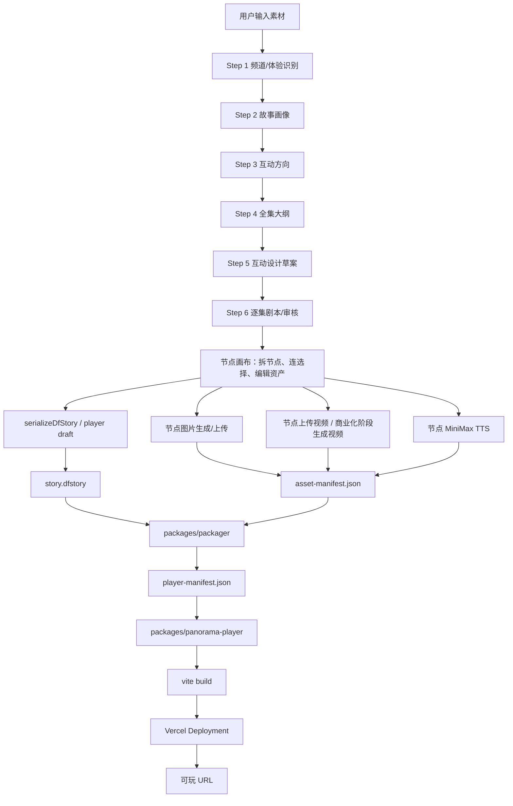

### 5.1.1 架构定稿

本项目按“创作端、节点画布、模板运行端、部署层”四层确定，不再把所有能力塞进一个应用。

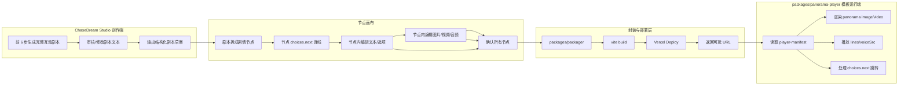

最终决策：

1. 前 6 步只负责把完整互动剧本做出来，包括故事方向、人物关系、分集大纲、互动设计草案和逐集剧本审核。
2. 前 6 步结束后进入“节点画布”。节点画布才负责把剧本拆成可玩的剧情节点，并让用户逐节点确认文本、选项、图片、视频、音频。
3. 每个节点代表一个剧情片段或选择点，必须包含剧情内容、选项、下一跳和资产槽位。
4. 图片、视频、语音不是散落的项目附件，而是挂在节点和对白上的资产。
5. 节点画布全部确认后，才调用 packager 注入 `packages/panorama-player`。
6. `packages/panorama-player` 不拉 CMS，也不直接调用 Studio 接口；它只读取构建时注入的 manifest 和静态/远程资产 URL。
7. 一键部署不是在浏览器执行 shell；主应用服务端只创建部署任务，local-codex-worker 或 Node Worker 负责调用 packager、构建和 Vercel 部署。

### 5.1.2 阶段边界定稿

为了避免概念混乱，本项目后续采用以下阶段命名：

| 阶段 | 产物 | 是否可玩 | 说明 |
|---|---|---|---|
| 前 6 步 | 完整互动剧本、互动设计草案、逐集审核结果 | 否 | 这是创作阶段，不直接部署 |
| 节点画布 | `PlayableStoryNodeDraft[]`、节点连线、节点资产槽 | 接近可玩 | 把剧本变成“节点 + 选择 + 下一跳” |
| 节点资产编辑 | 图片、视频、MiniMax 语音、文本最终版 | 接近可发布 | 每个节点单独编辑和确认 |
| 模板封装 | `player-manifest.json`、`story.json`、`characters.json`、轻量资产目录 | 是 | 注入 `packages/panorama-player` |
| Vercel 部署 | deployment、可玩 URL | 是 | 返回玩家可访问链接 |

注意：如果对标 AltFlow 文档中的 Step 5 叫“互动画板”，这里仍把它视为“互动设计草案”。本项目真正用于资产编辑和模板封装的“节点画布”是前 6 步之后的正式阶段。

### 5.2 模块边界

| 模块 | 职责 | 不负责 |
|---|---|---|
| `/studio` | 前 6 步创作、节点画布、节点资产编辑、审核、导出 `.dfstory` | 播放器运行时 |
| `src/lib/creation-flow` | Step 1-6 与节点画布类型、校验、状态转换、映射 | UI 渲染 |
| `src/store/use-creation-flow-store.ts` | 创作流程和节点画布状态持久化 | 大资产存储 |
| `src/lib/dfstory` | 最终故事协议 | 记录所有 UI 临时状态 |
| `src/lib/asset-pipeline` | 资产任务定义、prompt、回填规则 | 直接渲染播放器 |
| `packages/panorama-player` | 平面/全景双模式互动影游运行模板，包名暂沿用 panorama-player | 创作、AI 生成、部署 |
| `packages/packager` | `.dfstory + manifest -> player package` | AI 生成 |
| Deploy Service | 创建部署任务、保存部署记录、暴露状态查询 | 在浏览器暴露 token、执行长时间 build |
| Deploy Worker | 构建、上传、轮询 Vercel、写回部署结果 | 创作 UI、播放器运行时 |

### 5.2.1 当前 `panorama-player` 现实约束

`packages/panorama-player` 当前是独立的 `Vite + React + Three.js` 静态播放器，不是主应用里的 TanStack Studio。

| 项 | 当前真实情况 | 后续要求 |
|---|---|---|
| 运行入口 | `packages/panorama-player/src/main.tsx` -> `src/App.tsx` | 保持独立 SPA |
| 剧情数据 | `src/data/story.ts` 的 `storyNodes` 静态对象 | 改为读取 packager 生成的 manifest/data |
| 角色数据 | `src/data/characters.ts` 静态对象 | 改为 manifest 驱动 |
| 图片/视频 | `public/panoramas` 静态文件，代码用 `/panoramas/<file>` 引用 | v0 可内置小图；v1 大资产走 CDN URL |
| 视频判断 | `PanoramaViewer.tsx` 里按文件扩展名识别 `.mp4` | 保留，但 manifest 增加 `panoramaType` 明示 |
| 缺失素材 | 当前会显示 fallback 渐变/临时平面 | 保留 fallback，但发布检查必须 warning |
| CMS/API | 当前没有 CMS，也没有运行时接口拉剧情 | MVP 继续不做运行时 CMS |

当前 `public/panoramas` 实际存在：

- `成品.mp4`
- `s00-rain-night.jpg`
- `s01-rooftop.jpg`
- `s02-breakfast.jpg`
- `s03-cafe.jpg`
- `s04-dance-studio.jpg`
- `s05-roadshow.jpg`
- `s06-game-room.jpg`

当前 `story.ts` 已引用但本地不存在的资源包括 `s07-law-office.jpg`、`s08-planetarium.jpg`、`s09-beach.jpg`、`s10-convenience.jpg`、`s11-kitchen.jpg`、`s12-greenhouse.jpg`、`s13-livehouse.jpg`、`s14-game-expo.jpg`、`s15-storm-studio.jpg`、`s16-skybridge.jpg`、`s17-exhibition.jpg`、`e01-lin.jpg` 到 `e09-regret.jpg`。这些在当前模板中会触发 fallback。

### 5.3 前 6 步产品流程

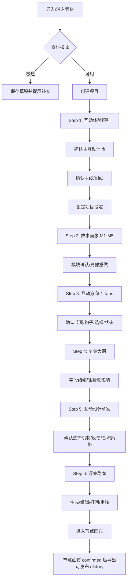

### 5.4 状态模型策略

不建议把 Step 1-6 的全部中间状态塞进当前 `usePipelineStore.context`。原因：

- `PipelineContext` 当前是专家管线摘要，只保存 `storyOutline`、`characters`、`scenes` 等粗粒度结果。
- AltFlow 式流程需要表达模块级确认、局部重做、逐集审核、revision、stale、job 状态。
- 如果复用 `usePipelineStore.context` 承载全部细节，会很快变成不可维护的大对象。

推荐新增：

- `src/lib/creation-flow/types.ts`
- `src/lib/creation-flow/validators.ts`
- `src/lib/creation-flow/step-defs.ts`
- `src/store/use-creation-flow-store.ts`

关系：

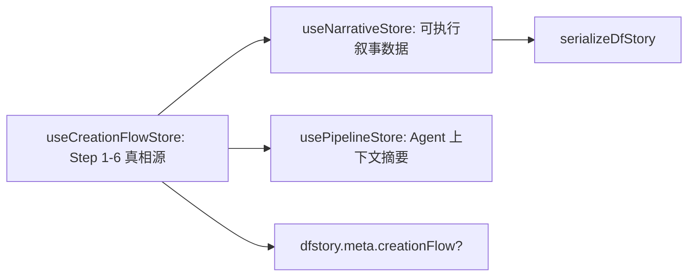

MVP 数据落点采用混合策略，不把所有数据都压在 IndexedDB，也不在第一版强行重做完整云端项目库：

| 数据 | MVP 落点 | 原因 | 后续演进 |
|---|---|---|---|
| Step 1-6 草稿、确认状态、stale、局部重做记录 | IndexedDB + `useCreationFlowStore` | 先快速完成单机创作体验，不被 DB schema 拖慢 | 商业化阶段迁入 Postgres 项目表 |
| 节点画布草稿 | IndexedDB，封装前可导出快照 | 节点编辑频繁，适合本地快速迭代 | 多人协作时迁入服务端版本表 |
| 发布快照 `ReleaseSnapshot` | 主应用服务端 DB | 正式封装/部署必须拿到不可变的 `.dfstory + asset-manifest + schema report`，不能依赖浏览器 IndexedDB | 版本化、回滚、审计 |
| 部署记录 `PanoramaDeployRecord` | 主应用服务端 DB | 公开链接、日志和状态需要跨会话查看 | 保留历史版本和回滚能力 |
| 玩家事件、反馈、自进化报告 | 主应用服务端 DB | 运行端公开链接无法写本地 IndexedDB，必须回流服务端 | 后续接分析仓库或数据报表 |
| 资产二进制 | MVP 轻量资产进构建目录，大资产后置 CDN | demo 阶段降低复杂度 | 生产接 OSS/R2/Vercel Blob |

服务端 DB 不应该只停留在类型定义。正式接入 Deploy Service、玩家回流和自进化前，必须先补最小 Drizzle schema、queries 和 migration：

| 表 | 用途 | v0-local 是否需要 | Phase 9 是否需要 |
|---|---|---|---|
| `release_snapshots` | 每次点击“封装/部署”前固化的 `.dfstory`、`asset-manifest`、schema 一致性报告和 manifest version | 否 | 是 |
| `panorama_deploy_records` | 部署任务、状态、Vercel deployment id、URL、错误摘要、Worker 锁和重试信息 | 否 | 是 |
| `deployment_targets` | 平台托管或用户自有 Vercel target 的脱敏配置，凭证只保存 `credentialRef` | 否 | 是 |
| `playtest_events` | 运行端匿名选择、进入节点、结局、放弃等批量事件 | 否 | 自进化前需要 |
| `playtest_feedback` | 通关评分、体验标签、可选文本反馈 | 否 | 自进化前需要 |
| `evolution_reports` | 按 deployment/version 聚合后的体验报告快照 | 否 | Phase 10 需要 |
| `evolution_candidates` | 人工审核的候选改版建议、Gene/Capsule 草稿 | 否 | Phase 10 需要 |

`release_snapshots` 是 Studio/IndexedDB 与后端部署链路之间的发布边界。创建 deploy record 时只引用 `snapshotId`，Worker 只读取 snapshot，不再反查浏览器里的节点画布草稿。`panorama_deploy_records` 兼任 MVP 队列表，至少需要 `snapshotId`、`status`、`lockedBy`、`lockedAt`、`attemptCount`、`nextRetryAt`、`errorMessage`。Worker 领取任务必须通过原子更新从 `queued` 变为 `packaging/building/deploying`，避免两个 Worker 同时部署同一个项目。

### 5.5 `.dfstory` 与 `player-manifest` 的关系

`.dfstory` 是创作真相源，`player-manifest` 是播放器运行配置。两者不互相替代。

| 文件 | 谁生成 | 谁消费 | 内容 |
|---|---|---|---|
| `.dfstory` | Studio | Packager、Studio、外部工具 | 故事、角色、节点、变量、互动、剧本、资产引用 |
| `asset-manifest.json` | 资产生成服务 | Packager、Studio | 图片/视频/音频 URL、provider、状态、成本 |
| `player-manifest.json` | Packager | `panorama-player` | 播放器所需的节点、角色、变量、主题、启动配置 |
| `release-snapshot` | Studio 发布页 | Deploy Service、Deploy Worker、Packager | 固化的 `.dfstory + asset-manifest + schema report + metadata` |

正式可发布 `.dfstory` 的生成前置条件是 `NodeCanvasState.status = "confirmed"`。Step 6 审核通过后可以生成 draft export 供调试，但不能进入 Packager、Vercel 部署或公开链接。

正式部署必须先创建 `release-snapshot`，再基于 `snapshotId` 执行封装和部署。这样可以避免部署任务运行时浏览器 IndexedDB 已变化、刷新丢失、或用户继续编辑节点画布导致线上版本和 UI 当前状态不一致。

### 5.5.1 剧本节点化规则

前 6 步完成后，系统必须把剧本转成统一的 `PlayableStoryNode`。这个节点是后续图片、视频、语音、选择跳转和部署的唯一挂载单位。

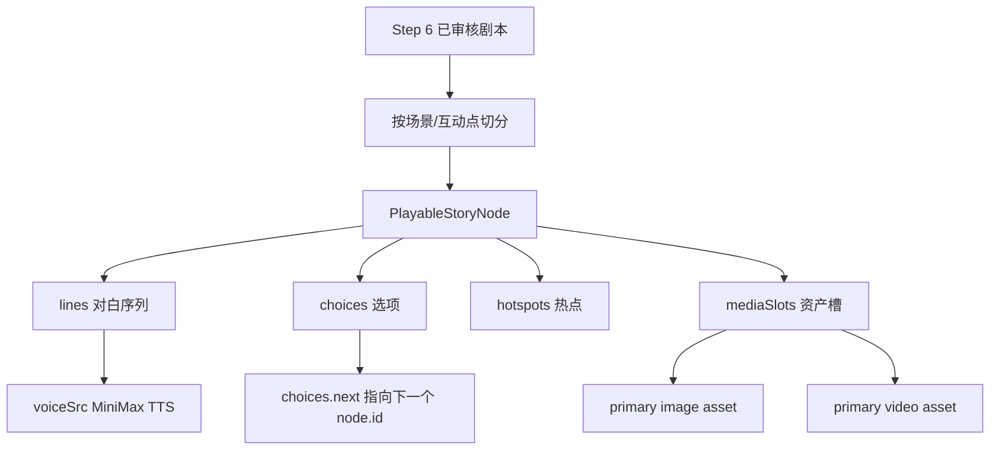

节点最小要求：

| 字段 | 是否必需 | 用途 |
|---|---|---|
| `id` | 必需 | 节点唯一 ID，所有 `choice.next` 必须引用它 |
| `chapter` | 必需 | 展示章节和回溯来源 |
| `episodeNumber` | 必需 | 关联 Step 4/6 的集数 |
| `title` | 必需 | 场景标题 |
| `location` | 必需 | 场景地点 |
| `synopsis` | 必需 | 节点摘要，用于生成图片/视频 prompt |
| `lines` | 必需 | 对白和旁白 |
| `choices` | 条件必需 | 非结局节点至少 1 个选择，线性节点可以只有默认下一跳 |
| `mediaSlots.image` | 必需 | 节点主图片槽位；v0/v1 默认平面图，缺失可 fallback 但发布 warning |
| `mediaSlots.video` | 可选 | 关键节点视频槽位 |
| `hotspots` | 可选 | 全景可点击信息点 |
| `ending` | 可选 | 结局节点信息 |

选择最小要求：

| 字段 | 是否必需 | 用途 |
|---|---|---|
| `id` | 必需 | 选项唯一 ID |
| `label` | 必需 | 玩家看到的选择文案 |
| `caption` | 可选 | 选择补充说明 |
| `next` | 必需 | 下一个节点 ID |
| `effect` | 推荐必需 | 变量、关系、flag、memory 变化 |
| `condition` | 可选 | 显示条件 |

硬规则：

1. `choices[].next` 必须指向存在的 node id。
2. 非结局节点不能没有出边；如果是线性推进，也要生成一个隐式默认选择或 edge。
3. 每个关键选择至少要有一个 `effect`，否则玩家选择没有反馈。
4. 每个节点都要能生成图片 prompt；视频和语音可按成本策略跳过。
5. 节点图必须能从 `startNodeId` 走到至少一个结局。

### 5.5.2 节点资产完成规则

每个节点有三个资产完成层级：

| 层级 | 要求 | 可发布性 |
|---|---|---|
| `draft` | 有节点文本、选项和下一跳，无真实资产 | 只允许 Studio 预览 |
| `image_ready` | 有节点主图片 URL 或明确 fallback | 可发布图文互动版 |
| `voice_ready` | 关键对白有 MiniMax `voiceSrc` | 可发布语音版 |
| `video_ready` | 关键节点有 `.mp4` 或视频 URL | 可发布视频增强版 |

MVP v0 的部署门槛是 `image_ready` 或 fallback accepted，不要求每个节点都有视频和语音。

### 5.5.3 资产存储决策

资产存储分 MVP 和生产两种模式。MVP 阶段为了快速验证闭环，允许轻量测试资产随 `panorama-player` 一起打包部署到 Vercel；生产阶段或遇到大资产时，再切换到对象存储/CDN。

| 资产类型 | MVP 存储 | 生产存储 | 说明 |
|---|---|---|---|
| 模板 demo jpg/mp4 | `packages/panorama-player/public/panoramas` | 仍可保留少量 demo | 当前约 5.3MB，可接受 |
| 每个项目生成的轻量主图片 | `.chasedream-build/<projectId>/player/public/assets/nodes/<nodeId>/main-image.jpg` | OSS/R2/Vercel Blob + CDN | MVP 可随 Vercel 静态包部署；默认平面图 |
| 小体积 TTS mp3 | `.chasedream-build/<projectId>/player/public/assets/nodes/<nodeId>/lines/<lineId>.mp3` | OSS/R2/Vercel Blob + CDN | MVP 可随包部署 |
| 上传视频 mp4 | 只允许小样片随包；超过阈值必须 CDN | OSS/R2 + CDN | MVP/demo 阶段只上传视频；商业化阶段再接视频生成 API |
| `asset-manifest.json` | 构建目录 | DB + 构建目录快照 | 记录 URL、provider、promptHash、状态 |
| `player-manifest.json` | 构建目录 | 构建目录 + deploy record | 播放器运行真相源 |

MVP 构建目录路径：

```text
.chasedream-build/<projectId>/
  player/
    public/
      assets/
        nodes/
          <nodeId>/
            main-image.jpg
            main-video.mp4
            lines/
              <lineId>.mp3
    src/
      data/
        generated/
          asset-manifest.json
          player-manifest.json
          story.json
          characters.json
```

MVP 里 manifest 可以写相对 URL：

```json
{
  "nodeId": "ep01-s01-rain-night",
  "imageUrl": "/assets/nodes/ep01-s01-rain-night/main-image.jpg",
  "voice": {
    "line-001": "/assets/nodes/ep01-s01-rain-night/lines/line-001.mp3"
  }
}
```

生产对象存储路径：

```text
object-storage://chasedream-assets/
  projects/<projectId>/
    nodes/<nodeId>/
      main-image.jpg
      main-video.mp4
      lines/<lineId>.mp3
    manifests/
      asset-manifest.json
      player-manifest.json
```

生产 URL 进入播放器时必须是 HTTPS CDN URL，例如：

```json
{
  "nodeId": "ep01-s01-rain-night",
  "imageUrl": "https://cdn.example.com/projects/p1/nodes/ep01-s01-rain-night/main-image.jpg",
  "videoUrl": "https://cdn.example.com/projects/p1/nodes/ep01-s01-rain-night/main-video.mp4",
  "voice": {
    "line-001": "https://cdn.example.com/projects/p1/nodes/ep01-s01-rain-night/lines/line-001.mp3"
  }
}
```

切换规则：

| 条件 | 使用模式 |
|---|---|
| MVP demo、小于配置阈值的图片和音频 | 随 Vercel 静态包部署 |
| 单个视频超过阈值 | 上传对象存储/CDN |
| 整个 deployment bundle 超过阈值 | 全部大资产切换 CDN |
| 需要跨部署复用资产 | CDN |
| 需要频繁替换资产但不想重新部署 | CDN |

建议初始阈值：

- 单图片：不超过 2MB 可随包。
- 单音频：不超过 2MB 可随包。
- 单视频：不超过 10MB 可随包；超过直接 CDN。
- 整个 Vercel 静态包：建议控制在 50MB 以内。

### 5.6 Packager 策略

`packages/packager` 应做纯转换，不依赖 React。

输入：

- `release-snapshot` 中固化的 `.dfstory`
- `release-snapshot` 中固化的 `asset-manifest.json`
- `packager.config.json`

输出：

- `packages/panorama-player/src/data/generated/story.json`
- `packages/panorama-player/src/data/generated/characters.json`
- `packages/panorama-player/src/data/generated/player-manifest.json`
- bundled 模式下的 `packages/panorama-player/public/assets/**`
- 或构建时复制到临时目录，不直接修改模板源码。

推荐初始实现使用临时工作目录：

```text
.chasedream-build/<projectId>/
  player/
    package.json
    src/
      data/
        generated/
          player-manifest.json
          story.json
          characters.json
    public/
      assets/
        nodes/
          <nodeId>/
```

这样模板源码保持干净，每次部署用临时包构建。

包管理决策：

1. v0 不引入 monorepo workspace，避免重写根依赖安装方式和锁文件。
2. `packages/packager` 按现有 `packages/panorama-player` 的模式做独立 npm package，使用 `npm --prefix packages/packager ...` 执行 build/test。
3. 根 `package.json` 只增加委托脚本，例如 `packager:install`、`packager:test`、`packager:build`、`v0:local`，不要求 `bun install` 管理子包依赖。
4. `packages/packager` 不依赖 React，不导入 Studio UI；它只读 JSON、校验 schema、复制模板和生成临时构建目录。
5. 如果后续 `packages/*` 数量继续增长，再单独评估迁移到 workspace；迁移不应混入 v0 本地闭环。

### 5.7 本地优先与 Vercel 部署策略

MVP 分两段执行：先跑本地可玩闭环，再跑部署 smoke。Deploy Service 和队列不应该阻塞 Phase -1 的本地验证。

| 阶段 | 目标 | 执行方式 | 明确不做 |
|---|---|---|---|
| v0-local | 证明 fixture manifest 能驱动播放器 | `packages/packager` 生成临时 player，启动或构建 `packages/panorama-player`，本地试玩 | 不调 Vercel、不写 deploy DB、不要求 Worker |
| v0-deploy-smoke | 证明本地产物可部署到公网 | 本机脚本或 local-codex-worker 使用现有 Vercel 配置部署一次 | 不做用户自有 Vercel、不做队列化多租户 |
| 正式 MVP | 产品化一键部署 | Deploy Service 创建 queued record，Node Worker 领取任务并部署 | 不在普通请求里执行完整 build/deploy |

MVP 的部署阶段推荐 Deploy Service 创建部署任务，再由 local-codex-worker 或 Node Worker 调 Vercel API/CLI，不在浏览器执行部署。但在 v0-local 阶段，只要求生成 manifest、构建播放器和完成本地试玩。

MVP bundled 模式下，`player/public/assets/**` 会进入 Vite 静态构建产物，并随 Vercel deployment 一起上传；播放器 manifest 里引用 `/assets/...`。生产或大资产模式下，Vercel 只部署源码和 manifest，图片、视频、音频引用 HTTPS CDN URL。

部署账号策略分两阶段：

| 阶段 | 模式 | 账号来源 | 用户是否需要配置 | 部署目标 | 适用场景 |
|---|---|---|---|---|---|
| MVP/demo | `platform-hosted` | 当前 ChaseDream 服务端环境变量、本机 Vercel link 或已授权的 Vercel Team | 否 | 平台控制的 Vercel project 或临时 preview deployment | 内部 demo、快速验证、样例项目 |
| 商业化 | `user-owned` | OAuth 授权用户自己的 Vercel Team/Project；手动 Token 只作为高级备用 | 是 | 用户自己的 Vercel project/team | 客户交付、自有域名、独立配额 |

部署执行策略也分两阶段：

| 阶段 | 执行器 | 说明 | 不做什么 |
|---|---|---|---|
| MVP/demo | `local-codex-worker` 或本机 Node 进程 | 沿用当前本机/Codex 已授权 Vercel 环境，先把“封装 -> 部署 -> 返回链接”跑通 | 不先做多租户 Worker、不做用户 Vercel OAuth |
| 正式 MVP | `node-worker` + queue | 主应用服务端只创建 deploy job；独立 Worker 执行 packager、build、Vercel deploy、轮询和日志写入 | 不把 build/deploy 长任务放进普通 server function |
| 商业化 | `node-worker` + user-owned target | Worker 根据 `deploymentTargetId` 读取服务端加密凭证或 OAuth token，部署到用户自己的 Vercel | 不让浏览器持有 Token |

当前已部署的 `https://meinubeibaoweila.vercel.app/` 作为播放器模板 demo 地址，用于验证 `packages/panorama-player` 的运行效果。它不应该成为所有生成游戏的固定覆盖地址；一键部署默认应为每次封装产物创建新的 deployment URL，只有用户明确选择“重新部署到 demo project”时才覆盖该演示项目。

主应用自身的 CI/CD 和生成游戏的一键部署分开处理：

| 对象 | 推荐机制 | 原因 |
|---|---|---|
| `chasedream-ai-studio` 主应用 | GitHub/Vercel Git Integration 或现有 Vercel 项目 CI | 主应用是固定代码仓库，适合 push/PR 自动部署 |
| 用户生成的互动影游 | Deploy Service 创建任务，Deploy Worker 动态打包后调用 Vercel CLI/API | 生成物来自画布、manifest 和资产，不适合为每个游戏创建 Git repo |

前端按钮只提交部署请求：

```text
用户点击“部署到 Vercel”
  -> 如还没有 snapshot，先 POST /api/panorama/release-snapshots
  -> POST /api/panorama/deploy { snapshotId, environment, deploymentTargetId? }
  -> 服务端创建引用 snapshotId 的 queued deploy record
  -> Deploy Service 解析 deploymentTargetId
  -> MVP 未传 deploymentTargetId 时使用 platform-hosted 默认目标
  -> 后续 user-owned 模式读取服务端加密凭证
  -> local-codex-worker / node-worker 获取 deploy job
  -> Worker 读取 release snapshot
  -> Packager 基于 snapshot 生成临时 player
  -> Vercel CLI/API 创建 deployment
  -> 返回可玩 URL
```

安全边界：

1. 浏览器不能持有 `VERCEL_TOKEN`，也不能执行 `vercel deploy`。
2. `deploymentTargetId` 是前端可见的配置引用，不是凭证。
3. `DeploymentTargetConfig.credentialRef` 只能指向服务端密钥存储，不得写入 IndexedDB、manifest、播放器包或部署产物。
4. MVP 可以依赖当前本机/服务端已配置的 Vercel link 简化流程；进入多人协作或商业化后，必须改为服务端配置表和 Worker 队列。
5. `src/server/functions/panorama-deploy.ts` 的职责是创建部署任务和返回 deploy record，不负责在请求生命周期内完成完整 build + deploy。

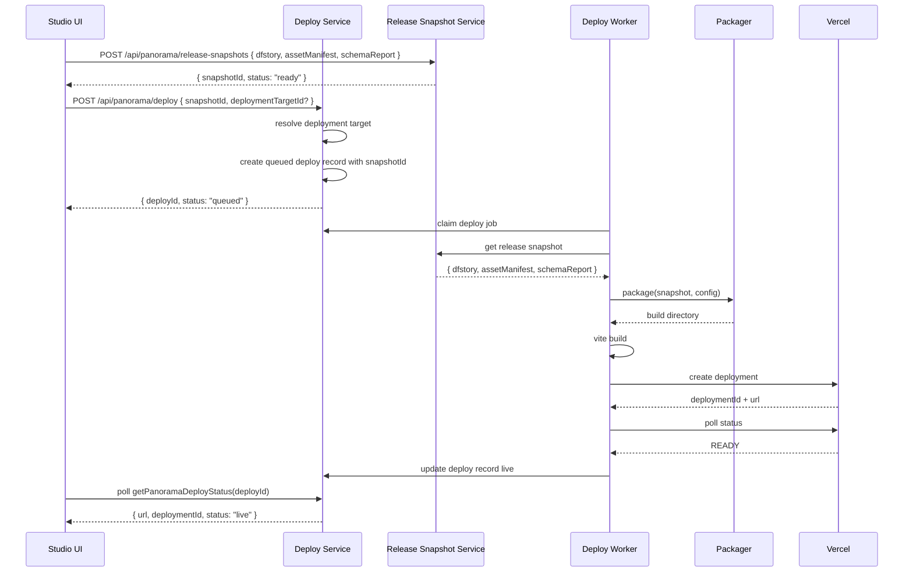

### 5.8 Provider 接入策略

Provider 分为四类：文本大模型、图片生成、音频生成、视频上传/商业化视频生成。所有 provider 都必须通过服务端 adapter 接入，前端节点画布只创建任务和展示状态。

截至 2026-06-19 的默认安排：

| 能力 | 默认 provider | 用途 | 接入方式 | 关键约束 |
|---|---|---|---|---|
| 前 6 步文本生成 | DeepSeek | Step 1-6 的结构化剧本、互动设计草案、单集剧本 | OpenAI-compatible Chat Completions | 使用服务端 `DEEPSEEK_API_KEY`；优先使用当前模型名，不把即将弃用模型名写死 |
| 节点图片生成 | Image 2 | 第一阶段生成节点平面关键图；全景图和可选重绘后续开放 | OpenAI-compatible Images API | `IMAGE2_BASE_URL` 可配置；用户手动上传时跳过 API |
| 节点音频生成 | MiniMax | 单句对白 TTS、角色音色绑定 | MiniMax T2A API | 使用 `voice_id` 绑定角色；临时 URL 或 hex 音频必须持久化 |
| 节点视频 | 手动上传视频 | demo 阶段关键节点视频增强 | 上传 mp4 并绑定到节点 | MVP 不接视频生成 API，不需要视频 API Key；商业化阶段再接 Seedance 2.0 或其它视频 provider |

Provider 文档参考：

| Provider | 文档 | 实施前检查 |
|---|---|---|
| DeepSeek | `https://api-docs.deepseek.com/zh-cn/` | 当前 DeepSeek 文档显示兼容 OpenAI/Anthropic API；模型名要跟随官方最新列表，避免写死即将弃用模型。 |
| Image 2 | `https://s.apifox.cn/745ae879-1acd-4054-a0c1-c1020b6f34e5` | 用户给定 BaseURL 为 `https://api.suanli.cn`，公开文档示例端点可能不同；实现前必须用 provider 控制台或实际 curl 验证 BaseURL、path、model。 |
| MiniMax | `https://platform.minimaxi.com/docs/guides/models-intro` | TTS 需确认 `voice_id`、输出格式、URL 有效期、并发限制。 |
| Seedance 2.0 | 待定 | MVP 不需要；商业化阶段再确认具体 API、key、计费、回调和输出格式。 |

密钥和 BaseURL 只允许放在服务端环境变量：

```env
DEEPSEEK_API_KEY=
DEEPSEEK_BASE_URL=https://api.deepseek.com
DEEPSEEK_MODEL=deepseek-v4-pro

IMAGE2_API_KEY=
IMAGE2_BASE_URL=https://api.suanli.cn
IMAGE2_MODEL=gpt-image-2

MINIMAX_API_KEY=
MINIMAX_GROUP_ID=
MINIMAX_BASE_URL=https://api.minimaxi.com
MINIMAX_TTS_MODEL=speech-2.8-hd

# MVP/demo 阶段不需要视频生成 API key。
# 商业化阶段再开启以下配置。
VIDEO_PROVIDER=
SEEDANCE_API_KEY=
SEEDANCE_BASE_URL=
SEEDANCE_MODEL=
```

不要把 Demo Key 写入 `.env.example`、Markdown、测试 fixture、manifest 或前端代码。如果 Demo Key 已经在聊天或文档中暴露，正式接入前应在 provider 平台更换密钥。

Provider 适配器建议统一成以下接口：

```ts
export interface TextModelProvider {
  generateStructuredText(input: TextGenerationInput): Promise<TextGenerationResult>;
}

export interface ImageGenerationProvider {
  generateNodeImage(input: GenerateNodeImageInput): Promise<GeneratedAssetResult>;
}

export interface VoiceGenerationProvider {
  generateLineVoice(input: GenerateLineVoiceInput): Promise<GeneratedAssetResult>;
}

export interface VideoGenerationProvider {
  generateNodeVideo(input: GenerateNodeVideoInput): Promise<GeneratedAssetResult>;
}

export interface GeneratedAssetResult {
  provider: string;
  model: string;
  source: "ai-generated";
  temporaryUrl?: string;
  binary?: ArrayBuffer;
  mimeType: string;
  width?: number;
  height?: number;
  durationSeconds?: number;
  promptHash?: string;
  cost?: number;
  raw?: unknown;
}
```

适配器落地规则：

1. DeepSeek 用于文本结构化生成，不直接写播放器 manifest。
2. Image 2 只负责产出图片结果，结果必须进入 AssetStorageClient，再由 asset manifest 记录最终 URL。
3. MiniMax TTS 如果返回 hex 音频，服务端必须转成 mp3 文件并写入 MVP bundle 或对象存储；如果返回 URL，必须判断有效期，短期 URL 不能直接给播放器长期使用。
4. MVP/demo 阶段视频只走手动上传，`VideoGenerationProvider` 可以先保留接口但不启用，也不要求配置视频 API key。
5. 商业化阶段再确认 Seedance 2.0 或其它视频 provider 的具体 API、价格、速率限制和输出格式。
6. 手动上传优先级高于 API 生成。节点已有用户上传资产时，批量生成任务默认跳过该槽位，除非用户明确点击“重新生成并替换”。

### 5.9 EvoMap/Evolver 自进化策略

EvoMap/Evolver 在本项目中的定位是“经验资产层”和“自进化编排层”，不是 DeepSeek、Image 2、MiniMax、Seedance 的替代品。底层模型 API 仍由本项目 provider adapter 调用，EvoMap 负责沉淀什么策略有效、什么失败样本需要避免、下一版应该如何改。

MVP 只接入两条自进化主线：

| 主线 | 输入信号 | 输出 | 是否自动应用 |
|---|---|---|---|
| Step 1-6 文本创作质量提升 | AI 输出、用户改稿、审核通过、打回原因、最终确认版本 | prompt 改进建议、结构化创作策略、候选 Gene/Capsule | 否，必须人工审核 |
| 玩家行为与体验回流 | 匿名选择路径、结局、停留/放弃点、评分、标签、文本反馈 | 体验报告、问题节点、选择热力、下一版改版建议 | 否，必须人工审核 |

不进入 MVP 自进化的环节：

- 图片生成自动调参。
- MiniMax 音色自动切换。
- 视频生成 API。
- `panorama-player` 模板自动变更。
- 线上已部署版本自动改剧情或素材。

自进化闭环：

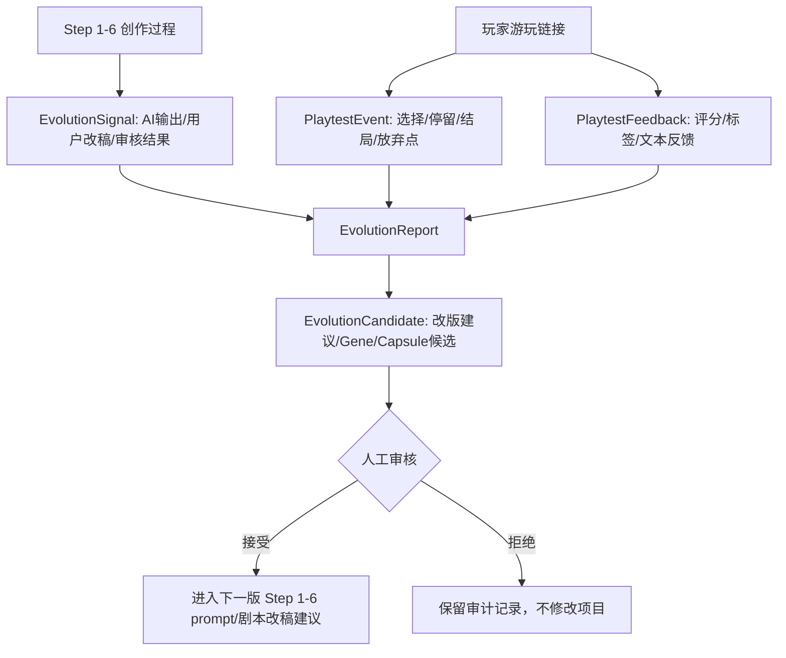

Evolver 运行模式：

| 阶段 | 模式 | 说明 |
|---|---|---|
| MVP | 人工审核模式 | Evolver 只生成建议和候选 Gene/Capsule，不自动写文件、不自动发布 Hub。 |
| 后续增强 | 本地沉淀模式 | 稳定策略可写入本地 Gene/Capsule，但仍不自动改线上内容。 |
| 商业化 | Hub 协作模式 | 启动 Proxy/登录 Hub 后可搜索、复用、发布资产；任何 Credit 消耗和发布都需人工确认。 |

当前环境检查结论：

- Evolver CLI 已存在，当前仓库是 git workspace。
- Evolver Proxy 未启动，默认 `http://127.0.0.1:19820` 当前不可达。
- 当前 Hub 同步 dry-run 未发现可同步的已购买或已发布资产。
- 文档可参考 `/Users/ruoyu/Documents/codex/evomap-content-media-capabilities.md` 中列出的 Gene/Capsule 方向，但 MVP 不依赖在线 Hub 搜索。

数据落点：

- 玩家行为、评分和反馈先写主应用 DB。
- Studio 侧从 DB 生成报告。
- Evolver 根据报告产出候选建议。
- 候选建议进入人工审核状态，不直接写回 Step 1-6 或 `panorama-player`。

### 5.10 MVP v0 本地最短闭环

MVP v0 不重写完整前 6 步，也不接自进化。它先验证“现有内容能否变成本地可玩的播放器”，本地通过后再单独做 Vercel 部署 smoke。

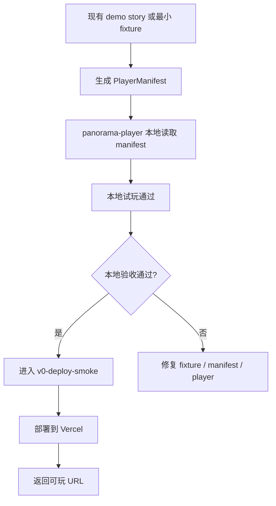

v0 交付标准：

| 项 | 验收 |
|---|---|
| 数据 | 不依赖完整 Step 1-6，允许使用现有 `packages/panorama-player/src/data/story.ts` 或一份最小 fixture 转换 |
| 播放器 | 能从 manifest 启动、进入起始节点、点击选择、跳转到下一节点或结局 |
| 资产 | 使用现有 demo 图/视频或少量手动上传资产，不批量调用生成 API |
| 本地门禁 | `small-3-node` 本地试玩通过后，才能进入部署 smoke |
| 部署 smoke | 本地通过后返回一个公网 URL，打开后能玩 |
| 记录 | 本地阶段保存 manifest 版本、构建方式和耗时；部署 smoke 额外保存 deploy URL、deployment id 和部署耗时 |
| 不做 | 不做完整节点画布、不做自进化、不做视频生成、不做用户自有 Vercel |

### 5.10.1 平面图/全景图双模式策略

播放器模板长期支持两种视觉模式，但第一阶段先做平面图。

| 模式 | 协议字段 | 资产要求 | 渲染方式 | 阶段 |
|---|---|---|---|---|
| 平面图模式 | `visualMode = "flat"`，`projection = "planar"` | 普通 16:9、9:16 或项目设定比例图片 | 作为平面背景/舞台图显示，支持 cover/contain、字幕、选择按钮、热点可选 | v0/v1 默认 |
| 全景图模式 | `visualMode = "panorama"`，`projection = "equirectangular"` | 真正 equirectangular 2:1 图片或视频 | Three.js 球面内侧贴图，支持拖拽、陀螺仪、yaw/pitch 热点 | v0.5 spike 后可选 |

第一阶段的实现原则：

1. `packages/panorama-player` 可以继续沿用包名，但 runtime 不能假设所有图片都是全景图。
2. `PlayerStoryNode` 必须写明 `visualMode` 和 `projection`；缺省值按 `flat/planar` 处理。
3. Step 7 默认生成平面剧情关键图，不要求 2:1，也不要求 equirectangular。
4. 用户上传现成平面图时，可以直接绑定节点并发布，不调用全景图生成 API。
5. 全景模式是节点级能力，不要求整部作品所有节点都用全景；一部作品可以平面节点和全景节点混用。
6. 全景图 spike 不阻塞平面图 MVP；它只决定后续是否开放批量全景图生成和陀螺仪体验。
7. 第一个 demo 不验收全景生成，不要求全景图片或全景视频；只要平面图、文本、选择、音频/上传视频、封装和 Vercel 链接跑通即可。
8. 第一个 demo 跑通后，全景图片和全景视频优先走“用户自制后上传”路径：图片推荐 `4096x2048` 或 `8192x4096`，视频推荐 `3840x1920` 或 `4096x2048`，都必须保持 2:1。
9. 上传自制全景资产时，系统只负责校验、绑定和播放，不调用 Image 2 或视频生成 API；不符合 2:1 的文件必须阻止全景绑定，用户确认后才可按 `flat/planar` 平面资产绑定。

### 5.11 全景图技术 Spike

全景图 spike 的目的不是把图片拼成 3D 模型，也不是第一阶段必须完成的图片能力。它只用于验证候选图片模型能否生成可作为 Three.js 球面内侧贴图使用的 equirectangular panorama。

核心概念：

| 概念 | 说明 |
|---|---|
| 普通 2:1 图片 | 只是宽高比为 2:1 的平面图，左右边缘通常不连续，贴到球面会有接缝和拉伸 |
| Equirectangular 全景图 | 一张 2:1 的球面展开纹理，左右边缘应无缝衔接，上下极点畸变可控 |
| Three.js 全景渲染 | 把 equirectangular 图片作为纹理贴到球体内侧，玩家站在球心看四周 |
| 多图拼接 | 用多张真实相机照片 stitch 成全景；这是另一条路线，不是文生图 spike 的默认路线 |

Spike 步骤：

1. 选 2-3 个候选 provider 或模型，例如 Image 2、可灵/即梦、其它支持 360 panorama 的模型。
2. 为同一场景写 3 条 prompt：室内、室外、人物近景场景。每条都明确要求 `equirectangular 360 panorama, seamless left-right edge, 2:1, no cropped subject, no text`。
3. 每个 provider 生成至少 3 张 4096x2048 或模型可支持的最高 2:1 图片。
4. 做静态检查：尺寸、左右边缘相似度、中心主体是否被拉伸、上下极点是否严重扭曲。
5. 把图片放进 `packages/panorama-player/public/panoramas` 或临时 `/assets/spike/`。
6. 用 `PanoramaViewer` 或一个最小 Three.js sphere 页面加载图片，桌面和手机各看一次。
7. 检查：水平旋转一圈是否明显断裂，抬头/低头是否眩晕，人物是否被球面拉坏，热点区域是否可读。
8. 记录结果到 `docs/superpowers/spikes/panorama-generation-spike.md`，每张图给出 `pass / usable-with-fallback / fail`。

通过标准：

| 标准 | 通过条件 |
|---|---|
| 接缝 | 左右边缘贴到球面后不出现明显硬切线 |
| 极点 | 天花/天空/地面在上下视角不出现严重破碎 |
| 主体 | 角色或关键物体不被拉成不可接受的形变 |
| 沉浸感 | 桌面和移动端旋转查看不明显眩晕或破图 |
| 成本 | 单张成本和耗时可接受，失败率可被重试策略覆盖 |

如果 spike 不通过，MVP 的图片策略应降级为：

| 降级方案 | 说明 |
|---|---|
| 平面背景模式 | `panorama-player` 支持非 360 的平面/半景背景，不强贴球面 |
| 模板 demo 全景 | 先使用少量人工制作或现有合格全景素材 |
| 人工上传优先 | 用户上传真实 equirectangular 图片，AI 只生成普通关键图或风格参考 |

### 5.12 播放器发布架构 Spike

当前蓝图默认 build-per-game：每个游戏生成临时 player、执行 Vite build、部署 Vercel。量产场景需要额外评估 runtime-manifest 架构。

| 方案 | 工作方式 | 优点 | 风险 |
|---|---|---|---|
| A: build-per-game | 每个游戏复制模板、注入 manifest、重新 build/deploy | 每个游戏可独立站点、离线静态、自定义域名简单 | 慢、重、每次都构建 Three.js/Vite、资产包容易大 |
| B: runtime-manifest | 播放器部署一次，访问 `/play/<gameId>` 时 fetch manifest 和资产 URL | 发布快、只上传 JSON/资产、适合大量游戏 | 需要公网 manifest/CDN、CORS、运行时错误兜底 |

Spike 要求：

1. 基于 v0 已跑通的真实 `player-manifest.json` 再做，不使用手写伪 manifest。
2. 用 `small-3-node` 和 `scale-80-node` 两份 manifest 分别跑 A/B 两种路径。
3. 记录从点击发布到可玩 URL 的耗时、构建产物体积、Vercel 上传耗时和首次打开耗时。
4. 验证手机端打开速度、缓存更新、manifest 404、资产 404、跨域失败。
5. 如果 B 通过，v1 以后默认采用“播放器部署一次 + gameId 拉 manifest”；A 保留给每游戏独立站点或客户自定义域名。

### 5.13 播放器交互 Spike

播放器必须在 v0.5 验证三类浏览器行为。该 spike 需要基于 v0 可运行 player 和真实 manifest 执行，避免只验证孤立 demo 页面：

| 问题 | Spike 内容 | 通过标准 |
|---|---|---|
| 音频自动播放 | 首页增加“开始体验”按钮，点击后解锁 AudioContext、BGM、TTS | 桌面 Chrome/Safari、iOS Safari、Android Chrome 均可在点击后播放 |
| TTS 时序 | 定义一句话播放、跳过、快速点击、切换节点时的行为 | 不出现多句音频叠加；切换节点会停止或淡出上一句 |
| iOS 陀螺仪权限 | 在用户手势后调用 `DeviceOrientationEvent.requestPermission()` | iOS Safari 可授权；拒绝时降级为拖拽视角 |

这三个问题不解决，MiniMax TTS、BGM、全景陀螺仪体验都会在真实手机上不稳定。

---

## 6. 数据结构变化

### 6.1 新增 `CreationFlowState`

文件：`src/lib/creation-flow/types.ts`

```ts
export type CreationStepId =
  | "material"
  | "step1_experience"
  | "step2_story_profile"
  | "step3_interaction_direction"
  | "step4_series_outline"
  | "step5_interaction_draft"
  | "step6_episode_script"
  | "node_canvas";

export type StepStatus =
  | "locked"
  | "pending"
  | "running"
  | "needs_review"
  | "confirmed"
  | "stale"
  | "failed";

export interface CreationFlowState {
  projectId: string;
  currentStepId: CreationStepId;
  material: MaterialInputState;
  steps: {
    step1: Step1ExperienceState;
    step2: Step2StoryProfileState;
    step3: Step3InteractionDirectionState;
    step4: Step4SeriesOutlineState;
    step5: Step5InteractionDraftState;
    step6: Step6EpisodeScriptState;
  };
  nodeCanvas: NodeCanvasState;
  revisions: FlowRevision[];
  jobs: Record<string, GenerationJob>;
  updatedAt: string;
}
```

### 6.2 Step 1 数据

```ts
export interface Step1ExperienceState {
  status: StepStatus;
  candidates: InteractiveExperienceCandidate[];
  selectedExperienceId?: string;
  mainLine?: string;
  sideLines: string[];
  projectSettings: {
    episodeCount: number;
    episodeDurationMinutes: number;
    platform: "douyin" | "kuaishou" | "hongguo" | "fanqie" | "other";
    audience: string;
    tone: string;
  };
  analysisCards: Step1AnalysisCard[];
  confirmedAt?: string;
}
```

### 6.3 Step 2 数据

```ts
export interface Step2StoryProfileState {
  status: StepStatus;
  modules: {
    overview: StoryProfileModule;
    narrativeArc: StoryProfileModule;
    coreExperience: StoryProfileModule;
    relationshipMap: StoryProfileModule;
    interactionOpportunities: StoryProfileModule;
  };
  moduleFeedback: Record<string, "accepted" | "needs_change">;
  confirmedAt?: string;
}
```

### 6.4 Step 3 数据

```ts
export interface Step3InteractionDirectionState {
  status: StepStatus;
  tabs: {
    rhythm: InteractionDirectionTab;
    hooks: InteractionDirectionTab;
    choiceMechanics: InteractionDirectionTab;
    stateFeedback: InteractionDirectionTab;
  };
  heatmap: EpisodeInteractionHeatmapEntry[];
  variables: VariableDesignDraft[];
  confirmedAt?: string;
}
```

### 6.5 Step 4 数据

```ts
export interface Step4SeriesOutlineState {
  status: StepStatus;
  arcStages: SeriesArcStage[];
  episodes: EpisodeOutline[];
  cascadeWarnings: CascadeWarning[];
  confirmedAt?: string;
}
```

### 6.6 Step 5 数据

```ts
export interface Step5InteractionDraftState {
  status: StepStatus;
  choiceMechanics: InteractionMechanicDraft[];
  feedbackRules: StateFeedbackRuleDraft[];
  branchMergeStrategy: BranchMergeStrategyDraft;
  variableEffects: VariableEffectDraft[];
  episodeInteractionNotes: EpisodeInteractionNote[];
  riskWarnings: InteractionRiskWarning[];
  confirmedAt?: string;
}
```

Step 5 只输出互动设计草案，包括选择机制、反馈规则、合流策略、数值影响和每集互动密度。它不是最终可玩节点画布，也不直接写入播放器模板。

### 6.6.1 前六步后的节点画布数据

前 6 步审核通过后，系统把完整剧本切成可玩的节点画布。节点画布才是“一个节点是什么故事、有哪些选择、选择后去哪个节点、节点绑定哪些图片/视频/音频”的正式数据结构。

```ts
export interface NodeCanvasState {
  status: "empty" | "generated" | "editing" | "needs_fix" | "confirmed";
  startNodeId?: string;
  nodes: PlayableStoryNodeDraft[];
  edges: PlayableStoryEdgeDraft[];
  validation: {
    unreachableNodeIds: string[];
    deadEndNodeIds: string[];
    missingTargetChoiceIds: string[];
    missingRequiredAssetSlotIds: string[];
  };
  generatedFrom: {
    step5RevisionId: string;
    step6RevisionIds: string[];
  };
  confirmedAt?: string;
}

export interface PlayableStoryEdgeDraft {
  id: string;
  sourceNodeId: string;
  choiceId: string;
  targetNodeId: string;
}
```

节点合同：

```ts
export interface PlayableStoryNodeDraft {
  id: string;
  episodeNumber: number;
  chapter: string;
  title: string;
  location: string;
  synopsis: string;
  sourceOutlineId?: string;
  sourceScriptBlockIds: string[];
  lines: PlayableDialogueLineDraft[];
  choices: PlayableChoiceDraft[];
  hotspots: PlayableHotspotDraft[];
  mediaSlots: NodeMediaSlots;
  ending?: {
    title: string;
    subtitle: string;
    type: "romance" | "growth" | "team" | "regret" | "good" | "bad" | "neutral" | "secret";
  };
}

export interface PlayableChoiceDraft {
  id: string;
  label: string;
  caption?: string;
  next: string;
  effect?: {
    variables?: Record<string, number>;
    flags?: string[];
    memories?: string[];
    route?: string | null;
  };
  condition?: {
    flags?: string[];
    missingFlags?: string[];
    minVariable?: Array<{ key: string; value: number }>;
    maxVariable?: Array<{ key: string; value: number }>;
  };
}

export interface NodeMediaSlots {
  image: NodeMediaSlot;
  video?: NodeMediaSlot;
  bgm?: NodeMediaSlot;
  ambient?: NodeMediaSlot;
}

export interface NodeMediaSlot {
  slotId: string;
  nodeId: string;
  mediaType: "image" | "video" | "audio" | "tts";
  visualMode?: "flat" | "panorama";
  projection?: "planar" | "equirectangular";
  aspectRatio?: "16:9" | "9:16" | "2:1" | "auto";
  fit?: "cover" | "contain";
  required: boolean;
  prompt: string;
  status: "empty" | "planned" | "generating" | "ready" | "failed" | "skipped" | "fallback";
  source?: "ai-generated" | "manual-upload" | "external-url" | "template-demo" | "fallback";
  assetId?: string;
  url?: string;
  provider?: string;
  promptHash?: string;
  lockedByUser?: boolean;
  updatedBy?: "ai" | "user" | "system";
  error?: string;
}
```

### 6.7 Step 6 数据

```ts
export interface Step6EpisodeScriptState {
  status: StepStatus;
  episodes: EpisodeScriptState[];
  exportReadiness: {
    approvedCount: number;
    totalCount: number;
    blockedReasons: string[];
  };
}

export interface EpisodeScriptState {
  episodeNumber: number;
  status: "locked" | "generatable" | "generating" | "draft" | "needs_rewrite" | "approved";
  scriptBlocks: string[];
  reviewNotes: string[];
  versionIds: string[];
  approvedAt?: string;
}
```

每条对白要能挂接 MiniMax TTS：

```ts
export interface PlayableDialogueLineDraft {
  id: string;
  speaker: string;
  text: string;
  mood?: string;
  focusYaw?: number;
  focusPitch?: number;
  voice?: {
    slotId: string;
    status: "empty" | "planned" | "generating" | "ready" | "failed" | "skipped";
    provider?: "minimax" | "openai-compatible";
    voiceId?: string;
    url?: string;
    error?: string;
  };
}
```

### 6.8 `.dfstory` 扩展建议

当前 `DfStoryMeta.version` 固定为 `"1.0"`。不要破坏现有协议，新增可选字段：

```ts
export interface DfStoryMeta {
  version: "1.0";
  id: string;
  title: string;
  genre: string;
  author: string;
  targetFormat: "interactive_h5" | "visual_novel" | "interactive_drama" | "narrative_game" | "webgal";
  industry: "game" | "tourism" | "education" | "derivative";
  aspectRatio: "9:16" | "16:9" | "auto";
  createdAt: string;
  updatedAt: string;
  chapterCount: number;
  estimatedDuration: number;
  tags: string[];
  cover?: string;
  description?: string;
  creationFlowVersion?: "altflow-6-v1";
}
```

新增顶层字段需谨慎。优先把 Step 1-6 中间态保存在 `CreationFlowState`，最终导出时把已确认结果映射进现有 `.dfstory` 的 graph、world、script、variables、chapters、assets、cinematic。

### 6.9 Player Manifest

文件：`packages/panorama-player/src/data/player-manifest.ts` 或 JSON。

```ts
export interface PanoramaPlayerManifest {
  schemaVersion: "1.0";
  gameId: string;
  title: string;
  startNodeId: string;
  defaultVisualMode: "flat" | "panorama";
  characters: PlayerCharacter[];
  variables: PlayerVariable[];
  variableGroups: PlayerVariableGroup[];
  nodes: PlayerStoryNode[];
  theme: PlayerTheme;
  assets: PlayerAssetIndex;
}

export interface PlayerVariable {
  id: string;
  label: string;
  initialValue: number;
  min?: number;
  max?: number;
  groupId?: string;
  visible?: boolean;
}

export interface PlayerVariableGroup {
  id: string;
  label: string;
  kind: "relationship" | "global" | "resource" | "route" | "custom";
  characterId?: string;
  variableIds: string[];
  display: "panel" | "hud" | "hidden";
}
```

播放器泛化后不能继续硬编码：

- `CharacterId = "lin" | "qi" | ...`
- `MetricKey = "spark" | "trust" | "boundary"`
- `GlobalKey = "career" | "integrity" | "stress"`

这些应改为运行时配置。

数值模型采用“底层拍平 + UI 分组”的方式：

| 层 | 结构 | 说明 |
|---|---|---|
| 运行时计算 | `state.variables[variableId]` | effect、condition、存档、遥测统一读写这一张表 |
| UI 展示 | `variableGroups[]` | “角色关系”“压力”“职业”“诚信”等只是分组展示，不影响底层计算 |
| 恋爱模板兼容 | group `kind = "relationship"` | 可继续展示角色关系面板，但播放器不能假设固定角色或固定指标 |
| 通用互动影游 | group `kind = "global" \| "resource" \| "route" \| "custom"` | 适配悬疑、旅游、教育、真人互动剧等非恋爱题材 |

### 6.10 Asset Manifest

`AssetManifest` 是资产生成和播放器封装之间的契约。它记录资产在哪里、属于哪个节点、由什么 prompt 和 provider 生成。

```ts
export interface AssetManifest {
  schemaVersion: "1.0";
  projectId: string;
  generatedAt: string;
  storage: {
    mode: "bundled" | "remote";
    provider: "local-build" | "vercel-static-bundle" | "oss" | "r2" | "vercel-blob" | "external-url";
    bundleBasePath?: string;
    publicBaseUrl?: string;
  };
  assets: AssetManifestItem[];
}

export interface AssetManifestItem {
  id: string;
  nodeId: string;
  lineId?: string;
  mediaType: "flat-image" | "panorama-image" | "flat-video" | "panorama-video" | "voice" | "bgm" | "sfx";
  visualMode?: "flat" | "panorama";
  projection?: "planar" | "equirectangular";
  aspectRatio?: "16:9" | "9:16" | "2:1" | "auto";
  status: "ready" | "failed" | "skipped" | "fallback";
  source: "ai-generated" | "manual-upload" | "external-url" | "template-demo" | "fallback";
  url?: string;
  localPath?: string;
  mimeType?: string;
  width?: number;
  height?: number;
  durationSeconds?: number;
  sizeBytes?: number;
  provider?: "deepseek" | "image2" | "minimax" | "seedance" | "manual" | "external-url" | "fallback";
  model?: string;
  prompt?: string;
  promptHash?: string;
  cost?: number;
  originalFileName?: string;
  replacedAssetId?: string;
  deletedAt?: string;
  error?: string;
}
```

字段解释：

| 字段 | MVP 随包部署 | 生产 CDN |
|---|---|---|
| `storage.mode` | `"bundled"` | `"remote"` |
| `storage.provider` | `"vercel-static-bundle"` 或 `"local-build"` | `"oss"` / `"r2"` / `"vercel-blob"` |
| `bundleBasePath` | `"/assets"` | 可为空 |
| `publicBaseUrl` | 可为空 | CDN base URL |
| `assets[].url` | `/assets/nodes/<nodeId>/...` | `https://cdn.../projects/<projectId>/...` |
| `assets[].source` | `"manual-upload"` 或 `"ai-generated"` | 同左 |
| `assets[].provider` | `"image2"` / `"minimax"` / `"manual"` | `"image2"` / `"minimax"` / `"seedance"` / `"external-url"` |

### 6.11 Player Story Node

Packager 输出给 `panorama-player` 的节点结构应尽量贴近当前模板的 `StoryNode`，但去掉硬编码角色和变量。

```ts
export interface PlayerStoryNode {
  id: string;
  chapter: string;
  episodeNumber?: number;
  title: string;
  location: string;
  visualMode: "flat" | "panorama";
  projection: "planar" | "equirectangular";
  panorama: string;
  panoramaType: "image" | "video";
  mediaFit?: "cover" | "contain";
  videoConfig?: {
    loop?: boolean;
    startTime?: number;
    playbackRate?: number;
  };
  palette: {
    from: string;
    via: string;
    to: string;
  };
  synopsis: string;
  lines: Array<{
    id: string;
    speaker: string;
    text: string;
    mood?: string;
    voiceSrc?: string;
    focusYaw?: number;
    focusPitch?: number;
  }>;
  hotspots: Array<{
    id: string;
    label: string;
    description: string;
    yaw: number;
    pitch: number;
    effect?: PlayerEffect;
  }>;
  choices: Array<{
    id: string;
    label: string;
    caption?: string;
    next: string;
    effect?: PlayerEffect;
    condition?: PlayerCondition;
    major?: boolean;
  }>;
  ending?: {
    title: string;
    subtitle: string;
    type: string;
  };
}
```

```ts
export interface PlayerEffect {
  variables?: Record<string, number>;
  flags?: string[];
  memories?: string[];
  route?: string | null;
}

export interface PlayerCondition {
  flags?: string[];
  missingFlags?: string[];
  route?: string | null;
  minVariable?: Array<{ key: string; value: number }>;
  maxVariable?: Array<{ key: string; value: number }>;
}
```

`PlayerEffect` 和 `PlayerCondition` 不再区分 `relationships` 与 `globals`。例如 `lin.trust`、`career`、`stress` 都应作为变量 ID 写入 `variables`，再通过 `variableGroups` 决定它在 UI 中显示为“角色关系”还是“全局状态”。

### 6.12 Deploy Record 扩展

当前 `DeployRecord` 已有 `deployUrl`、`status`、`fileSize`、`duration`。为一键部署闭环建议扩展：

```ts
export interface ReleaseSnapshot {
  id: string;
  projectId: string;
  version: string;
  status: "ready" | "invalid";
  dfstory: DfStory;
  assetManifest: AssetManifest;
  schemaReport: SchemaConsistencyReport;
  playerManifestPreview?: PanoramaPlayerManifest;
  source: "v0-fixture" | "studio-node-canvas";
  createdBy: string;
  createdAt: string;
  invalidReasons?: string[];
}
```

字段规则：

1. `ReleaseSnapshot` 是不可变发布输入；部署已经开始后，不允许原地修改 snapshot 内容。
2. 如果用户继续编辑节点、剧本或资产，必须创建新的 snapshot，再触发新的封装/部署。
3. `status = "invalid"` 的 snapshot 只能用于调试和错误展示，不能创建正式 deploy record。
4. v0-local 可以不写 DB，只生成本地 snapshot JSON；正式部署 smoke 和 Phase 9 开始写 `release_snapshots` 表。

```ts
export type DeploymentAccountMode = "platform-hosted" | "user-owned";
export type DeployExecutionMode = "local-codex-worker" | "node-worker";

export interface DeploymentTargetConfig {
  id: string;
  provider: "vercel";
  mode: DeploymentAccountMode;
  displayName: string;
  enabled: boolean;
  isDefault: boolean;
  demoUrl?: string;
  vercelTeamId?: string;
  vercelProjectId?: string;
  vercelProjectName?: string;
  credentialRef?: string;
  createdAt: string;
  updatedAt: string;
}
```

字段规则：

1. `platform-hosted` 是 MVP 默认模式，使用当前服务端或本机 Vercel 配置。
2. `user-owned` 是后续商业化模式，`credentialRef` 指向服务端加密凭证，不能存明文 Token。
3. `demoUrl` 可保存当前模板 demo 地址，例如 `https://meinubeibaoweila.vercel.app/`，仅用于展示和验收，不代表所有部署都覆盖该地址。
4. `vercelTeamId`、`vercelProjectId`、`vercelProjectName` 是配置元数据，不等于部署权限；真正权限来自服务端密钥或 OAuth 授权。

```ts
export interface PanoramaDeployRecord {
  id: string;
  projectId: string;
  snapshotId: string;
  environment: "preview" | "production";
  deploymentTargetId?: string;
  deploymentMode: DeploymentAccountMode;
  executionMode: DeployExecutionMode;
  status: "queued" | "validating" | "packaging" | "building" | "deploying" | "live" | "failed" | "canceled";
  deployUrl?: string;
  vercelDeploymentId?: string;
  vercelProjectId?: string;
  vercelTeamId?: string;
  vercelProjectName?: string;
  workerRunId?: string;
  playerManifestUrl?: string;
  assetManifestUrl?: string;
  buildLogUrl?: string;
  errorMessage?: string;
  triggeredBy: "studio-button" | "worker-retry" | "ci";
  createdAt: string;
  deployedAt?: string;
  durationSeconds?: number;
}
```

`PanoramaDeployRecord` 禁止保存任何明文 Vercel Token。排查部署问题时只能记录 deployment id、project id、team id、worker run id、日志 URL 和错误摘要。

### 6.13 v0 Fixture Set

v0 不从完整前 6 步开始，而是先用 fixture 验证播放器、manifest、封装和部署。fixture 必须显式记录规模和用途，避免把小样例的成功误判为量产可用。

```ts
export interface V0FixtureSet {
  id: "small-3-node" | "scale-80-node";
  purpose: "shortest-path" | "scale-test";
  nodeCount: number;
  choiceCount: number;
  variableCount: number;
  assetMode: "fallback-only" | "bundled-light-assets" | "remote-assets";
  visualMode: "flat";
  projection: "planar";
  expectedChecks: Array<
    | "manifest-valid"
    | "player-build"
    | "local-playable"
    | "vercel-deploy"
    | "bundle-size"
    | "first-load-time"
  >;
}
```

| fixture | 目标 | 必须验证 |
|---|---|---|
| `small-3-node` | 证明最短本地可玩链路成立 | 起始节点、选择跳转、结局、fallback 图片、本地构建；本地通过后再做 Vercel smoke |
| `scale-80-node` | 提前暴露 30 集规模风险 | manifest 体积、构建时间、Vercel 上传时间、首次加载、存档大小、选择跳转性能 |

### 6.14 自进化数据结构

自进化状态统一使用：

```ts
export type EvolutionReviewStatus = "draft" | "needs_review" | "accepted" | "rejected" | "applied";
```

Step 1-6 创作过程信号：

```ts
export interface EvolutionSignal {
  id: string;
  projectId: string;
  source: "creation-flow" | "node-canvas" | "playtest" | "manual-review";
  signalType:
    | "ai_output"
    | "user_edit"
    | "review_approved"
    | "review_rejected"
    | "choice_selected"
    | "session_completed"
    | "session_abandoned"
    | "rating_submitted"
    | "feedback_submitted";
  stepId?: CreationStepId;
  nodeId?: string;
  choiceId?: string;
  deploymentId?: string;
  versionId?: string;
  payload: Record<string, unknown>;
  createdAt: string;
}
```

玩家匿名事件：

```ts
export interface PlaytestEvent {
  id: string;
  projectId: string;
  deploymentId: string;
  playerManifestVersion: string;
  sessionId: string;
  anonymousPlayerId: string;
  eventType:
    | "session_started"
    | "node_entered"
    | "choice_selected"
    | "hotspot_opened"
    | "session_completed"
    | "session_abandoned";
  nodeId?: string;
  choiceId?: string;
  endingId?: string;
  elapsedSeconds?: number;
  deviceType?: "desktop" | "mobile" | "tablet";
  payload?: Record<string, unknown>;
  createdAt: string;
}
```

通关反馈：

```ts
export interface PlaytestFeedback {
  id: string;
  projectId: string;
  deploymentId: string;
  sessionId: string;
  anonymousPlayerId: string;
  rating: 1 | 2 | 3 | 4 | 5;
  tags: Array<
    | "story_clear"
    | "story_confusing"
    | "choices_meaningful"
    | "choices_weak"
    | "emotion_strong"
    | "pacing_slow"
    | "pacing_fast"
    | "visual_good"
    | "audio_good"
    | "technical_issue"
  >;
  comment?: string;
  createdAt: string;
}
```

自进化报告：

```ts
export interface EvolutionReport {
  id: string;
  projectId: string;
  deploymentId?: string;
  versionId?: string;
  generatedAt: string;
  dateRange: { start: string; end: string };
  summary: {
    totalSessions: number;
    completionRate: number;
    abandonmentRate: number;
    averageRating?: number;
    topEndingId?: string;
    lowestRatedNodeIds: string[];
    highestDropoffNodeIds: string[];
  };
  choiceInsights: Array<{
    nodeId: string;
    choiceId: string;
    selectionRate: number;
    averageHesitationSeconds?: number;
    completionAfterChoice?: number;
  }>;
  feedbackInsights: Array<{
    tag: string;
    count: number;
    representativeComments: string[];
  }>;
  recommendations: EvolutionRecommendation[];
}

export interface EvolutionRecommendation {
  id: string;
  target: "step_prompt" | "story_node" | "choice" | "pacing" | "ending" | "asset_note";
  severity: "low" | "medium" | "high";
  title: string;
  rationale: string;
  suggestedChange: string;
  evidenceRefs: string[];
}
```

候选 Gene/Capsule：

```ts
export interface EvolutionCandidate {
  id: string;
  projectId: string;
  reportId: string;
  type: "prompt_improvement" | "story_revision" | "choice_revision" | "gene_candidate" | "capsule_candidate";
  status: EvolutionReviewStatus;
  title: string;
  content: string;
  targetStepIds?: CreationStepId[];
  targetNodeIds?: string[];
  sourceSignals: string[];
  createdAt: string;
  reviewedAt?: string;
  appliedAt?: string;
}
```

---

## 7. 接口变化

### 7.1 Client API

新增文件：`src/lib/api/creation-flow.ts`

| API 编号 | 函数 | 输入 | 输出 | 用途 |
|---|---|---|---|---|
| API-001 | `createCreationProject(input)` | 原始素材、模式、项目名 | projectId、flowState | 创建创作项目 |
| API-002 | `runCreationStep(projectId, stepId, options)` | stepId、重跑范围 | jobId | 启动 AI 生成 |
| API-003 | `getGenerationJob(jobId)` | jobId | job status | 轮询或恢复任务 |
| API-004 | `confirmCreationStep(projectId, stepId, payload)` | 用户确认后的结构化数据 | updated flowState | 锁定步骤 |
| API-005 | `regenerateCreationBlock(projectId, blockId, instruction)` | 模块 ID、用户要求 | jobId | 局部重做 |
| API-006 | `exportDfStory(projectId)` | projectId | `.dfstory` JSON | 仅在节点画布 confirmed 后导出可发布故事协议 |
| API-007 | `createAssetJobs(projectId, types)` | image/video/tts | jobIds | 节点画布确认后的 Step 7-9 |
| API-008 | `deployPanoramaProject(snapshotId, environment, deploymentTargetId?)` | snapshotId、环境、可选部署目标 | queued deploy record | 基于不可变发布快照创建一键部署任务；MVP 默认使用 platform-hosted |
| API-009 | `generateNodeImage(projectId, nodeId)` | nodeId、prompt、style、visualMode、projection | asset job | 生成单节点图片，第一阶段默认平面图 |
| API-010 | `generateNodeVideo(projectId, nodeId)` | nodeId、imageUrl、motionPrompt | asset job | 商业化阶段图片生视频；MVP 不启用 |
| API-011 | `generateLineVoice(projectId, nodeId, lineId)` | line text、voiceId | asset job | MiniMax 单句配音 |
| API-012 | `packagePanoramaProject(snapshotId)` | release snapshot | player manifest + build dir | 基于发布快照封装模板 |
| API-013 | `getPanoramaDeployStatus(deployId)` | deployId | deploy record | 查询部署状态 |
| API-014 | `uploadNodeAsset(projectId, target, file)` | nodeId/lineId、mediaType、file | asset item | 上传现成图片/视频/音频并跳过生成 API |
| API-015 | `bindExternalAssetUrl(projectId, target, url)` | nodeId/lineId、mediaType、url | asset item | 绑定 CDN/OSS 外链 |
| API-016 | `unbindNodeAsset(projectId, assetId)` | assetId | updated node asset status | 解除节点资产绑定，不物理删除文件 |
| API-017 | `replaceNodeAsset(projectId, target, source)` | 目标槽位、新资产来源 | asset item | 上传或重新生成后替换旧资产 |
| API-023 | `listDeploymentTargets()` | 无 | `DeploymentTargetConfig[]` | 读取平台托管目标和用户自有部署目标 |
| API-024 | `saveDeploymentTarget(input)` | provider、mode、team/project、OAuth 授权或高级 Token 凭证引用 | deployment target | 后续设置页保存用户自己的 Vercel 部署配置 |
| API-025 | `generateNodeCanvas(projectId)` | 已确认 Step 5 + 已审核 Step 6 | `NodeCanvasState` | 前六步后生成正式节点画布 |
| API-026 | `createReleaseSnapshot(projectId)` | confirmed node canvas、dfstory、assetManifest、schemaReport | `ReleaseSnapshot` | 把浏览器/Studio 当前可发布状态固化成后端部署输入 |
| API-027 | `getReleaseSnapshot(snapshotId)` | snapshotId | `ReleaseSnapshot` | Deploy Worker 和封装页读取不可变发布输入 |

### 7.2 Server Functions

在新增 Server Functions 前，先补 Drizzle schema、queries 和 migration。Server Functions 只调用 query 层，不直接拼 SQL，也不把 deploy/playtest/evolution 数据临时塞进 IndexedDB。

新增文件：

- `src/server/functions/creation-flow.ts`
- `src/server/functions/asset-generation.ts`
- `src/server/functions/panorama-deploy.ts`
- `src/server/functions/deployment-settings.ts`
- `src/server/functions/release-snapshots.ts`

MVP 采用混合数据落点：Step 1-6 和节点画布草稿先存在 IndexedDB；部署记录、玩家事件、反馈、自进化报告写主应用服务端 DB。只要引入长任务、资产生成和部署，就需要服务端函数或独立 Worker。

部署接口规则：

1. `POST /api/panorama/release-snapshots` 先校验并保存 `.dfstory`、asset-manifest 和 schema report，返回 `snapshotId`。
2. `POST /api/panorama/deploy` 只接受 `snapshotId`，在 MVP 可以不传 `deploymentTargetId`，服务端自动选择 `isDefault = true` 的 `platform-hosted` 目标。
3. `POST /api/panorama/deploy` 只创建引用 `snapshotId` 的 `queued` deploy record；真正的 packager、build、Vercel deploy、轮询由 `local-codex-worker` 或独立 `node-worker` 执行。
4. 后续商业化阶段，前端只能传 `deploymentTargetId`，不得传 Vercel Token 明文。
5. `deployment-settings` 只返回脱敏后的 team/project/displayName/enabled 状态，不能返回 `credentialRef` 对应的真实密钥值。
6. 如果部署目标未配置或不可用，`deployPanoramaProject` 返回 `status = "failed"` 的 deploy record，并给出可读错误原因。
7. `exportDfStory` 和 `createReleaseSnapshot` 必须校验 `NodeCanvasState.status = "confirmed"`；未确认时只能返回 draft export，不能进入正式部署。
8. Worker 领取部署任务必须走 query 层的原子 claim 方法，不能先查询再更新，避免并发重复部署。

### 7.3 AI Tool Registry

当前 `src/lib/ai/tool-registry.ts` 已有生成媒体相关工具，但存在调用签名需要统一的问题。目标接口统一为：

```ts
generateMedia({
  type: "image" | "video" | "audio" | "tts",
  prompt,
  options,
});
```

新增或调整工具：

| 工具编号 | 工具名 | 用途 |
|---|---|---|
| TOOL-001 | `analyze_interactive_experience` | Step 1 识别互动体验候选 |
| TOOL-002 | `generate_story_profile_modules` | Step 2 生成 M1-M5 |
| TOOL-003 | `generate_interaction_direction` | Step 3 生成 4 个 Tab |
| TOOL-004 | `generate_series_outline` | Step 4 生成全集大纲 |
| TOOL-005 | `generate_interaction_draft` | Step 5 生成互动设计草案 |
| TOOL-006 | `generate_episode_script` | Step 6 生成单集剧本 |
| TOOL-007 | `generate_node_canvas` | 前六步后生成节点画布 |
| TOOL-008 | `generate_panorama_assets` | 节点画布确认后的 Step 7 图片任务 |
| TOOL-009 | `generate_video_assets` | 商业化阶段 Step 8 视频生成任务；MVP 不启用 |
| TOOL-010 | `generate_minimax_tts` | 节点画布确认后的 Step 9 MiniMax 配音 |

### 7.4 MiniMax TTS Provider

当前 `src/lib/ai/media-service.ts` 的 TTS 更偏 OpenAI-compatible。需要新增 MiniMax provider：

| 字段 | 说明 |
|---|---|
| provider | `"minimax"` |
| apiKey | 服务端环境变量 `MINIMAX_API_KEY` |
| groupId | 服务端环境变量 `MINIMAX_GROUP_ID` |
| model | 默认 `speech-2.8-hd`，可通过 `MINIMAX_TTS_MODEL` 配置 |
| voiceId | 角色绑定音色，对应 MiniMax `voice_setting.voice_id` |
| text | 对白文本 |
| emotion | 可选情绪 |
| speed | 语速 |
| output | 生成结果先进入 AssetStorageClient，最终返回稳定 mp3 URL |

MiniMax TTS 接入规则：

1. 每个角色必须在角色配置里绑定默认 `voiceId`，对白行可以覆盖该 voiceId。
2. 同步短文本优先使用 HTTP T2A；长文本或批量生成可以后续切异步接口。
3. MiniMax 默认可能返回 hex 音频，也可以配置返回 URL；无论哪种形式，服务端都必须落到 `.chasedream-build` 或对象存储，再把稳定 URL 写回 `line.voiceSrc`。
4. 如果 provider 返回的 URL 只有短期有效期，不能直接写入播放器 manifest。
5. 生成失败只更新 `line.voice.status = "failed"`，不能删除对白文本。

### 7.5 Packager API

新增包：`packages/packager`

```ts
export interface PackagePanoramaInput {
  snapshot: ReleaseSnapshot;
  outputDir: string;
  templateDir: string;
  mode: "preview" | "deploy";
}

export interface PackagePanoramaResult {
  outputDir: string;
  playerManifestPath: string;
  warnings: string[];
  stats: {
    snapshotId: string;
    nodeCount: number;
    assetCount: number;
    missingAssetCount: number;
  };
}
```

### 7.6 节点资产 API

资产生成应按节点粒度调度，不按“整部剧一次生成”。这样失败、重试、成本估算和进度展示都更清楚。

```ts
export interface GenerateNodeImageInput {
  projectId: string;
  nodeId: string;
  prompt: string;
  visualMode: "flat" | "panorama";
  projection: "planar" | "equirectangular";
  aspectRatio: "16:9" | "9:16" | "2:1";
  styleId?: string;
  provider: "image2";
}

export interface GenerateNodeVideoInput {
  projectId: string;
  nodeId: string;
  sourceImageAssetId: string;
  motionPrompt: string;
  durationSeconds: number;
  provider: "seedance";
  enabledStage: "commercial";
}

export interface GenerateLineVoiceInput {
  projectId: string;
  nodeId: string;
  lineId: string;
  text: string;
  speakerId: string;
  voiceId: string;
  provider: "minimax";
}

export interface UploadNodeAssetInput {
  projectId: string;
  nodeId: string;
  lineId?: string;
  mediaType: "flat-image" | "panorama-image" | "flat-video" | "panorama-video" | "voice" | "bgm" | "sfx";
  file: File;
  replaceAssetId?: string;
}

export interface BindExternalAssetUrlInput {
  projectId: string;
  nodeId: string;
  lineId?: string;
  mediaType: "flat-image" | "panorama-image" | "flat-video" | "panorama-video" | "voice" | "bgm" | "sfx";
  url: string;
  mimeType?: string;
  replaceAssetId?: string;
}
```

接口行为规则：

1. `generateNodeImage` 成功后按 `visualMode` 写 `AssetManifestItem.mediaType = "flat-image"` 或 `"panorama-image"`；第一阶段默认 `"flat-image"`。
2. MVP/demo 阶段不调用 `generateNodeVideo`；如果节点需要视频，使用 `uploadNodeAsset(mediaType = "flat-video")` 或后续 `"panorama-video"`。
3. 商业化阶段启用 `generateNodeVideo` 时，只能在已有 `sourceImageAssetId` 时调用，避免空 prompt 直接生视频。
4. `generateLineVoice` 成功后把 URL 回填到对应 `lines[].voiceSrc`。
5. 任一资产失败不能删除节点文本，只更新资产状态。
6. 资产生成完成后必须重新计算该节点的 `nodeAssetStatus`。
7. `uploadNodeAsset` 成功后写 `source = "manual-upload"`，并把对应 `NodeMediaSlot.lockedByUser` 设为 `true`。
8. `bindExternalAssetUrl` 成功后写 `source = "external-url"`，部署前只校验 URL 可访问性，不复制远程文件，除非用户选择“归档到项目资产”。
9. `unbindNodeAsset` 只移除节点或对白引用，并把旧 `AssetManifestItem.deletedAt` 标记为解绑时间；不删除底层文件。
10. `replaceNodeAsset` 必须记录 `replacedAssetId`，方便回滚和审计。
11. `uploadNodeAsset(mediaType = "panorama-image" | "panorama-video")` 只能用于用户自制全景资产上传，不触发 Image 2 或视频生成 provider。
12. 上传全景图片或全景视频时，服务端必须校验宽高比为 2:1；通过后写 `visualMode = "panorama"`、`projection = "equirectangular"`，不通过则提示用户改为 `flat-image` 或 `flat-video`。

### 7.7 存储接口

建议抽象一层 `asset-storage`，避免业务代码直接绑定 OSS/R2/Vercel Blob。

```ts
export interface AssetStorageClient {
  putObject(input: {
    projectId: string;
    key: string;
    body: Blob | ArrayBuffer | Uint8Array;
    contentType: string;
  }): Promise<{ url: string; sizeBytes: number }>;

  putRemoteObject(input: {
    projectId: string;
    key: string;
    sourceUrl: string;
    contentType?: string;
  }): Promise<{ url: string; sizeBytes?: number }>;

  getPublicUrl(input: {
    projectId: string;
    key: string;
  }): string;
}
```

存储 key 规则：

```text
projects/<projectId>/nodes/<nodeId>/main-image.jpg
projects/<projectId>/nodes/<nodeId>/main-video.mp4
projects/<projectId>/nodes/<nodeId>/lines/<lineId>.mp3
projects/<projectId>/manifests/asset-manifest.json
projects/<projectId>/manifests/player-manifest.json
```

### 7.8 自进化与玩家回流接口

新增主应用服务端接口：

| API 编号 | 路径 | 输入 | 输出 | 用途 |
|---|---|---|---|---|
| API-018 | `POST /api/play-events` | `PlaytestEvent` 或批量事件 | `{ accepted: number }` | 接收运行端匿名选择、节点、结局和放弃事件 |
| API-019 | `POST /api/play-feedback` | `PlaytestFeedback` | `{ feedbackId: string }` | 接收通关评分、体验标签和文本反馈 |
| API-020 | `POST /api/evolution/report` | projectId、deploymentId、dateRange | `EvolutionReport` | 生成自进化反馈报告 |
| API-021 | `POST /api/evolution/candidates` | reportId、scope | `EvolutionCandidate[]` | 生成候选改版建议或 Gene/Capsule 草稿 |
| API-022 | `POST /api/evolution/accept-candidate` | candidateId、reviewAction | updated candidate | 人工接受、拒绝或标记已应用 |

接口规则：

1. 这些接口只写主应用服务端，不直接从 `panorama-player` 调用 Evolver Proxy 或 EvoMap Hub。
2. `panorama-player` 只发送匿名事件和反馈，不包含 API Key、Node Secret、Evolver token、Vercel Token。
3. `POST /api/play-events` 必须支持批量上报，避免玩家每次点击都阻塞 UI。
4. `POST /api/evolution/candidates` 生成的候选建议默认 `status = "needs_review"`。
5. `POST /api/evolution/accept-candidate` 只改变候选状态；真正写入 Step 1-6 或节点画布必须走现有人工编辑/确认流程。
6. 如果 Evolver Proxy 未启动，报告仍可生成；候选 Gene/Capsule 仅作为本地草稿，不发布 Hub。

---

## 8. 页面/交互变化

### 8.1 顶层布局

保留当前 `/studio` 的基本形态：

- 顶部：项目名、保存状态、步骤进度、管理入口、音频/样式/导出/设置面板。
- 左侧：Agent ChatPanel。
- 右侧：Workflow CanvasArea。

需要调整的是进度语义：

| 当前 | 目标 |
|---|---|
| 8 阶段：entry/narrative/interaction/cinematic/asset/qa/preview/release | 6 步创作流程 + 7/8/9 资产生成 + 封装部署 |
| 阶段完成依据是粗粒度 expectedOutputs | 步骤完成依据是模块确认、字段完整性、审核状态 |
| Chat 驱动为主 | Chat + 结构化步骤视图共同驱动 |

### 8.2 页面清单

| 页面编号 | 页面/视图 | 路径或组件 | 说明 |
|---|---|---|---|
| PAGE-001 | Studio 主工作台 | `/studio`, `src/components/studio/studio-layout.tsx` | 总入口 |
| PAGE-002 | 素材输入/导入 | `workflow/material-input-view.tsx` | 输入小说、上传文件、创建项目 |
| PAGE-003 | Step 1 互动体验识别 | `workflow/step1-experience-view.tsx` | 候选体验、主线副线、项目设定 |
| PAGE-004 | Step 2 故事画像 | `workflow/step2-story-profile-view.tsx` | M1-M5 模块 |
| PAGE-005 | Step 3 互动方向 | `workflow/step3-interaction-direction-view.tsx` | 节奏、钩子、选择机制、状态反馈 |
| PAGE-006 | Step 4 全集大纲 | `workflow/step4-series-outline-view.tsx` | 阶段弧线、分集卡片、级联影响 |
| PAGE-007 | Step 5 互动设计草案 | `workflow/step5-interaction-draft-view.tsx` | 选择机制、反馈、合流策略草案 |
| PAGE-008 | Step 6 逐集剧本 | `workflow/step6-episode-script-view.tsx` | 单集生成、编辑、审核 |
| PAGE-013 | 节点画布与资产详情 | `workflow/node-canvas-view.tsx` + `workflow/node-asset-panel.tsx` | 前六步后拆节点、连选择、编辑文本/图片/视频/音频 |
| PAGE-009 | 节点资产 Step 7 图片生成 | `workflow/step7-image-assets-view.tsx` | 基于已确认节点生成平面图任务；全景图为后续可选模式 |
| PAGE-010 | 节点资产 Step 8 视频上传 | `workflow/step8-video-assets-view.tsx` | MVP 上传关键视频；商业化阶段可扩展视频生成任务 |
| PAGE-011 | 节点资产 Step 9 音频生成 | `workflow/step9-audio-assets-view.tsx` | 基于已确认节点对白生成 MiniMax TTS |
| PAGE-012 | 封装与部署 | `workflow/package-deploy-view.tsx` | Packager + Vercel |
| PAGE-014 | 高级节点图 | 现有 `GraphView` | 专业编辑 |
| PAGE-015 | 预览试玩 | 现有 `PreviewView` + simulator | 创作端预览 |
| PAGE-016 | 运行端播放器 | `packages/panorama-player` | 最终可玩页面 |
| PAGE-017 | 自进化报告 | `workflow/evolution-report-view.tsx` | 玩家回流分析、改版建议、候选 Gene/Capsule 审核 |
| PAGE-018 | 部署设置 | `settings/deployment-settings-panel.tsx` | 后续商业化阶段配置用户自己的 Vercel 部署目标 |

### 8.3 关键按钮

| 按钮编号 | 所属页面 | 文案 | 动作 |
|---|---|---|---|
| BTN-001 | PAGE-002 | 开始创作 | 创建项目并进入 Step 1 |
| BTN-002 | PAGE-003 | 确认主互动体验 | 锁定 selectedExperienceId |
| BTN-003 | PAGE-003 | 确认主线副线 | 锁定 mainLine 和 sideLines |
| BTN-004 | PAGE-003 | 确认设定，开始解析整部小说 | 生成 Step 1 analysisCards |
| BTN-005 | PAGE-004 | 方向对 | 接受当前模块 |
| BTN-006 | PAGE-004 | 有问题 | 打开反馈输入 |
| BTN-007 | PAGE-004 | 重新生成该模块 | 局部重做 |
| BTN-008 | PAGE-005 | 确认 01 节奏 | 锁定 rhythm tab |
| BTN-009 | PAGE-005 | 确认 02 钩子 | 锁定 hooks tab |
| BTN-010 | PAGE-005 | 确认 03 选择机制 | 锁定 choiceMechanics tab |
| BTN-011 | PAGE-005 | 确认 04 状态与反馈 | 锁定 stateFeedback tab |
| BTN-012 | PAGE-006 | 生成全集大纲 | 生成 arcStages 和 episodes |
| BTN-013 | PAGE-006 | 字段级调整 | 对单字段发起 AI 修改 |
| BTN-014 | PAGE-013 | 生成节点画布 | 从 Step 6 剧本拆出 PlayableStoryNodeDraft |
| BTN-015 | PAGE-013 | 运行连通性检查 | 校验 choices.next 和结局可达 |
| BTN-016 | PAGE-008 | 生成本集剧本 | 生成当前 episode script |
| BTN-017 | PAGE-008 | 打回，需重写 | 标记 needs_rewrite |
| BTN-018 | PAGE-008 | 审核通过 | 标记 approved，解锁下一集 |
| BTN-019 | PAGE-009 | 生成图片 | 创建 image asset jobs；默认平面图，节点切到全景模式时才生成全景图 |
| BTN-020 | PAGE-010 | 上传关键视频 | 上传 mp4 并绑定关键节点 |
| BTN-021 | PAGE-011 | 生成配音 | 创建 MiniMax TTS jobs |
| BTN-022 | PAGE-012 | 封装预览包 | 调用 packager preview |
| BTN-023 | PAGE-012 | 部署到 Vercel | 调用 deploy service |
| BTN-024 | PAGE-013 | 重新生成本节点图片 | 只重跑当前节点图片 job |
| BTN-025 | PAGE-013 | 上传/替换节点视频 | MVP 上传 mp4；商业化阶段可切换为图片生视频 |
| BTN-026 | PAGE-013 | 生成本节点配音 | 为当前节点所有对白生成 TTS |
| BTN-027 | PAGE-013 | 接受 fallback | 明确允许该节点无真实图片发布 |
| BTN-028 | PAGE-013 | 上传节点图片 | 上传现成图片并绑定到 `mediaSlots.image`，跳过图片生成 API |
| BTN-029 | PAGE-013 | 上传节点视频 | 上传现成视频并绑定到 `mediaSlots.video`，跳过视频生成 API |
| BTN-030 | PAGE-013 | 上传对白音频 | 上传现成音频并绑定到 `line.voice`，跳过 MiniMax TTS |
| BTN-031 | PAGE-013 | 粘贴外部 URL | 把 CDN/OSS URL 绑定到当前图片、视频或音频槽位 |
| BTN-032 | PAGE-013 | 解除资产绑定 | 从当前节点或对白移除资产引用，不物理删除底层文件 |
| BTN-033 | PAGE-013 | 重新生成并替换 | 显式允许 API 生成结果覆盖当前已绑定资产 |
| BTN-034 | PAGE-016 | 提交体验反馈 | 通关后提交 5 分评分、体验标签和可选文本 |
| BTN-035 | PAGE-017 | 生成自进化报告 | 按 deployment/version 聚合玩家数据并生成 EvolutionReport |
| BTN-036 | PAGE-017 | 生成改版建议 | 基于报告生成 EvolutionCandidate，默认 needs_review |
| BTN-037 | PAGE-017 | 接受候选建议 | 人工接受候选建议，进入下一版创作流程 |
| BTN-038 | PAGE-017 | 拒绝候选建议 | 保留审计记录，不修改项目 |
| BTN-039 | PAGE-018 | 添加 Vercel 部署目标 | 后续保存用户自己的 Vercel team/project 配置 |
| BTN-040 | PAGE-018 | 设为默认部署目标 | 后续把某个 deployment target 设为当前用户默认目标 |
| BTN-041 | PAGE-007 | 确认互动设计草案 | 锁定 Step 5，作为 Step 6 和节点画布的稳定输入 |
| BTN-042 | PAGE-012 | 导出 `.dfstory` | 节点画布 confirmed 后导出可发布故事协议 |
| BTN-043 | PAGE-016 | 开始体验 | 运行端用户手势，解锁音频、视频声音和 iOS 陀螺仪权限 |
| BTN-044 | PAGE-009/PAGE-011/PAGE-013 | 确认批量生成预算 | 展示项目级图片/TTS/后续视频成本预估，用户二次确认后才创建批量任务 |

### 8.4 用户反馈

每个生成类按钮都必须显示：

- 预计消耗。
- 当前状态。
- 可取消或可重试状态。
- 部分成功时已完成模块。
- 错误原因。

### 8.5 前六步后的节点画布

节点画布是前六步之后的正式阶段，不属于前六步本身。它负责把已经审核过的互动剧本变成可封装的播放器节点。

节点画布必须支持：

| 能力 | 说明 |
|---|---|
| 剧本拆节点 | 把 Step 6 剧本拆成剧情节点、选择节点、结局节点 |
| 选择连线 | 每个 `choice.next` 指向下一个 node id |
| 节点文本编辑 | 修改节点标题、摘要、对白、旁白、选项文案 |
| 节点图片编辑 | 生成、上传、替换、删除绑定、粘贴外部 URL 或接受 fallback |
| 节点视频编辑 | MVP 上传视频、替换视频、删除绑定或标记跳过视频；商业化阶段可基于图片生成视频 |
| 节点语音编辑 | 为每条对白生成 MiniMax TTS、上传音频、替换音频、删除绑定或标记跳过 |
| 节点检查 | 检查缺图、断链、无结局、未确认文本 |
| 节点确认 | 所有节点进入 confirmed 后才可封装 |

画布的操作顺序：

```text
Step 6 审核剧本
  -> 生成节点画布
  -> 用户逐节点编辑文本/选项/下一跳
  -> 用户逐节点生成、上传、替换或删除图片/视频/音频
  -> 运行连通性和资产检查
  -> 确认节点画布
  -> 封装到 packages/panorama-player
```

### 8.6 节点资产面板

`node-asset-panel` 是节点画布里的单节点编辑面板。用户点选一个节点时，右侧或弹窗显示：

| 区域 | 显示内容 | 允许动作 |
|---|---|---|
| 节点信息 | id、集数、标题、地点、摘要 | 编辑摘要、复制 nodeId |
| 剧情与对白 | lines、speaker、mood、voice status | 单句生成配音、批量生成配音 |
| 选择跳转 | choices.label、next、effect、condition | 检查 next 是否存在、跳到目标节点 |
| 主图片 | image prompt、visualMode、projection、状态、预览、URL、来源 | 生成平面图、重新生成、手动上传、粘贴 URL、替换、解除绑定、接受 fallback；全景图仅在 spike 通过或用户自制上传后可选 |
| 视频 | source image、motion prompt、状态、URL、来源 | MVP 上传视频、粘贴 URL、替换、解除绑定、跳过视频；商业化阶段图片生视频 |
| 音频 | voiceId、音色、状态、URL、来源 | MiniMax 生成、上传音频、粘贴 URL、替换、解除绑定、跳过语音 |
| 热点 | yaw、pitch、label、effect | 标记需要人工放点 |
| 发布状态 | draft/image_ready/voice_ready/video_ready | 查看阻塞原因 |

这块不能藏在发布页里，因为资产生成是节点粒度，用户需要看到“哪个节点还缺什么”。

节点资产面板必须遵守“上传优先”原则：如果 `source = "manual-upload"` 或 `lockedByUser = true`，批量生成任务默认不能覆盖该资产；只有用户点击“重新生成并替换”时，才允许新资产替换旧资产。

### 8.7 自进化报告与运行端反馈

运行端 `panorama-player` 首次进入公开链接时显示轻量匿名数据提示，说明会采集选择路径、结局、停留/放弃点和反馈用于改进作品。玩家继续游玩即视为允许匿名事件采集；通关反馈表仍可跳过。

玩家完成结局后显示轻量反馈表：

| 字段 | 说明 |
|---|---|
| 评分 | 1-5 分，必填 |
| 体验标签 | 多选，例如剧情清晰、选择有意义、节奏过慢、技术问题 |
| 文本反馈 | 可选，允许玩家描述卡点、喜欢或不喜欢的情节 |

创作端自进化报告页显示：

| 区域 | 内容 | 允许动作 |
|---|---|---|
| 版本概览 | deployment、样本数、完成率、平均评分、主要结局 | 切换版本和日期范围 |
| 选择热力 | 各节点选项选择率、犹豫时间、选择后完成率 | 跳转到对应节点 |
| 流失分析 | 高放弃节点、平均停留时间、路径断点 | 生成节点改写建议 |
| 反馈摘要 | 标签统计、代表性评论、低分原因 | 生成报告 |
| 改版建议 | `EvolutionCandidate[]` | 接受、拒绝、标记已应用 |

自进化报告页不得自动修改线上版本。被接受的候选建议只能进入下一版 Step 1-6 或节点画布草稿，由用户再次确认后发布。

### 8.8 部署设置

MVP 阶段不要求用户进入部署设置页。发布页默认显示一个“平台托管 Vercel”目标，用户只需要点击“部署到 Vercel”。

后续商业化阶段再开放 `deployment-settings-panel`：

| 区域 | 显示内容 | 允许动作 |
|---|---|---|
| 平台托管目标 | 默认 Vercel target、当前 demo URL、启用状态 | 设为默认、查看最近部署 |
| 用户自有 Vercel | team、project、projectName、连接状态 | 添加目标、更新 project、设为默认、禁用 |
| 凭证状态 | 是否已配置、最近验证时间、权限范围摘要 | 重新验证、移除授权 |
| 部署策略 | preview/production、是否覆盖 demo project、是否创建新 deployment | 保存为用户默认策略 |

页面规则：

1. 商业化阶段优先使用 OAuth 授权；如果开放手动 Token 高级模式，Token 输入只在设置页出现，保存时立即提交到服务端加密存储，前端不持久化明文。
2. 发布页只引用 `deploymentTargetId`，不展示或传输真实凭证。
3. MVP 的 `platform-hosted` 默认目标可以来自当前本机 Vercel link 或服务端环境变量；切换到线上多人协作后，应迁移为服务端 `DeploymentTargetConfig`。
4. 当前模板 demo 地址 `https://meinubeibaoweila.vercel.app/` 在设置页只作为“模板预览链接”展示，不能误导为每个游戏的永久地址。
5. 商业化阶段优先走 Vercel OAuth；手动 Token 输入只作为高级备用模式。

---

## 9. 需要修改的文件列表

### 9.1 新增文件

| 文件 | 责任 |
|---|---|
| `src/lib/creation-flow/types.ts` | Step 1-6 类型定义 |
| `src/lib/creation-flow/step-defs.ts` | 步骤元数据、按钮、完成条件 |
| `src/lib/creation-flow/validators.ts` | 步骤校验和推进条件 |
| `src/lib/creation-flow/dfstory-mapper.ts` | CreationFlowState -> DfStory 输入 |
| `src/lib/creation-flow/prompt-builders.ts` | Step 1-6 AI prompt 组装 |
| `src/lib/creation-flow/revision.ts` | revision 和 stale 传播 |
| `docs/superpowers/spikes/panorama-generation-spike.md` | 全景图生成 spike 记录，包含样图、接缝、极点和球面观感结论 |
| `docs/superpowers/spikes/player-deployment-architecture-spike.md` | build-per-game 与 runtime-manifest 发布架构对比 |
| `docs/superpowers/spikes/player-interaction-spike.md` | 音频解锁、TTS 时序、iOS 陀螺仪权限 spike 记录 |
| `packages/packager/fixtures/small-3-node/player-manifest.json` | v0 最短链路 fixture，固定 `flat/planar` |
| `packages/packager/fixtures/scale-80-node/player-manifest.json` | v0 规模 fixture，验证 50-80 节点本地构建、加载和选择跳转表现 |
| `src/lib/player-manifest/consistency-validator.ts` | `.dfstory`、asset-manifest、player-manifest 跨 schema 一致性校验 |
| `src/lib/asset-pipeline/budget-estimator.ts` | 图片、TTS、后续视频的项目级生成预算估算 |
| `src/store/use-creation-flow-store.ts` | 创作流程 Zustand store |
| `src/components/studio/workflow/workflow-shell.tsx` | 右侧步骤容器 |
| `src/components/studio/workflow/material-input-view.tsx` | 素材输入 |
| `src/components/studio/workflow/step1-experience-view.tsx` | Step 1 |
| `src/components/studio/workflow/step2-story-profile-view.tsx` | Step 2 |
| `src/components/studio/workflow/step3-interaction-direction-view.tsx` | Step 3 |
| `src/components/studio/workflow/step4-series-outline-view.tsx` | Step 4 |
| `src/components/studio/workflow/step5-interaction-draft-view.tsx` | Step 5 互动设计草案 |
| `src/components/studio/workflow/step6-episode-script-view.tsx` | Step 6 |
| `src/components/studio/workflow/node-canvas-view.tsx` | 前六步后的节点画布 |
| `src/components/studio/workflow/node-asset-panel.tsx` | 单节点文本、图片、视频、音频编辑面板 |
| `src/components/studio/workflow/asset-generation-view.tsx` | Step 7-9 聚合入口 |
| `src/components/studio/workflow/package-deploy-view.tsx` | 封装部署 |
| `src/lib/asset-pipeline/types.ts` | AssetManifest、AssetJob 类型 |
| `src/lib/asset-pipeline/prompt.ts` | 节点主图片、视频、TTS prompt 生成；全景 prompt 仅在 spike 通过后启用 |
| `src/lib/asset-pipeline/node-asset-status.ts` | 根据节点和资产 manifest 计算完成度 |
| `src/lib/providers/provider-config.ts` | 从服务端环境变量读取 provider 配置，不暴露密钥 |
| `src/lib/providers/text/deepseek-provider.ts` | DeepSeek 文本大模型 adapter，用于 Step 1-6 |
| `src/lib/providers/image/image2-provider.ts` | Image 2 图片生成 adapter |
| `src/lib/providers/voice/minimax-tts-provider.ts` | MiniMax TTS adapter，负责音色、hex/url 结果处理 |
| `src/lib/providers/video/seedance-provider.ts` | 商业化阶段 Seedance 2.0 视频 adapter 占位，MVP 不启用 |
| `src/lib/asset-storage/types.ts` | 存储抽象接口 |
| `src/lib/asset-storage/local-build-storage.ts` | v0 临时构建目录存储 |
| `src/lib/asset-storage/vercel-static-bundle-storage.ts` | MVP 随 Vercel 静态包部署的资产适配 |
| `src/lib/asset-storage/r2-storage.ts` | R2/OSS 类对象存储适配 |
| `src/lib/api/creation-flow.ts` | 客户端 API |
| `src/lib/api/node-assets.ts` | 节点图片、视频、语音 API |
| `src/lib/api/deployment-targets.ts` | 查询和保存部署目标，不暴露 Vercel Token |
| `src/lib/api/playtest.ts` | 运行端匿名事件和反馈 API |
| `src/lib/api/evolution.ts` | 自进化报告和候选建议 API |
| `src/lib/db/schema/release-snapshots.ts` | release snapshots，不可变发布输入 |
| `src/lib/db/schema/panorama-deployments.ts` | deploy records、deployment targets、Worker 锁字段 |
| `src/lib/db/schema/playtest.ts` | playtest events 和 feedback 表 |
| `src/lib/db/schema/evolution.ts` | evolution reports 和 candidates 表 |
| `src/lib/db/queries/release-snapshots.ts` | 创建、读取和校验发布快照 |
| `src/lib/db/queries/panorama-deployments.ts` | 基于 snapshot 创建 deploy record、查询状态、原子 claim、更新结果 |
| `src/lib/db/queries/deployment-targets.ts` | 默认 platform-hosted target 查询、脱敏配置读写 |
| `src/lib/db/queries/playtest.ts` | 批量写入匿名事件和反馈 |
| `src/lib/db/queries/evolution.ts` | 报告、候选建议和审核状态读写 |
| `src/lib/evolution/types.ts` | EvolutionSignal、EvolutionReport、EvolutionCandidate 类型 |
| `src/lib/evolution/report-builder.ts` | 玩家行为和反馈聚合为自进化报告 |
| `src/lib/evolution/candidate-builder.ts` | 基于报告生成候选改版建议和 Gene/Capsule 草稿 |
| `src/components/studio/workflow/evolution-report-view.tsx` | 创作端自进化报告页面 |
| `src/components/studio/settings/deployment-settings-panel.tsx` | 后续商业化阶段配置用户自有 Vercel 部署目标 |
| `packages/panorama-player/src/components/FeedbackPanel.tsx` | 通关后评分、标签、文本反馈表 |
| `src/server/functions/creation-flow.ts` | 服务端生成任务入口 |
| `src/server/functions/panorama-deploy.ts` | 部署任务创建和状态查询入口，不执行完整 build/deploy 长任务 |
| `src/server/functions/release-snapshots.ts` | 创建和读取 release snapshot |
| `src/server/functions/deployment-settings.ts` | 部署目标设置入口，负责脱敏读写和凭证引用 |
| `src/server/functions/node-assets.ts` | 节点资产生成入口 |
| `src/server/functions/playtest-events.ts` | 接收运行端匿名事件和反馈 |
| `src/server/functions/evolution.ts` | 生成自进化报告和候选建议 |
| `src/server/workers/panorama-deploy-worker.ts` | 正式 MVP 的部署 Worker，占用队列任务并执行 packager/build/Vercel deploy |
| `scripts/panorama-deploy-local.ts` | MVP/demo 本机部署执行器，沿用当前本机/Codex Vercel 配置 |
| `packages/packager/package.json` | Packager 包 |
| `packages/packager/src/index.ts` | Packager API |
| `packages/packager/src/dfstory-to-player.ts` | `.dfstory` 到播放器 manifest |
| `packages/packager/src/validate-player-manifest.ts` | manifest 校验 |
| `packages/packager/src/build-template.ts` | 临时构建目录生成 |

### 9.2 修改文件

| 文件 | 修改点 |
|---|---|
| `src/store/index.ts` | 导出 `useCreationFlowStore` |
| `src/store/StoreHydrator.tsx` | 加入 `cd-creation-flow` rehydrate |
| `src/components/studio/studio-layout.tsx` | 接入 WorkflowShell 和新的步骤导航 |
| `src/components/studio/studio-toolbar.tsx` | 进度条语义从 8 阶段调整为创作/资产/部署流程 |
| `src/components/studio/pipeline-progress.tsx` | 支持 Step 1-6 状态、stale、locked |
| `src/components/studio/chat-panel.tsx` | 将当前步骤上下文注入 Agent；生成结果写入 creation flow store |
| `src/components/studio/canvas-area.tsx` | 减少巨型条件渲染，逐步迁移到 workflow 子组件 |
| `src/components/studio/workflow/node-canvas-view.tsx` | 承接 Step 6，生成和编辑 `PlayableStoryNodeDraft[]` |
| `src/components/studio/workflow/package-deploy-view.tsx` | 展示 asset manifest、player manifest、deploy target、deploy record |
| `src/components/studio/settings-panel.tsx` | 后续接入 DeploymentSettingsPanel；MVP 可隐藏在高级设置中 |
| `src/store/use-analytics-store.ts` | 接入真实 playtest session、评分和报告聚合，逐步替换 mock 数据 |
| `src/lib/db/schema/index.ts` | 导出新增 deploy/playtest/evolution schema |
| `src/lib/db/queries/index.ts` | 导出新增 query helpers |
| `src/lib/dfstory/types.ts` | 可选增加 `creationFlowVersion`；导出 mapper 使用的类型 |
| `src/lib/export/adapters.ts` | 增加 `h5-package` 或 `panorama-player` adapter |
| `src/lib/ai/tool-registry.ts` | 统一 `generateMedia` 调用签名；新增 Step 1-6 工具 |
| `src/lib/ai/media-service.ts` | 增加 MiniMax TTS provider；保留 OpenAI compatible |
| `src/lib/types/export-engine.ts` | 增加 panorama package / deploy record 字段 |
| `src/components/screens/PublishScreen.tsx` | 替换 mock URL，接真实 deploy record |
| `packages/panorama-player/src/types.ts` | 角色、变量、指标泛化 |
| `packages/panorama-player/src/engine/game.ts` | 从 manifest 初始化状态，遍历变量配置；在选择、进入节点、结局、放弃时产生匿名事件 payload |
| `packages/panorama-player/src/engine/variables.ts` | 新增拍平变量读写、clamp、effect 和 condition 判断 |
| `packages/panorama-player/src/data/story.ts` | 改为读取 generated manifest 或 JSON |
| `packages/panorama-player/src/data/characters.ts` | 改为读取 manifest characters |
| `packages/panorama-player/src/App.tsx` | 状态面板按 manifest 动态渲染 |
| `packages/panorama-player/src/components/PanoramaViewer.tsx` | 保留图片/视频/fallback，增加 manifest asset metadata 支持 |
| `package.json` | 增加 packager、test、panorama 脚本 |

---

## 10. 关键实现步骤

### Phase -1A: MVP v0 本地最短闭环

- [ ] 准备 `small-3-node` fixture，可以来自现有 `packages/panorama-player/src/data/story.ts` 或手写 3 个节点。
- [ ] 将 `small-3-node` 转成最小 `PanoramaPlayerManifest`，包含 `startNodeId`、nodes、choices、characters、variables、variableGroups 和 assets。
- [ ] 新增 `packages/packager` 独立 npm package，并提供 `npm --prefix packages/packager run test` 和 `npm --prefix packages/packager run build`。
- [ ] 根 `package.json` 增加 `packager:*` 和 `v0:local` 委托脚本，不引入 workspace。
- [ ] 让 `packages/panorama-player` 能读取这份 manifest 并本地运行。
- [ ] 本地验证起始节点、选择跳转、结局页和 fallback 图片。
- [ ] 第一个 demo 固定使用 `visualMode = "flat"`、`projection = "planar"`，只验证平面图链路。
- [ ] 准备 `scale-80-node` fixture，复用同一套变量模型和播放器入口，记录 manifest 体积、bundle 体积、本地构建耗时、首次加载耗时和选择跳转性能。
- [ ] 跑 v0 局部类型门禁：新增 manifest 类型、`packages/panorama-player` 构建、`packages/packager` fixture 测试必须通过；主项目全量 `tsc` 既有债务只登记不阻断。
- [ ] 记录 manifest 版本、本地构建方式、本地构建耗时和试玩结论。
- [ ] 这个阶段不接完整 Step 1-6、不接自进化、不接视频生成、不要求全景图片或全景视频，也不要求 Vercel、Deploy Service、服务端 DB 或 Worker。

### Phase -1B: MVP v0 部署 Smoke

- [ ] 只有 Phase -1A 本地验收通过后，才进入部署 smoke。
- [ ] 用当前本机/Codex Vercel 配置部署一次，返回公网 URL。
- [ ] 记录 deploy URL、deployment id、manifest 版本和部署耗时。
- [ ] 部署 smoke 可以先用本地脚本记录 JSON 结果，不要求先接正式 Deploy Service 队列。
- [ ] 如果部署失败，回到本地 fixture、manifest 或构建产物修复；不要同时启动完整前 6 步重构。

### Phase -0.5: 技术 Spike

- [ ] 执行全景图生成 spike，输出 `docs/superpowers/spikes/panorama-generation-spike.md`。
- [ ] 执行播放器发布架构 spike，对比 build-per-game 与 runtime-manifest，输出 `docs/superpowers/spikes/player-deployment-architecture-spike.md`。
- [ ] 执行播放器交互 spike，验证音频解锁、TTS 时序、iOS 陀螺仪权限，输出 `docs/superpowers/spikes/player-interaction-spike.md`。
- [ ] 根据 spike 结果决定 v1 是否开放全景节点；无论全景是否通过，v1 都先保留平面图模式。

### Phase 0: 类型和现状收紧

- [ ] 修复与本次 v0/v0.5 直接相关的 TypeScript 错误；全仓 `bunx tsc --noEmit` 类型债单独拆任务处理，不阻塞 v0 链路验证。
- [ ] 为 `src/lib/ai/media-service.ts` 和 `src/lib/ai/tool-registry.ts` 统一 `generateMedia(request)` 调用方式。
- [ ] 确认 `packages/panorama-player` 构建继续通过：`npm --prefix packages/panorama-player run build`。
- [ ] 确认主项目构建继续通过：`bun run build`。

### Phase 1: 前 6 步数据模型

- [ ] 新增 `src/lib/creation-flow/types.ts`。
- [ ] 新增 `src/lib/creation-flow/validators.ts`，覆盖每一步的 required fields。
- [ ] 新增 `src/store/use-creation-flow-store.ts`，persist key 使用 `cd-creation-flow`。
- [ ] 修改 `src/store/StoreHydrator.tsx`，把新 store 加入 rehydrate。
- [ ] 修改 `src/store/index.ts`，统一导出。
- [ ] 写 `bun test src/lib/creation-flow/validators.test.ts`，覆盖 Step 1-6 完成条件。

### Phase 2: Studio 页面接入

- [ ] 新增 `src/components/studio/workflow/workflow-shell.tsx`。
- [ ] 把 `CanvasArea` 中和创作步骤相关的视图逐步迁移到 workflow 子组件。
- [ ] 修改 `PipelineProgress`，显示 Step 1-6 的 `locked/running/needs_review/confirmed/stale/failed`。
- [ ] 修改 `ChatPanel`，在用户发送消息时注入当前 step、已确认上游、当前模块。
- [ ] 每个 Step 页面只写对应 store 字段，不直接散写 narrative store。

### Phase 3: AI 生成与确认机制

- [ ] 新增 prompt builders：Step 1 候选体验、Step 2 M1-M5、Step 3 四 Tab、Step 4 大纲、Step 5 互动设计草案、Step 6 单集剧本。
- [ ] 新增 generation job 类型和状态更新逻辑。
- [ ] 所有“确认”按钮写入 confirmedAt 和 revision。
- [ ] Step 5 必须实现“确认互动设计草案”按钮，确认后才允许 Step 6 生成剧本。
- [ ] 所有“重新生成”按钮只影响指定模块，并标记下游 stale。
- [ ] AI 输出先进入 `needs_review`，用户确认后才进入 `confirmed`。

### Phase 4: 映射到 `.dfstory`

- [ ] 新增 `src/lib/creation-flow/dfstory-mapper.ts`。
- [ ] Step 1/2 映射到 `meta`、`world.characters`、`world.scenes`。
- [ ] Step 3 映射到 `variables.definitions`、`interactionPoints`、`consequenceChains`。
- [ ] Step 4 映射到 `chapters.plans`。
- [ ] Step 5 映射到互动设计草案、状态反馈策略和分支设计约束。
- [ ] Step 6 映射到 `script.blocks`。
- [ ] 节点画布确认后映射到 `graph.nodes`、`graph.edges`、`graph.branches`。
- [ ] 用 `validateDfStory` 做导出前校验。
- [ ] 节点画布未 confirmed 时，`exportDfStory` 只能产出 draft export，不能进入 Packager 或部署。

### Phase 5: 节点画布与剧本节点化

- [ ] 新增 `src/lib/creation-flow/node-builder.ts`，把 Step 4 分集大纲和 Step 6 审核剧本切成 `PlayableStoryNodeDraft`。
- [ ] 新增 `src/components/studio/workflow/node-canvas-view.tsx`，作为前六步后的正式节点画布。
- [ ] 新增 `src/components/studio/workflow/node-asset-panel.tsx`，支持逐节点编辑文本、选项、图片、视频、音频。
- [ ] 为每个节点生成稳定 `nodeId`，格式推荐 `ep<episodeNumber>-s<sceneIndex>-<slug>`。
- [ ] 为每个选择生成稳定 `choiceId`，并校验 `choices[].next` 指向存在节点。
- [ ] 为每个节点生成 `mediaSlots.image.prompt`，默认生成平面图 prompt，必须包含地点、角色、动作、情绪、画幅；只有 `visualMode = "panorama"` 时才加入 2:1 equirectangular 要求。
- [ ] 为关键节点生成 `mediaSlots.video.motionPrompt`，默认只覆盖开场、转折、结局。
- [ ] 为每条对白生成 `line.id`，为 TTS 回填预留 `voice.slotId`。
- [ ] 跑路径测试，确认 `startNodeId -> ending` 可达。

### Phase 6: 播放器模板泛化

- [ ] 修改 `packages/panorama-player/src/types.ts`，将 `CharacterId`、`MetricKey`、`GlobalKey` 改为 string + manifest 配置。
- [ ] 修改 `packages/panorama-player/src/engine/game.ts`，从 manifest 初始化 relationships/globals。
- [ ] 修改 `packages/panorama-player/src/App.tsx`，状态条和关系面板按 manifest 渲染。
- [ ] 保持 `PanoramaViewer` 图片/视频全景行为不变。
- [ ] 构建校验：`npm --prefix packages/panorama-player run build`。

### Phase 7: Packager

- [ ] 新增 `packages/packager`。
- [ ] 实现 `dfstory-to-player.ts`，把 `.dfstory` join 成 `PanoramaPlayerManifest`。
- [ ] 实现 asset 缺失兜底：缺图用 palette，缺音频不阻断，缺起点报错。
- [ ] 实现临时构建目录复制，不直接修改模板源码。
- [ ] 增加 fixture 测试：输入一份最小 `.dfstory`，输出可构建 player manifest。

### Phase 8: 资产生成与存储

- [ ] 新增 `src/lib/asset-storage`，先实现 `vercel-static-bundle-storage` 和 `local-build-storage`，让 MVP 轻量资产随 Vercel 包部署。
- [ ] R2/OSS/Vercel Blob 作为生产和大资产模式后置实现。
- [ ] Step 7：根据节点生成平面图 prompt 和 image jobs；只有 `visualMode = "panorama"` 时生成 2:1 equirectangular prompt。
- [ ] Step 8：MVP/demo 阶段只支持关键节点上传视频；商业化阶段再启用 video jobs。
- [ ] 平面 demo 跑通后，允许用户上传自制 2:1 equirectangular 图片或视频，并绑定为 `panorama-image` 或 `panorama-video`。
- [ ] 上传全景资产时校验宽高比；通过则写 `visualMode = "panorama"`、`projection = "equirectangular"`，不通过则只能绑定为平面资产。
- [ ] Step 9：为每条对白生成 MiniMax TTS jobs。
- [ ] 资产输出统一写 `asset-manifest.json`。
- [ ] 资产 URL 回填 `.dfstory.assets.cards`。
- [ ] 节点资产状态按 `draft/image_ready/voice_ready/video_ready` 计算。

### Phase 9: 部署闭环

- [ ] 新增 Drizzle schema：`release_snapshots`、`panorama_deploy_records`、`deployment_targets`、`playtest_events`、`playtest_feedback`、`evolution_reports`、`evolution_candidates`。
- [ ] 生成并执行 DB migration，确认保留现有 `users` 表。
- [ ] 新增 query helpers：创建 release snapshot、读取 snapshot、创建 deploy record、查询 deploy status、原子 claim deploy job、更新 deploy 成功/失败。
- [ ] 为默认 `platform-hosted` target 准备初始化或读取逻辑，配置缺失时返回明确错误，不写假 target。
- [ ] 新增 `src/server/functions/release-snapshots.ts`，把 `.dfstory + asset-manifest + schema report` 固化成不可变 snapshot。
- [ ] 新增 `src/server/functions/panorama-deploy.ts`。
- [ ] 新增 `DeploymentTargetConfig`，MVP 初始化一个 `platform-hosted` 默认目标。
- [ ] 实现部署目标解析：未传 `deploymentTargetId` 时使用默认平台托管目标；传入目标时校验 owner、enabled 和 provider。
- [ ] `panorama-deploy.ts` 只接受 `snapshotId`，创建 `queued` deploy record，并返回 `deployId` 给 UI 轮询。
- [ ] 新增 `scripts/panorama-deploy-local.ts`，MVP/demo 阶段由本机/Codex worker 执行部署任务。
- [ ] 后续新增 `src/server/workers/panorama-deploy-worker.ts`，正式 MVP 使用独立 Node Worker + queue 执行部署任务。
- [ ] Deploy Worker 读取 `release_snapshots`，调 `packages/packager` 生成临时 player。
- [ ] MVP 模式下由 Deploy Worker 把轻量资产复制进 `.chasedream-build/<projectId>/player/public/assets`。
- [ ] 生成 bundled 模式 `asset-manifest.json`，URL 使用 `/assets/...`。
- [ ] Deploy Worker 执行 `vite build`。
- [ ] Deploy Worker 调 Vercel API/CLI 创建 deployment。
- [ ] 在 deploy record 写入 `deploymentMode`、`deploymentTargetId`、`vercelProjectId`、`vercelTeamId`，不写入 Token。
- [ ] Deploy Worker 轮询状态，保存 deploy record。
- [ ] UI 显示 URL、复制链接、重新部署、查看部署日志。
- [ ] 后续商业化阶段再开放 `deployment-settings-panel`，保存用户自有 Vercel target，并把真实凭证放入服务端密钥存储。

### Phase 10: EvoMap/Evolver 自进化闭环

- [ ] 新增 `src/lib/evolution/types.ts`，定义 `EvolutionSignal`、`PlaytestEvent`、`PlaytestFeedback`、`EvolutionReport`、`EvolutionCandidate`。
- [ ] 新增 `src/server/functions/playtest-events.ts`，接收 `panorama-player` 匿名事件和通关反馈。
- [ ] 在 `packages/panorama-player` 增加匿名 session、事件队列和批量上报；上报失败不能影响玩家继续游玩。
- [ ] 在结局页增加轻量反馈表：5 分评分、多选体验标签、可选文本。
- [ ] 新增 `src/lib/evolution/report-builder.ts`，按 deployment/version 聚合选择路径、流失节点、结局分布、评分和标签。
- [ ] 新增 `src/lib/evolution/candidate-builder.ts`，把报告转成候选改版建议，默认 `needs_review`。
- [ ] 新增 `src/components/studio/workflow/evolution-report-view.tsx`，展示报告、证据和候选建议。
- [ ] 接入人工审核动作：接受、拒绝、标记已应用；不得自动修改线上版本。
- [ ] 记录 Evolver 运行边界：MVP 不要求 Proxy，不自动发布 Hub，不消耗 Credit。
- [ ] 验证密钥不泄露：构建产物和 manifest 不得包含 EvoMap token、Node Secret、provider API Key 或 Vercel Token。

---

## 11. 边界情况

| 编号 | 情况 | 处理 |
|---|---|---|
| EDGE-001 | 素材太短 | 保存草稿，提示补充；允许用户强行继续但标记低置信度 |
| EDGE-002 | 用户刷新页面 | 从 persist store 或服务端 job 状态恢复 |
| EDGE-003 | Step 2 某个模块失败 | 只标记该模块 failed，其他模块保留 |
| EDGE-004 | 用户修改 Step 1 主互动体验 | Step 2-6 标记 stale，需要用户确认是否重生成 |
| EDGE-005 | Step 4 修改某集大纲 | 后续集、Step 5/6 和节点画布显示级联影响 |
| EDGE-006 | 节点画布删除节点导致断链 | 删除前弹出影响检查；删除后自动运行路径测试 |
| EDGE-007 | Step 6 某集审核未通过 | 不允许导出最终可玩包，只允许预览草稿 |
| EDGE-008 | `.dfstory` 缺起始节点 | 导出失败，提示回到节点画布修复 |
| EDGE-009 | 资产缺图片 | 播放器使用 palette fallback，但发布检查显示 warning |
| EDGE-010 | 资产缺 TTS | 不阻塞发布，播放器不播放该句语音 |
| EDGE-011 | 视频过大 | 超过 MVP 阈值时不打进 Vercel 包，必须走对象存储/CDN |
| EDGE-012 | MiniMax API 失败 | job failed，可重试；对白文本不丢失 |
| EDGE-013 | Vercel 部署失败 | 保存 failed deploy record，显示错误和重试 |
| EDGE-014 | Vercel token 缺失 | 禁用部署按钮，提示在服务端配置 |
| EDGE-015 | `panorama-player` manifest 变量为空 | 使用空变量面板，不阻塞播放 |
| EDGE-016 | 中文文件名资产 | manifest URL 必须 encode，构建目录避免依赖中文路径 |
| EDGE-017 | 用户导入旧 `.dfstory` | 走兼容解析，缺 creationFlowVersion 时进入可编辑导入模式 |
| EDGE-018 | MVP 静态包过大 | 自动提示切换 CDN 模式，或阻塞部署并列出超限资产 |
| EDGE-019 | 玩家事件上报失败 | 运行端本地队列重试，不阻塞游玩；超过重试次数后静默丢弃并记录本地 warning |
| EDGE-020 | 玩家拒绝或跳过反馈 | 只记录 completion event，不强制提交评分和文本 |
| EDGE-021 | 回流样本太少 | 不生成强结论，只显示样本不足并允许查看原始事件摘要 |
| EDGE-022 | Evolver Proxy 未启动 | 仍可生成本地 EvolutionReport；候选 Gene/Capsule 只保存为草稿，不发布 Hub |
| EDGE-023 | 候选建议质量低或冲突 | 保持 `needs_review` 或标记 rejected，不写回 Step 1-6、节点画布或线上版本 |
| EDGE-024 | 匿名事件误带敏感字段 | 服务端过滤并拒收敏感字段，报告中不展示 token、邮箱、手机号、API Key |
| EDGE-025 | MVP 默认部署目标未初始化 | 部署按钮置灰，提示“平台托管 Vercel 目标未配置” |
| EDGE-026 | 用户自有 Vercel target 失效 | 返回 failed deploy record，提示重新验证部署设置，不回退到平台托管目标覆盖发布 |
| EDGE-027 | 用户误以为 demo URL 会更新 | 发布页明确区分“模板 demo 链接”和“本次游戏部署链接” |
| EDGE-028 | Deploy Worker 未运行 | 部署任务停留 queued，UI 提示启动本机/Codex worker 或 Node Worker |
| EDGE-029 | 节点选择全景模式但生成图只是普通 2:1 平面图 | 全景 spike 标记 failed，该节点降级为 `flat/planar` 或要求人工上传 equirectangular 图 |
| EDGE-030 | 球面接缝明显 | 禁止批量生成该 provider 的全景图，记录 provider/prompt 为不可用 |
| EDGE-031 | 音频自动播放被浏览器拦截 | 进入游戏必须先点击“开始体验”解锁音频；未解锁时只显示字幕 |
| EDGE-032 | TTS 快速点击导致音频叠加 | 播放新对白前停止或淡出上一句 voice，切换节点时清空播放队列 |
| EDGE-033 | iOS 陀螺仪权限被拒绝 | 降级为手动拖拽视角，不阻塞游玩 |
| EDGE-034 | 批量生成成本过高 | 展示项目级成本预估并要求二次确认，超过预算上限时阻塞任务 |
| EDGE-035 | IndexedDB 草稿丢失 | 提供项目导出和云端快照兜底；用户清缓存前提示风险 |
| EDGE-036 | 三套 manifest schema 漂移 | 发布前运行跨 schema 校验，确保 nodeId、assetId、choice.next、voiceSrc 全部可解析 |
| EDGE-037 | 用户上传的全景图片或视频不是 2:1 | 不允许绑定为 `panorama-image` 或 `panorama-video`；提示改为平面资产或重新上传合格全景文件 |
| EDGE-038 | 第一个 demo 误开全景模式 | 发布检查提示“第一个 demo 只验收平面图”，要求切回 `flat/planar` 后再部署 |
| EDGE-039 | effect/condition 引用未定义变量 | manifest 校验失败，列出变量 ID、节点 ID、choiceId，不允许播放器静默忽略 |
| EDGE-040 | `scale-80-node` 体积或耗时超阈值 | 不阻塞 `small-3-node` 可玩链接，但必须提前触发 CDN/runtime-manifest 评估 |
| EDGE-041 | 发布架构或交互 spike 未使用 v0 真实 manifest/player | 该 spike 结论无效，必须基于 v0 基线重跑 |
| EDGE-042 | 图片、TTS 或视频 provider key 缺失 | 对应生成按钮置灰并显示原因；上传、外部 URL、fallback accepted、本地试玩和封装继续可用 |
| EDGE-043 | 两个 Worker 同时领取同一部署任务 | DB 原子更新只允许一个 Worker 把 `queued` 改为执行中；失败 Worker 不执行 build/deploy |

---

## 12. 测试方案

### 12.1 单元测试

| 测试编号 | 文件 | 覆盖 |
|---|---|---|
| TEST-001 | `src/lib/creation-flow/validators.test.ts` | Step 1-6 完成条件 |
| TEST-002 | `src/lib/creation-flow/revision.test.ts` | 上游修改导致下游 stale |
| TEST-003 | `src/lib/creation-flow/dfstory-mapper.test.ts` | CreationFlowState -> DfStory |
| TEST-004 | `src/lib/dfstory/types.test.ts` | validateDfStory 起点、边、变量引用 |
| TEST-005 | `packages/packager/src/dfstory-to-player.test.ts` | DfStory -> PlayerManifest |
| TEST-006 | `packages/panorama-player/src/engine/game.test.ts` | 动态角色/变量 effect、condition |
| TEST-007 | `src/lib/evolution/report-builder.test.ts` | playtest events + feedback -> EvolutionReport |
| TEST-008 | `src/lib/evolution/candidate-builder.test.ts` | report -> needs_review candidates |
| TEST-009 | `packages/panorama-player/src/telemetry.test.ts` | 匿名事件 payload 不包含敏感字段 |
| TEST-010 | `src/server/functions/deployment-settings.test.ts` | deployment target 脱敏返回、默认目标选择、Token 不出现在响应中 |
| TEST-011 | `src/lib/player-manifest/consistency-validator.test.ts` | `.dfstory`、asset-manifest、player-manifest 的 nodeId、assetId、choice.next、voiceSrc 一致性 |
| TEST-012 | `src/lib/asset-pipeline/budget-estimator.test.ts` | 按节点数、图片数、对白数、视频数估算项目级成本和预算上限 |
| TEST-013 | `packages/panorama-player/src/engine/variables.test.ts` | 拍平变量 effect、condition、clamp、save/load，不依赖固定 `relationships/globals` |
| TEST-014 | `src/lib/db/queries/panorama-deployments.test.ts` | deploy record 创建、状态查询、原子 claim、防重复领取 |
| TEST-015 | `src/lib/providers/provider-config.test.ts` | provider key 缺失时只禁用生成能力，不阻断上传、fallback 和封装 |
| TEST-016 | `src/lib/db/queries/release-snapshots.test.ts` | snapshot 创建、读取、不可变约束、invalid snapshot 不可部署 |

### 12.2 集成测试

| 测试编号 | 场景 | 命令/方式 |
|---|---|---|
| TEST-101 | 主项目构建 | `bun run build` |
| TEST-102 | 主项目类型检查 | `bunx tsc --noEmit` |
| TEST-103 | 播放器构建 | `npm --prefix packages/panorama-player run build` |
| TEST-104 | Packager fixture 构建 | `npm --prefix packages/packager test` |
| TEST-105 | `.dfstory` 导入导出回环 | serialize -> json -> deserialize -> validate |
| TEST-106 | Vercel 预览部署 | deploy preview project，curl 返回 200 |
| TEST-107 | 资产存储适配 | 上传图片/音频到 storage，返回 HTTPS URL |
| TEST-108 | 节点图构建 | Step 4/6 fixture -> PlayableStoryNodeDraft[]，所有 next 可达 |
| TEST-109 | 匿名事件上报 | 播放器 choice_selected 批量发送到 `/api/play-events` |
| TEST-110 | 通关反馈提交 | 评分、标签、文本写入 `/api/play-feedback` |
| TEST-111 | 自进化报告生成 | 10 条 session 后生成 completion、dropoff、rating、choice insights |
| TEST-112 | 候选建议审核 | candidate 默认 needs_review，接受/拒绝只改状态 |
| TEST-113 | MVP 默认部署目标 | 不传 `deploymentTargetId` 时使用 `platform-hosted` 默认目标并生成 deploy record |
| TEST-114 | 用户自有部署目标 | 传入 `deploymentTargetId` 时只读取服务端凭证引用，不接收前端 Token |
| TEST-115 | 部署 Worker 长任务 | `deployPanoramaProject` 只创建 queued record，Worker 领取任务后完成 package/build/deploy |
| TEST-116 | 混合数据落点 | Step 1-6 草稿可从 IndexedDB 恢复，deploy/playtest/evolution 记录写入服务端 DB |
| TEST-117 | MVP v0 部署 smoke | 本地验收通过的 fixture -> Vercel URL |
| TEST-118 | 全景图技术 spike | 生成样图、球面加载、记录 pass/usable-with-fallback/fail 和降级方案 |
| TEST-119 | 播放器发布架构 spike | 同一 manifest 分别验证 build-per-game 与 runtime-manifest 的耗时、缓存、404、CORS |
| TEST-120 | 播放器交互 spike | 桌面和手机验证开始手势、音频解锁、TTS 不叠加、iOS 陀螺仪授权/拒绝 |
| TEST-121 | 跨 schema 发布校验 | 部署前校验 `.dfstory`、asset-manifest、player-manifest 全部引用可解析 |
| TEST-122 | 草稿兜底恢复 | IndexedDB 草稿可导出快照，并能从快照恢复 Step 1-6 与节点画布状态 |
| TEST-123 | v0 规模 fixture | `scale-80-node` 生成 manifest、本地构建和本地预览，并记录 manifest 体积、bundle 体积、本地构建耗时、首次加载耗时 |
| TEST-124 | v0 局部类型门禁 | `player-manifest`、`packages/panorama-player`、`packages/packager` 新增代码类型/构建通过；全项目既有 `tsc` 债务单独记录 |
| TEST-125 | spike 依赖顺序 | 全景 spike 可独立启动；发布架构 spike 和播放器交互 spike 必须使用 v0 真实 manifest/player 基线 |
| TEST-126 | DB migration | deploy/playtest/evolution 新表 migration 可执行，且不破坏现有 `users` 表 |
| TEST-127 | v0 local-only | `small-3-node` -> manifest -> player build/local preview 通过，且不依赖 Vercel、服务端 DB 或 Worker |
| TEST-128 | deploy worker claim | 两个 Worker 并发领取同一 queued deploy record 时，只有一个成功进入执行状态 |
| TEST-129 | release snapshot 创建 | confirmed node canvas + `.dfstory` + asset-manifest + schema report -> ready snapshot |
| TEST-130 | snapshot 驱动部署 | deploy API 只接受 snapshotId，Worker 读取 snapshot 后封装；不从 IndexedDB 或当前 UI 状态取数据 |

### 12.3 UI 测试

| 测试编号 | 场景 | 验收 |
|---|---|---|
| TEST-201 | 输入短素材 | 显示软提醒，可保存草稿 |
| TEST-202 | Step 1 确认体验 | 按钮后 selectedExperienceId 存在 |
| TEST-203 | Step 2 局部重做 | 仅目标模块状态变化 |
| TEST-204 | Step 3 四 Tab | 未确认前不能进入 Step 4 |
| TEST-205 | Step 4 字段修改 | 出现级联影响提示 |
| TEST-206 | Step 5 草案完整性 | 选择机制、反馈规则、合流策略字段完整后才允许确认 |
| TEST-207 | Step 6 审核通过 | 解锁下一集 |
| TEST-208 | 部署成功 | UI 显示可点击 URL |
| TEST-209 | 单节点图片生成 | 节点资产面板显示 image job 状态并回填 URL |
| TEST-210 | MVP 上传视频 | 上传 mp4 后绑定到 `mediaSlots.video`，不创建 video job |
| TEST-211 | MiniMax 单句配音 | line voice 状态从 generating 到 ready，播放器拿到 voiceSrc |
| TEST-212 | 上传节点图片 | 上传后 `source = "manual-upload"`，批量图片生成默认跳过该节点 |
| TEST-213 | 上传节点视频 | 上传后 `mediaSlots.video.status = "ready"`，不调用视频生成 API |
| TEST-214 | 上传对白音频 | 上传后 `line.voice.status = "ready"`，不调用 MiniMax TTS |
| TEST-215 | 解除资产绑定 | 节点引用被移除，底层 asset item 保留并记录解绑状态 |
| TEST-216 | 重新生成并替换 | 新资产记录 `replacedAssetId`，旧资产不被物理删除 |
| TEST-217 | Provider 密钥不泄露 | 构建产物和 manifest 中不存在 API key、Demo Key、Vercel Token |
| TEST-218 | 通关反馈表 | 到达结局后显示 5 分评分、标签、可选文本 |
| TEST-219 | 自进化报告页 | 显示选择热力、流失节点、结局分布、评分摘要 |
| TEST-220 | 接受候选建议 | 点击接受后进入 accepted，不自动发布或改线上版本 |
| TEST-221 | 拒绝候选建议 | 点击拒绝后进入 rejected，报告保留审计记录 |
| TEST-222 | 平台托管部署 | 发布页默认显示平台托管 Vercel 目标，用户无需配置账号即可点击部署 |
| TEST-223 | 部署设置脱敏 | 设置页只显示 team/project/displayName，不显示 Token 明文 |
| TEST-224 | Step 5 确认草案 | 点击“确认互动设计草案”后 Step 5 进入 confirmed，Step 6 才可生成 |
| TEST-225 | 匿名采集提示 | 公开链接首次进入显示匿名数据提示，继续游玩后才上报事件 |
| TEST-226 | `.dfstory` 导出门禁 | 节点画布未 confirmed 时只能导出 draft，不能进入正式部署 |
| TEST-227 | 开始体验手势 | 公开链接进入后先显示“开始体验”，点击后才播放 BGM/TTS 或申请陀螺仪权限 |
| TEST-228 | TTS 播放时序 | 快速切换节点或连续点击对白时不出现多句语音叠加 |
| TEST-229 | 批量生成预算 | 批量图片/TTS/视频任务前显示项目级总成本、节点数、对白数和预算上限 |
| TEST-230 | 移动端全景降级 | 陀螺仪拒绝或性能不足时降级为拖拽视角，不阻塞游玩 |
| TEST-231 | 平面图默认发布 | 不做全景 spike 时，平面图节点仍可完成生成、封装、部署和游玩 |
| TEST-232 | 自制全景资产上传 | 上传 2:1 equirectangular 图片或视频后绑定为 panorama 资产，不调用生成 API |
| TEST-233 | 非 2:1 全景上传拦截 | 上传 16:9 视频或普通横图并选择全景模式时，阻止 panorama 绑定并提示改为平面资产 |
| TEST-234 | 无 provider key 手动发布 | 图片/TTS key 缺失时，生成按钮置灰；用户通过上传、外部 URL 或 fallback accepted 仍可本地试玩和封装 |
| TEST-235 | 长素材分段导入 | 长篇素材分段保存，保留段落索引，AI 输出能引用来源段落 |
| TEST-236 | `.dfstory` 导入 | 导入 `.dfstory` 时跳过 Step 1，生成项目摘要并进入可编辑状态 |
| TEST-237 | 分支合流策略 | Step 5 默认采用“分支 -> 反馈 -> 合流 -> 状态承接”，复杂度超限时提示 |
| TEST-238 | Provider adapter 边界 | 文本、图片、音频、视频生成只通过服务端 provider adapter 调用，组件和节点画布不直接写厂商 API |

### 12.4 手动验收脚本

v0/v0.5 先验收：

1. 准备 `small-3-node` fixture，生成最小 `player-manifest.json`。
2. 启动 `packages/panorama-player`，确认起始节点、选择跳转、结局页、fallback 资产都可用。
3. 确认第一个 demo 的所有节点都使用 `visualMode = "flat"`、`projection = "planar"`。
4. 跑 v0 local-only：确认本地构建/预览不依赖 Vercel、服务端 DB 或 Worker。
5. 准备 `scale-80-node` fixture，记录 manifest 体积、bundle 体积、本地构建耗时、首次加载耗时和选择跳转性能。
6. 跑 v0 局部类型门禁：发布链路新增类型、`packages/panorama-player` 构建、`packages/packager` fixture 测试必须通过；主项目全量 `tsc` 既有债务只记录不阻断 v0。
7. 本地验收通过后，用当前本机/Codex Vercel 配置部署一次，确认返回本次游戏 URL。
8. 用 2-3 个候选图片 provider 生成 2:1 样图，放入播放器球面场景检查接缝、极点、人物形变和移动端观感；该全景 spike 可与 v0-local 并行。
9. 平面链路跑通后，上传一张自制 2:1 equirectangular 图片或一段 2:1 全景视频，确认它能绑定为 panorama 资产且不调用生成 API。
10. 上传一个 16:9 视频并选择全景模式，确认系统拦截 panorama 绑定；用户确认后才可改为平面视频使用。
11. 基于 v0 真实 manifest/player 分别跑 build-per-game 与 runtime-manifest spike，记录发布耗时、缓存更新、404 和 CORS 表现。
12. 基于 v0 真实 player，在桌面 Chrome/Safari、iOS Safari、Android Chrome 上验证“开始体验”后音频可播、TTS 不叠加、陀螺仪授权失败可降级。
13. 根据 spike 结果决定 v1 是否开放全景节点、是否采用 runtime-manifest；平面图模式继续作为默认发布路径。

v1 完整链路再验收：

1. 打开 `/studio`。
2. 输入一个 1000 字左右短篇素材。
3. 完成 Step 1：确认主互动体验、主线副线、项目设定。
4. 完成 Step 2：确认 M1-M5。
5. 完成 Step 3：确认四个 Tab。
6. 完成 Step 4：生成 3-5 集测试大纲。
7. 完成 Step 5：确认互动设计草案。
8. 完成 Step 6：生成并审核第一集。
9. 进入节点画布：拆出节点、确认 `choices.next`、运行路径测试，并把节点画布标记为 confirmed。
10. 给至少 1 个节点上传轻量图片，确认图片生成 API 被跳过。
11. 给至少 1 条对白上传音频或生成 MiniMax 配音，确认 `voiceSrc` 可播放。
12. 在缺少图片或 TTS provider key 的环境下，确认生成按钮置灰，但上传、外部 URL、fallback accepted、本地试玩和封装不被禁用。
13. 批量生成图片或 TTS 前确认项目级成本预算弹窗存在，并可因超预算阻塞任务。
14. 节点画布 confirmed 后导出可发布 `.dfstory`，运行 `validateDfStory` 和跨 schema 一致性校验。
15. 创建 `ReleaseSnapshot`，确认 snapshot 包含 `.dfstory`、asset-manifest、schema report，且后续节点编辑不会改变该 snapshot。
16. 通过 packager 读取 `snapshotId` 生成 player manifest。
17. MVP 模式下把轻量资产复制进构建目录并启动 `packages/panorama-player`，确认可进入起始节点、点击选择、切换节点。
18. 在封装与部署页确认默认目标为“平台托管 Vercel”，用户无需填写账号。
19. 点击“部署到 Vercel”，确认 API 只提交 `snapshotId` 并返回 queued deploy record，local-codex-worker 或 Node Worker 完成后返回本次游戏的可玩 URL，而不是默认覆盖 `https://meinubeibaoweila.vercel.app/`。
20. 打开公开链接，确认首次进入显示匿名数据提示；继续游玩后完成至少 3 条路径，确认匿名 `choice_selected`、`session_completed` 可上报。
21. 通关后提交评分、标签和可选文本反馈。
22. 回到 Studio 自进化报告页，按 deployment 生成报告。
23. 生成候选改版建议，确认所有候选默认为 `needs_review`。
24. 接受 1 条候选建议，确认不会自动修改线上部署版本。

---

## 13. 已采用决策与后续确认

### 13.1 已采用决策

| 决策 | 原因 | 采用方案 | 落入文档位置 |
|---|---|---|---|
| MVP 执行层级 | 一开始做全量 Step 1-6、资产、部署和自进化会把风险混在一起 | 先跑 v0-local 本地可玩闭环，再做 v0-deploy-smoke 和 v0.5 技术 spike，最后进入 v1 完整链路 | 0.1、5.10、Phase -1A/-1B、TEST-117/127 |
| 平面图优先 | 第一阶段要先跑通可玩链接和节点资产，不应被 equirectangular 质量拖住 | v0/v1 默认 `flat/planar`；全景是后续节点级增强模式 | RULE-301/332、5.10.1、TEST-231 |
| 第一个 demo 范围 | 先验证整体功能闭环，不把全景资产质量混入第一轮验收 | 第一个 demo 固定平面图；跑通后再上传自制 2:1 全景图片/视频测试全景节点 | RULE-333/334、TEST-232/233 |
| 全景图技术路线 | 2:1 图片不必然是 equirectangular，全景贴球后可能接缝、极点和人物形变严重 | 批量全景图生成前必须完成全景图 spike；不通过不影响平面图模式发布 | RULE-325、5.11、TEST-118 |
| 播放器发布架构 | 每游戏 build/deploy 简单但量产慢；runtime-manifest 适合规模化但需要验证 CORS 和缓存 | v0 可用 build-per-game；v0.5 对比 runtime-manifest，量产默认优先评估播放器部署一次 + gameId 拉 manifest | RULE-329、5.12、TEST-119 |
| 播放器移动端交互 | 浏览器会拦截自动播放，iOS 陀螺仪需要权限，TTS 容易叠加 | 运行端必须有“开始体验”手势；TTS 单声道顺序播放；拒绝陀螺仪时降级拖拽 | RULE-326/327、5.13、TEST-120/227/228 |
| 批量生成成本控制 | 节点级按钮不足以控制整部项目成本，容易误触发大量图片/TTS/视频任务 | 批量任务前显示项目级预算估算，超预算必须阻塞或二次确认 | RULE-328、BTN-044、TEST-229 |
| 草稿与 schema 可靠性 | IndexedDB 和多 schema 容易造成数据丢失或字段漂移 | IndexedDB 必须支持导出/云端快照；`.dfstory`、asset-manifest、player-manifest 发布前做一致性校验 | RULE-330/331、TEST-011/121/122 |
| MVP 部署执行位置 | build + deploy 是长任务，普通 server function 不适合承载完整执行 | Demo 阶段使用本机/Codex worker；正式 MVP 使用独立 Node Worker + queue | RULE-316、Phase 9、14.12 |
| MVP 数据落点 | 公开链接的部署、玩家事件和反馈必须跨会话保存 | Step 1-6 和节点画布草稿先用 IndexedDB；部署记录、玩家事件、反馈、自进化报告写服务端 DB | RULE-318、5.4、7.2 |
| `.dfstory` 导出时机 | Packager 必须拿到完整节点图、选择跳转和资产槽 | 可发布 `.dfstory` 只能在节点画布 confirmed 后导出；Step 6 后只允许 draft export | RULE-319、FLOW-008、TEST-226 |
| Step 5 确认动作 | Step 6 需要稳定上游输入 | 增加“确认互动设计草案”按钮，Step 5 confirmed 后才能进入 Step 6 | RULE-320、BTN-041、TEST-224 |
| 一键部署默认 URL 策略 | 避免覆盖 `meinubeibaoweila` demo | 默认每次创建新的 deployment URL；覆盖 demo project 必须显式选择 | RULE-317、TEST-222 |
| Vercel 账号模式 | MVP 要先跑通闭环，商业化再处理用户自有部署 | MVP 使用 `platform-hosted`；商业化优先 Vercel OAuth，手动 Token 仅高级备用 | RULE-313/314、8.8 |
| 玩家数据采集 | 需要兼顾体验回流和用户信任 | 首次进入公开链接显示轻量匿名提示，继续游玩或提交反馈后采集匿名数据 | RULE-321、8.7、TEST-225 |
| 生产大资产存储 | MVP 不应被对象存储选型拖慢 | MVP 轻量资产随包；生产按目标市场选择，国内优先 OSS，全球优先 R2 | RULE-322 |
| 视频生成 API | 视频生成成本高、失败率高，不应阻塞 MVP | MVP/demo 只上传视频；商业化阶段再接 Seedance 2.0 或其它视频 provider | RULE-323 |
| 自进化应用边界 | 防止线上版本和创作结果被自动改坏 | Evolver 只生成报告和候选建议，必须人工审核后进入下一版草稿，不自动改线上版本 | RULE-405/408 |
| 运行时数值模型 | 当前播放器硬编码恋爱模板关系值，无法支持通用互动影游 | 底层拍平成 `variables: Record<string, number>`；用 `variableGroups` 表达关系值、全局值、资源值等 UI 分组 | RULE-335、6.9、TEST-013 |
| v0 fixture 策略 | 3 节点能验证链路但不能暴露 30 集规模风险 | 同时准备 `small-3-node` 和 `scale-80-node`；前者跑通本地与部署 smoke，后者验证体积、本地性能和加载耗时 | RULE-336、6.13、TEST-117/123/127 |
| spike 并行边界 | 无条件并行会让发布架构和交互验证缺少真实基线 | 全景图 spike 可与 v0 并行；发布架构 spike 和播放器交互 spike 等 v0 manifest/player 可用后执行 | RULE-337、TEST-125 |
| v0 类型门禁 | 全项目已有类型债不应阻塞链接验证，但发布链路不能继续增加不受控类型风险 | v0 只要求发布链路相关包和新增 manifest 类型通过类型/构建检查；主项目全量 `tsc` 另列债务清单 | RULE-338、TEST-124 |

### 13.2 后续商业化再确认

| 问题 | 为什么重要 | 可选方案 A/B/C | 推荐 | 触发时机 |
|---|---|---|---|---|
| 生产对象存储最终选型 | 影响成本、访问速度、跨部署复用 | A: 阿里云 OSS；B: Cloudflare R2；C: Vercel Blob | 国内优先 A，全球优先 B | 有大资产或客户交付需求时 |
| 全景图片生成 provider | 影响是否能真正进入球面全景，而不是普通 2:1 平面图 | A: Image 2 直接产 equirectangular；B: 专门 360 panorama provider；C: 人工上传/平面降级 | spike 后再定，不能只按 2:1 尺寸判断；不影响平面图默认路径 | 完成 TEST-118 后 |
| 全景视频来源 | 当前 demo 视频是 16:9，不能作为标准 360 视频 | A: 用户自制 2:1 全景视频上传；B: 后续视频生成 API；C: 暂不做全景视频 | 先用 A；B 商业化后再接 | 平面 demo 跑通后 |
| 播放器量产发布模式 | 影响大量游戏发布速度、成本和缓存策略 | A: build-per-game；B: runtime-manifest；C: 混合模式 | v0 用 A，量产优先 B，客户独立站点保留 A/C | 完成 TEST-119 后 |
| 用户自有 Vercel 授权细节 | 影响安全和接入体验 | A: OAuth；B: 手动 Token；C: 仅平台托管 | A，B 仅高级备用 | 商业化用户需要部署到自己账号时 |
| 视频生成 provider | 影响成本、质量、耗时和回调链路 | A: Seedance 2.0；B: 其它视频 API；C: 继续只上传 | 商业化阶段再评估 A/B | 视频生成成为付费能力时 |
| 自定义域名 | 影响客户交付和品牌化 | A: 平台子域名；B: 用户自定义域名；C: 项目独立域名 | MVP 用 A，商业化再做 B/C | 需要正式对外发布时 |

---

## 14. 逻辑地图

本节用统一编号体系整理能力、页面、按钮、动作、流程、数据、接口、规则、测试之间的关系。编号前缀：

- `CAP`：能力
- `PAGE`：页面/视图
- `BTN`：按钮
- `ACT`：动作
- `FLOW`：流程
- `DATA`：数据
- `API`：接口
- `RULE`：业务规则
- `TEST`：测试
- `NODE`：播放器节点
- `ASSET`：节点资产
- `STORE`：资产存储

### 14.0 逻辑地图维护规则

后续任何功能增删改查，都必须先定位或新增对应编号，再更新逻辑地图。不能只改页面、接口或按钮其中一处。

1. 新增能力必须补齐 `CAP -> PAGE -> BTN -> ACT -> FLOW -> DATA -> API -> RULE -> TEST` 链路；没有 UI、接口或测试时必须写“无”，不能空着。
2. 新增按钮必须进入 `BTN-*` 和页面按钮地图，并指向一个明确 `ACT-*`。
3. 新增接口必须进入 `API-*`，写清调用方、被调用方、输入数据、输出数据和覆盖测试。
4. 新增数据结构必须进入 `DATA-*`，写清来源、写入者和消费者；发布链路数据还必须同步 14.10、14.11、14.12。
5. 新增规则必须进入 `RULE-*`，并在 14.6 绑定至少一个测试；没有测试的规则不能进入实现。
6. 新增测试必须进入 `TEST-*`，并反向覆盖到规则、能力或接口。
7. 删除或替换功能时，必须检查是否还有孤儿编号：被引用但未定义、已定义但无消费者、已定义但无测试。
8. 发布、封装、部署相关变更必须优先检查 `DATA-028 ReleaseSnapshot`，正式封装和部署不得绕过 snapshot 直接读浏览器当前草稿。

### 14.1 能力地图

| 能力编号 | 能力 | 页面 | 关键按钮 | 动作 | 数据 | 接口 | 规则 | 测试 |
|---|---|---|---|---|---|---|---|---|
| CAP-001 | 素材立项 | PAGE-002 | BTN-001 | ACT-001 创建项目 | DATA-001 MaterialInputState | API-001 | RULE-101/102/103 | TEST-201 |
| CAP-002 | 互动体验识别 | PAGE-003 | BTN-002/003/004 | ACT-002 生成并确认 Step 1 | DATA-002 Step1ExperienceState | API-002/004 | RULE-001/005 | TEST-202 |
| CAP-003 | 故事画像 | PAGE-004 | BTN-005/006/007 | ACT-003 生成 M1-M5 | DATA-003 Step2StoryProfileState | API-002/005 | RULE-006/007 | TEST-203 |
| CAP-004 | 互动方向 | PAGE-005 | BTN-008/009/010/011 | ACT-004 锁定四 Tab | DATA-004 Step3InteractionDirectionState | API-002/004 | RULE-201/202 | TEST-204 |
| CAP-005 | 全集大纲 | PAGE-006 | BTN-012/013 | ACT-005 生成并编辑 episodes | DATA-005 Step4SeriesOutlineState | API-002/005 | RULE-003/004 | TEST-205 |
| CAP-006 | 互动设计草案 | PAGE-007 | BTN-041 | ACT-006 生成并确认选择、反馈、合流策略 | DATA-006 Step5InteractionDraftState | API-002/004 | RULE-203/204/320 | TEST-206/224 |
| CAP-007 | 逐集剧本审核 | PAGE-008 | BTN-016/017/018 | ACT-007 生成/打回/审核 | DATA-007 Step6EpisodeScriptState | API-002/004 | RULE-205 | TEST-207 |
| CAP-008 | `.dfstory` 导出 | PAGE-012 | BTN-042 | ACT-008 节点画布 confirmed 后序列化并校验 | DATA-008 DfStory | API-006 | RULE-305/319 | TEST-105 |
| CAP-009 | 平面/全景图片生成 | PAGE-009 | BTN-019 | ACT-009 创建图片任务，默认平面图 | DATA-009 AssetManifest | API-007/009 | RULE-301/304/332 | TEST-209/231 |
| CAP-010 | 视频上传/商业化生成 | PAGE-010 | BTN-020 | ACT-010 MVP 上传视频；商业化阶段创建视频任务 | DATA-009 AssetManifest | API-014/007 | RULE-302/304 | TEST-210/213 |
| CAP-011 | MiniMax TTS | PAGE-011 | BTN-021 | ACT-011 创建 TTS 任务 | DATA-009 AssetManifest | API-007/011 | RULE-303/304 | TEST-211 |
| CAP-012 | 播放器封装 | PAGE-012 | BTN-022 | ACT-012 Packager 转换 | DATA-028 ReleaseSnapshot -> DATA-010 PlayerManifest | API-012 | RULE-305/331 | TEST-005/130 |
| CAP-013 | Vercel 部署 | PAGE-012 | BTN-023 | ACT-013 创建部署 | DATA-028 ReleaseSnapshot + DATA-011 DeployRecord | API-008/013 | RULE-306/316/317 | TEST-106/208/113/115/130 |
| CAP-014 | 运行端游玩 | PAGE-016 | 运行端选择按钮 | ACT-014 选择/热点/存档 | DATA-010 PlayerManifest | 无 | RULE-301/302/303 | TEST-006 |
| CAP-015 | 剧本节点化 | PAGE-013/PAGE-008 | BTN-014/018 | ACT-015 生成 PlayableStoryNodeDraft | DATA-012 NodeGraph | API-025 | RULE-201/204/205 | TEST-003/108 |
| CAP-016 | 节点资产详情 | PAGE-013 | BTN-024/025/026/027 | ACT-016 更新当前节点资产槽 | DATA-013 NodeAssetStatus | API-009/010/011 | RULE-301/302/303/304 | TEST-209 |
| CAP-017 | 资产存储 | PAGE-009~013 | 自动 | ACT-017 随包复制或上传 CDN | DATA-014 StorageObject | API-007/009/010/011 | RULE-304 | TEST-107 |
| CAP-018 | 匿名玩家回流 | PAGE-016 | 运行端自动 | ACT-018 上报 playtest events | DATA-016 PlaytestEvent | API-018/019 | RULE-403/407 | TEST-109/110/218 |
| CAP-019 | 自进化报告 | PAGE-017 | BTN-035 | ACT-019 聚合报告 | DATA-018 EvolutionReport | API-020 | RULE-401/405 | TEST-111/219 |
| CAP-020 | 候选改版建议 | PAGE-017 | BTN-036/037/038 | ACT-020 生成并审核候选建议 | DATA-019 EvolutionCandidate | API-021/022 | RULE-405/408 | TEST-112/220/221 |
| CAP-021 | 部署账号策略 | PAGE-012/PAGE-018 | BTN-023/039/040 | ACT-021 选择或保存部署目标 | DATA-020 DeploymentTargetConfig | API-023/024 | RULE-313/314/315 | TEST-010/113/114/222/223 |
| CAP-022 | MVP v0 本地闭环与部署 smoke | PAGE-012/PAGE-016 | BTN-022/023 | ACT-022 fixture manifest 本地试玩通过后再部署 smoke | DATA-027/DATA-028/DATA-010/DATA-011 | API-012/008/013/026 | RULE-324/336/338 | TEST-117/127/129/130 |
| CAP-023 | 全景图技术 Spike | PAGE-009/PAGE-013/PAGE-016 | BTN-019/028 | ACT-023 验证 2:1 图片是否可作为 equirectangular 球面贴图，不阻塞平面模式 | DATA-021 PanoramaSpikeReport | 无 | RULE-325 | TEST-118 |
| CAP-024 | 播放器发布架构 Spike | PAGE-012/PAGE-016 | BTN-023 | ACT-024 对比 build-per-game 与 runtime-manifest | DATA-022 DeploymentArchitectureSpikeReport | API-008/012/013 | RULE-329 | TEST-119 |
| CAP-025 | 播放器交互 Spike | PAGE-016 | BTN-043 | ACT-025 解锁音频、验证 TTS 时序和陀螺仪权限 | DATA-023 PlayerInteractionSpikeReport | 无 | RULE-326/327 | TEST-120/227/228/230 |
| CAP-026 | 批量生成预算 | PAGE-009/PAGE-011/PAGE-013 | BTN-044 | ACT-026 估算项目级生成成本并二次确认 | DATA-024 GenerationBudgetEstimate | API-007/009/011 | RULE-328 | TEST-012/229 |
| CAP-027 | 草稿兜底与 schema 一致性 | PAGE-012/PAGE-013 | BTN-042 | ACT-027 导出草稿快照并校验三套 manifest 引用 | DATA-025 SchemaConsistencyReport | API-006/026 | RULE-330/331 | TEST-011/121/122 |
| CAP-028 | 自制全景资产上传 | PAGE-013/PAGE-009/PAGE-010 | BTN-028/029/031 | ACT-028 上传或绑定 2:1 equirectangular 图片/视频 | DATA-009 AssetManifest | API-014/015 | RULE-333/334 | TEST-232/233 |
| CAP-029 | 通用变量运行时 | PAGE-005/PAGE-013/PAGE-016 | 选择按钮/条件判断 | ACT-029 拍平变量 effect/condition/save/load | DATA-026 PlayerVariableModel | API-012 | RULE-335 | TEST-013 |
| CAP-030 | v0 规模 fixture | PAGE-012/PAGE-016 | BTN-022/023 | ACT-030 用 `scale-80-node` 验证体积、本地性能和加载耗时 | DATA-027 V0FixtureSet | API-012/013 | RULE-336/338 | TEST-123/124 |
| CAP-031 | 发布快照 | PAGE-012 | BTN-022/023/042 | ACT-031 固化 dfstory、asset manifest 和 schema report | DATA-028 ReleaseSnapshot | API-026/027 | RULE-305/331 | TEST-121/129/130 |

### 14.1.1 动作地图

| 动作编号 | 动作 | 入口 | 读数据 | 写数据 | 下游 | 覆盖测试 |
|---|---|---|---|---|---|---|
| ACT-001 | 创建项目 | BTN-001 | DATA-001 | projectId + flowState | FLOW-001/API-001 | TEST-201 |
| ACT-002 | 生成并确认 Step 1 | BTN-002/003/004 | DATA-001 | DATA-002 | FLOW-002 | TEST-202 |
| ACT-003 | 生成 M1-M5 | BTN-005/006/007 | DATA-002 | DATA-003 | FLOW-003 | TEST-203 |
| ACT-004 | 锁定四 Tab | BTN-008/009/010/011 | DATA-003 | DATA-004 | FLOW-004 | TEST-204 |
| ACT-005 | 生成并编辑 episodes | BTN-012/013 | DATA-004 | DATA-005 | FLOW-005 | TEST-205 |
| ACT-006 | 生成并确认选择、反馈、合流策略 | BTN-041 | DATA-005 | DATA-006 | FLOW-006 | TEST-206/224/237 |
| ACT-007 | 生成、打回或审核逐集剧本 | BTN-016/017/018 | DATA-006 | DATA-007 | FLOW-007 | TEST-207 |
| ACT-008 | 节点画布 confirmed 后序列化并校验 | BTN-042 | DATA-012 | DATA-008 | FLOW-008/FLOW-030 | TEST-105/226 |
| ACT-009 | 创建图片任务，默认平面图 | BTN-019 | DATA-008/DATA-012/DATA-024 | DATA-009 | FLOW-009/FLOW-013 | TEST-209/231 |
| ACT-010 | MVP 上传视频，商业化阶段创建视频任务 | BTN-020/029 | DATA-012 | DATA-009 | FLOW-014 | TEST-210/213 |
| ACT-011 | 创建 TTS 任务 | BTN-021/026 | DATA-012/DATA-024 | DATA-009 | FLOW-015 | TEST-211 |
| ACT-012 | Packager 转换 | BTN-022 | DATA-028 | DATA-010 | FLOW-010/FLOW-016 | TEST-005/130 |
| ACT-013 | 创建部署 | BTN-023 | DATA-028/DATA-020 | DATA-011 | FLOW-011 | TEST-208/113/115/130 |
| ACT-014 | 运行端选择、热点和存档 | PAGE-016 运行时 | DATA-010 | DATA-016 | FLOW-017/FLOW-018 | TEST-006/109/110 |
| ACT-015 | 生成 PlayableStoryNodeDraft | BTN-014 | DATA-005/DATA-007 | DATA-012 | FLOW-012 | TEST-003/108 |
| ACT-016 | 更新当前节点资产槽 | BTN-024~033 | DATA-012/DATA-009 | DATA-013 | FLOW-013~015 | TEST-209/212~216 |
| ACT-017 | 随包复制或上传 CDN | asset storage | DATA-009/DATA-014 | DATA-014 | FLOW-009/FLOW-016 | TEST-107 |
| ACT-018 | 上报 playtest events | PAGE-016 自动事件 | DATA-010/运行端 session | DATA-016 | FLOW-017 | TEST-109/225 |
| ACT-019 | 聚合报告 | BTN-035 | DATA-016/DATA-017 | DATA-018 | FLOW-019 | TEST-111/219 |
| ACT-020 | 生成并审核候选建议 | BTN-036/037/038 | DATA-018 | DATA-019 | FLOW-020 | TEST-112/220/221 |
| ACT-021 | 选择或保存部署目标 | BTN-039/040 | 用户授权或平台默认配置 | DATA-020 | FLOW-011 | TEST-010/113/114/222/223 |
| ACT-022 | fixture manifest 本地试玩通过后再部署 smoke | BTN-022/023 | DATA-027 | DATA-010/DATA-011/DATA-028 | FLOW-021 | TEST-117/127/129 |
| ACT-023 | 验证 2:1 equirectangular 球面贴图 | BTN-019/028 | 候选全景图片/视频 | DATA-021 | FLOW-022 | TEST-118/230 |
| ACT-024 | 对比 build-per-game 与 runtime-manifest | BTN-023 | DATA-010/DATA-027 | DATA-022 | FLOW-023 | TEST-119 |
| ACT-025 | 解锁音频、验证 TTS 时序和陀螺仪权限 | BTN-043 | DATA-010 | DATA-023 | FLOW-024 | TEST-120/227/228/230 |
| ACT-026 | 估算项目级生成成本并二次确认 | BTN-044 | DATA-012/DATA-009 | DATA-024 | FLOW-025 | TEST-012/229 |
| ACT-027 | 导出草稿快照并校验三套 manifest 引用 | BTN-042 | DATA-008/DATA-009/DATA-010 | DATA-025 | FLOW-026 | TEST-011/121/122 |
| ACT-028 | 上传或绑定 2:1 equirectangular 图片/视频 | BTN-028/029/031 | 用户文件或外部 URL | DATA-009 | FLOW-027 | TEST-232/233 |
| ACT-029 | 拍平变量 effect、condition、save/load | 选择按钮/运行时 | DATA-004/DATA-006/DATA-012 | DATA-026 | FLOW-028 | TEST-013 |
| ACT-030 | 用 `scale-80-node` 验证体积、本地性能和加载耗时 | BTN-022/023 | DATA-027 | 性能记录 | FLOW-029 | TEST-123/124 |
| ACT-031 | 固化 dfstory、asset manifest 和 schema report | BTN-022/023/042 | DATA-008/DATA-009/DATA-025 | DATA-028 | FLOW-030 | TEST-129/130 |

### 14.2 流程地图

| 流程编号 | 开始 | 步骤 | 结束 | 失败处理 |
|---|---|---|---|---|
| FLOW-001 | 用户输入素材 | PAGE-002 -> ACT-001 -> DATA-001 | 项目创建，进入 Step 1 | 素材过短则保存草稿 |
| FLOW-002 | Step 1 运行 | API-002 -> job running -> candidates/mainLine/settings | DATA-002 confirmed | job failed 可重试 |
| FLOW-003 | Step 2 运行 | 生成 M1-M5 -> 用户逐模块确认 | DATA-003 confirmed | 单模块 failed |
| FLOW-004 | Step 3 运行 | rhythm -> hooks -> choice -> state | DATA-004 confirmed | 未确认四 Tab 不进入 Step 4 |
| FLOW-005 | Step 4 运行 | arcStages -> episodes -> cascadeWarnings | DATA-005 confirmed | 字段修改触发下游 stale |
| FLOW-006 | Step 5 运行 | episodes -> 互动设计草案 -> 分支策略 | DATA-006 confirmed | 草案不完整则不能进入 Step 6 |
| FLOW-007 | Step 6 运行 | episode draft -> review -> approved | DATA-007 approvedCount 更新 | 打回创建 rewrite task |
| FLOW-008 | 导出 | DATA-001~007 + DATA-012 confirmed -> dfstory-mapper -> validateDfStory | DATA-008 | 节点画布未 confirmed 时只允许 draft export |
| FLOW-009 | 资产生成 | DATA-008 -> asset jobs -> upload -> manifest | DATA-009 | 单资产可重试 |
| FLOW-010 | 封装 | DATA-028 release snapshot -> packager -> player manifest | DATA-010 | manifest 校验失败 |
| FLOW-011 | 部署 | DATA-028 snapshotId -> resolve deployment target -> queued DeployRecord -> Worker build -> Vercel -> poll | DATA-011 live | failed record + retry |
| FLOW-012 | 剧本节点化 | DATA-005 + DATA-007 -> node-builder -> path test | DATA-012 | next 不存在则阻塞 |
| FLOW-013 | 单节点图片 | NODE-001 -> visualMode -> ASSET-001 -> STORE-004 或 STORE-001 -> DATA-009 | image_ready | 平面图失败可重试或 fallback；全景图失败可降级平面 |
| FLOW-014 | 单节点视频 | 上传 mp4 或外部 URL -> ASSET-002 video -> STORE-004 或 STORE-001 | video_ready | 过大切 CDN；商业化阶段才启用图片生视频 |
| FLOW-015 | 单句配音 | NODE line -> ASSET-003 TTS -> STORE-004 或 STORE-001 | voice_ready | 单句失败不阻塞文本 |
| FLOW-016 | 模板注入 | DATA-028 release snapshot -> DATA-010 -> player generated data | 可构建模板 | 缺 startNodeId 或 snapshot invalid 阻塞 |
| FLOW-017 | 匿名事件回流 | PAGE-016 -> API-018 -> DATA-016 | playtest event accepted | 上报失败本地队列重试，不阻塞游玩 |
| FLOW-018 | 通关反馈 | ending reached -> BTN-034 -> API-019 | DATA-017 feedback saved | 玩家可跳过反馈 |
| FLOW-019 | 自进化报告 | DATA-016 + DATA-017 -> API-020 -> DATA-018 | 报告生成 | 样本不足时只显示弱结论 |
| FLOW-020 | 候选建议审核 | DATA-018 -> API-021 -> PAGE-017 -> API-022 | accepted/rejected/applied | 不自动改线上版本 |
| FLOW-021 | MVP v0 本地闭环与部署 smoke | fixture -> DATA-010 -> 本地试玩 -> 本地通过后 Vercel deploy | DATA-010 本地通过 + DATA-011 live URL | 本地失败先修 fixture/manifest；部署失败不启动完整前 6 步 |
| FLOW-022 | 全景图技术 spike | 生成 2:1 样图 -> 球面加载 -> 桌面/手机检查 | DATA-021 pass/usable/fail | 不通过则全景模式关闭；平面模式继续 |
| FLOW-023 | 发布架构 spike | 同一 manifest 跑 build-per-game 与 runtime-manifest | DATA-022 架构建议 | runtime-manifest 不通过则 v1 继续 build-per-game |
| FLOW-024 | 播放器交互 spike | BTN-043 -> 解锁音频/申请陀螺仪 -> TTS 时序测试 | DATA-023 交互结论 | 权限或自动播放失败则降级字幕/拖拽 |
| FLOW-025 | 批量预算确认 | 节点/对白/视频数量 -> DATA-024 -> BTN-044 | asset jobs created | 超预算则阻塞或改为手动上传 |
| FLOW-026 | schema 一致性校验 | DATA-008 + DATA-009 + DATA-010 -> consistency validator | DATA-025 pass/fail | fail 时阻塞 snapshot/deploy 并列出字段 |
| FLOW-027 | 自制全景上传 | 平面 demo 通过 -> 用户上传 2:1 equirectangular 图片/视频 -> API-014/API-015 -> DATA-009 | panorama asset ready | 非 2:1 文件改为 flat 资产或重新上传 |
| FLOW-028 | 通用变量映射 | Step 3/5 变量设计 + 节点选择 effect -> `variables` + `variableGroups` | DATA-026 -> DATA-010 | 未定义变量或越界值阻塞 manifest 校验 |
| FLOW-029 | v0 规模验证 | `small-3-node` 跑通 -> `scale-80-node` 本地构建/加载/跳转计时 -> 记录结果 | DATA-027 | 体积或耗时超阈值则提前评估 CDN/runtime-manifest |
| FLOW-030 | 发布快照 | DATA-008 + DATA-009 + DATA-025 -> release snapshot service | DATA-028 ready | invalid snapshot 不能创建 deploy record |

### 14.3 数据地图

| 数据编号 | 名称 | 来源 | 写入者 | 消费者 |
|---|---|---|---|---|
| DATA-001 | `MaterialInputState` | 用户输入/上传 | PAGE-002/API-001 | Step 1 prompt |
| DATA-002 | `Step1ExperienceState` | Step 1 AI + 用户确认 | PAGE-003 | Step 2 prompt, dfstory meta |
| DATA-003 | `Step2StoryProfileState` | Step 2 AI + 用户确认 | PAGE-004 | Step 3 prompt, world data |
| DATA-004 | `Step3InteractionDirectionState` | Step 3 AI + 用户确认 | PAGE-005 | Step 4/5 prompt, variables |
| DATA-005 | `Step4SeriesOutlineState` | Step 4 AI + 用户编辑 | PAGE-006 | Step 5/6 prompt, chapters |
| DATA-006 | `Step5InteractionDraftState` | Step 5 AI + 用户确认 | PAGE-007 | node-builder、Step 6 prompt |
| DATA-007 | `Step6EpisodeScriptState` | Step 6 AI + 用户审核 | PAGE-008 | script blocks |
| DATA-008 | `DfStory` | dfstory-mapper | API-006 | release snapshot service、外部导出 |
| DATA-009 | `AssetManifest` | asset pipeline | API-007 | release snapshot service、Studio、资产面板 |
| DATA-010 | `PanoramaPlayerManifest` | packager | API-012 | panorama-player、deploy service |
| DATA-011 | `DeployRecord` | deploy service | API-008 | Studio 发布页 |
| DATA-012 | `PlayableStoryNodeDraft[]` | Step 5/6 node-builder | ACT-015 | dfstory-mapper、asset pipeline、packager |
| DATA-013 | `NodeAssetStatus` | asset status calculator | ACT-016 | 节点资产面板、发布检查 |
| DATA-014 | `StorageObject` | asset-storage | ACT-017 | AssetManifest |
| DATA-015 | `EvolutionSignal` | Step 1-6、节点画布、玩家回流 | creation-flow/playtest functions | EvolutionReport、候选 Gene/Capsule |
| DATA-016 | `PlaytestEvent` | panorama-player 匿名运行端 | API-018 | Analytics、EvolutionReport |
| DATA-017 | `PlaytestFeedback` | 通关反馈表 | API-019 | EvolutionReport |
| DATA-018 | `EvolutionReport` | report-builder | API-020/PAGE-017 | EvolutionCandidate、人工决策 |
| DATA-019 | `EvolutionCandidate` | candidate-builder/Evolver | API-021/PAGE-017 | 下一版 Step 1-6 或节点画布草稿 |
| DATA-020 | `DeploymentTargetConfig` | 平台默认配置或用户设置页 | API-023/024/PAGE-018 | Deploy Service、发布页 |
| DATA-021 | `PanoramaSpikeReport` | 全景图技术 spike | PAGE-009/PAGE-016 | 图片 provider 选型、降级策略 |
| DATA-022 | `DeploymentArchitectureSpikeReport` | 发布架构 spike | PAGE-012/PAGE-016 | v1 发布架构决策 |
| DATA-023 | `PlayerInteractionSpikeReport` | 播放器交互 spike | PAGE-016 | 运行端音频、TTS、陀螺仪实现 |
| DATA-024 | `GenerationBudgetEstimate` | budget-estimator | PAGE-009/PAGE-011/PAGE-013 | 批量图片/TTS/视频任务 |
| DATA-025 | `SchemaConsistencyReport` | consistency-validator | PAGE-012 | 发布门禁、错误定位 |
| DATA-026 | `PlayerVariableModel` | Step 3/5 变量设计、node-builder | packager | panorama-player runtime、存档、遥测、自进化报告 |
| DATA-027 | `V0FixtureSet` | packager fixtures | v0 执行者 | 发布架构 spike、交互 spike、性能记录 |
| DATA-028 | `ReleaseSnapshot` | Studio 发布页 / v0 fixture | API-026 | packager、deploy service、deploy worker |

### 14.4 接口地图

| 接口编号 | 调用方 | 被调用方 | 输入数据 | 输出数据 | 关联测试 |
|---|---|---|---|---|---|
| API-001 | PAGE-002 | creation-flow function | DATA-001 | projectId + flowState | TEST-201 |
| API-002 | PAGE-003~008 | generation job service | step input | jobId | TEST-202~207 |
| API-003 | UI/job poller | job service | jobId | job status | TEST-203 |
| API-004 | PAGE-003~008 | creation-flow function | confirmed payload | updated flowState | TEST-202~207 |
| API-005 | PAGE-004/006 | generation job service | blockId + instruction | jobId | TEST-203/205 |
| API-006 | PAGE-012 | dfstory exporter | projectId + confirmed DATA-012 | DATA-008 | TEST-105 |
| API-007 | PAGE-009~011 | asset service | DATA-008 + type | DATA-009 jobs | TEST-106 |
| API-008 | PAGE-012 | deploy service | DATA-028 + DATA-020 | queued DATA-011 | TEST-208/113/115/130 |
| API-009 | PAGE-013 | node image service | projectId + nodeId | ASSET-001 job | TEST-209 |
| API-010 | PAGE-013 | node video service | nodeId + image asset | ASSET-002 job | TEST-210 |
| API-011 | PAGE-013 | MiniMax TTS service | nodeId + lineId | ASSET-003 job | TEST-211 |
| API-012 | PAGE-012 | packager service | DATA-028 | DATA-010 | TEST-005/130 |
| API-013 | PAGE-012 | deploy status service | deployId | DATA-011 | TEST-208 |
| API-014 | PAGE-013 | node asset upload service | file + target | asset item | TEST-212/213/214 |
| API-015 | PAGE-013 | external asset binding service | URL + target | asset item | TEST-212~214 |
| API-016 | PAGE-013 | node asset binding service | assetId | updated status | TEST-215 |
| API-017 | PAGE-013 | node asset replace service | target + source | asset item | TEST-216 |
| API-018 | PAGE-016 | playtest event service | DATA-016 batch | accepted count | TEST-109 |
| API-019 | PAGE-016 | playtest feedback service | DATA-017 | feedbackId | TEST-110/218 |
| API-020 | PAGE-017 | evolution report service | project/deployment/dateRange | DATA-018 | TEST-111/219 |
| API-021 | PAGE-017 | evolution candidate service | reportId + scope | DATA-019[] | TEST-112/219 |
| API-022 | PAGE-017 | evolution review service | candidateId + action | DATA-019 updated | TEST-220/221 |
| API-023 | PAGE-012/PAGE-018 | deployment target service | none | DATA-020[] | TEST-010/222 |
| API-024 | PAGE-018 | deployment target service | provider + team/project + credential | DATA-020脱敏结果 | TEST-010/114/223 |
| API-025 | PAGE-013 | node canvas service | confirmed DATA-006 + approved DATA-007 | DATA-012 | TEST-108 |
| API-026 | PAGE-012 | release snapshot service | DATA-008 + DATA-009 + DATA-025 | DATA-028 | TEST-129 |
| API-027 | deploy worker | release snapshot service | snapshotId | DATA-028 | TEST-129/130 |

### 14.5 页面与按钮地图

| 页面 | 必须显示 | 必须按钮 | 写入数据 | 下一步条件 |
|---|---|---|---|---|
| PAGE-002 | 输入框、上传、字数、模式 | BTN-001 | DATA-001 | Material 校验通过 |
| PAGE-003 | 候选体验、主线副线、设定、分析卡 | BTN-002/003/004 | DATA-002 | selectedExperienceId + settings |
| PAGE-004 | M1-M5、模块状态、反馈 | BTN-005/006/007 | DATA-003 | 所有模块 accepted |
| PAGE-005 | 4 Tabs、热力图、变量 | BTN-008~011 | DATA-004 | 四 Tab confirmed |
| PAGE-006 | 阶段弧线、分集卡片 | BTN-012/013 | DATA-005 | episodes 完整 |
| PAGE-007 | 选择机制、反馈、合流策略草案 | BTN-041 | DATA-006 | 草案字段完整且 confirmed |
| PAGE-008 | 集数 Dock、编辑器、审核状态 | BTN-016/017/018 | DATA-007 | 目标集数 approved |
| PAGE-009 | 图片任务列表、视觉模式、全景 spike 结论、项目级预算 | BTN-019/044 | DATA-009/021/024 | 平面图默认可生成；全景图需 spike 通过或选择降级 |
| PAGE-010 | 视频上传列表 | BTN-020/029 | DATA-009 | 关键视频 uploaded 或 skipped |
| PAGE-011 | TTS 任务列表、角色音色、项目级预算 | BTN-021/044 | DATA-009/024 | 关键对白 complete 或 skipped |
| PAGE-012 | 检查清单、封装状态、部署目标、部署状态、schema 一致性结果、发布快照状态 | BTN-022/023/042 | DATA-008/010/011/020/025/028 | ReleaseSnapshot ready 后可封装/部署；Vercel READY |
| PAGE-013 | 节点画布、当前节点剧情、选项、图片、视频、语音槽位 | BTN-014/015/024~033 | DATA-012/013 | 节点图连通且节点达到 image_ready 或 fallback accepted |
| PAGE-016 | 开始体验、运行端游玩、选择按钮、结局、反馈表 | BTN-043/034 | DATA-016/017/023 | 匿名事件可上报，反馈可跳过；音频/陀螺仪有降级 |
| PAGE-017 | 版本概览、选择热力、流失分析、反馈摘要、改版建议 | BTN-035/036/037/038 | DATA-018/019 | 候选建议人工审核 |
| PAGE-018 | 平台托管目标、用户自有 Vercel 目标、凭证状态、默认策略 | BTN-039/040 | DATA-020 | MVP 可隐藏；商业化阶段启用 |

### 14.6 规则与测试地图

| 规则 | 覆盖测试 | 阻塞级别 |
|---|---|---|
| RULE-001 | TEST-204 | hard |
| RULE-002 | TEST-201~208 | soft |
| RULE-003 | TEST-002/205 | hard |
| RULE-004 | TEST-203/205 | hard |
| RULE-005 | TEST-202~207 | hard |
| RULE-006 | TEST-203 | hard |
| RULE-007 | TEST-203 | hard |
| RULE-008 | TEST-116/122 | hard |
| RULE-101 | TEST-201 | soft |
| RULE-102 | TEST-201 | soft |
| RULE-103 | TEST-235 | hard |
| RULE-104 | TEST-236 | hard |
| RULE-201 | TEST-004/204 | soft |
| RULE-202 | TEST-004/013 | hard |
| RULE-203 | TEST-206/237 | hard |
| RULE-204 | TEST-206 | hard |
| RULE-205 | TEST-207 | hard |
| RULE-301 | TEST-005/006 | soft |
| RULE-305 | TEST-105/106 | hard |
| RULE-306 | TEST-208 | hard |
| RULE-307 | TEST-212~216/234 | hard |
| RULE-308 | TEST-212/213/214/234 | hard |
| RULE-309 | TEST-215/216 | hard |
| RULE-310 | TEST-217 | hard |
| RULE-311 | TEST-107/217 | hard |
| RULE-312 | TEST-015/238 | hard |
| RULE-302 | TEST-210 | soft |
| RULE-303 | TEST-211 | soft |
| RULE-304 | TEST-107/209/210/211 | hard |
| RULE-401 | TEST-007/008/111 | hard |
| RULE-402 | TEST-007/111 | hard |
| RULE-403 | TEST-109/110/218 | soft |
| RULE-404 | TEST-109/220 | hard |
| RULE-405 | TEST-112/220/221 | hard |
| RULE-406 | TEST-210/213/214 | soft |
| RULE-407 | TEST-009/217 | hard |
| RULE-408 | TEST-112/220/221 | hard |
| RULE-313 | TEST-113/222 | hard |
| RULE-314 | TEST-010/114/223 | hard |
| RULE-315 | TEST-222 | soft |
| RULE-316 | TEST-115 | hard |
| RULE-317 | TEST-208/222 | hard |
| RULE-318 | TEST-116 | hard |
| RULE-319 | TEST-105/226 | hard |
| RULE-320 | TEST-224 | hard |
| RULE-321 | TEST-225 | hard |
| RULE-322 | TEST-107 | soft |
| RULE-323 | TEST-210/213 | hard |
| RULE-324 | TEST-117 | hard |
| RULE-325 | TEST-118/230 | hard |
| RULE-326 | TEST-120/227/230 | hard |
| RULE-327 | TEST-120/228 | hard |
| RULE-328 | TEST-012/229 | hard |
| RULE-329 | TEST-119 | hard |
| RULE-330 | TEST-122 | hard |
| RULE-331 | TEST-011/121 | hard |
| RULE-332 | TEST-209/231 | hard |
| RULE-333 | TEST-231/232 | hard |
| RULE-334 | TEST-232/233 | hard |
| RULE-335 | TEST-013 | hard |
| RULE-336 | TEST-117/123 | hard |
| RULE-337 | TEST-118/119/120/125 | hard |
| RULE-338 | TEST-124 | hard |
| RULE-339 | TEST-015/234 | hard |

### 14.7 端到端验收地图

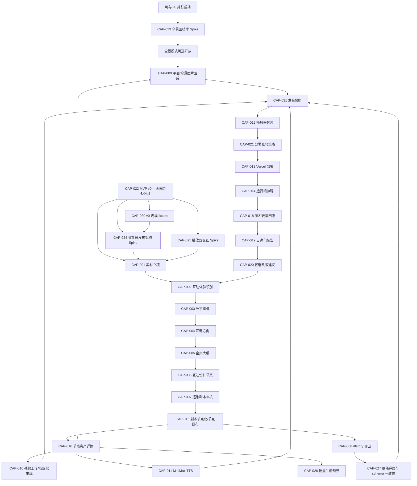

### 14.8 节点逻辑地图

| 节点编号 | 对应字段 | 来源 | 生成/编辑页面 | 下游 |
|---|---|---|---|---|
| NODE-001 | `id` | node-builder | PAGE-007/PAGE-008 | choice.next、asset path、player routing |
| NODE-002 | `chapter/episodeNumber/title/location` | Step 4 大纲 + Step 6 剧本 | PAGE-006/PAGE-008 | UI 展示、prompt |
| NODE-003 | `synopsis` | Step 4 大纲 + AI 摘要 | PAGE-006/PAGE-013 | 图片 prompt、视频 prompt |
| NODE-004 | `lines[]` | Step 6 审核剧本 | PAGE-008 | MiniMax TTS、播放器对白 |
| NODE-005 | `lines[].voiceSrc` | ASSET-003 TTS | PAGE-011/PAGE-013 | 播放器语音 |
| NODE-006 | `choices[]` | Step 5 互动设计草案 + Step 6 剧本切分 | PAGE-007/PAGE-013 | 玩家选择 UI |
| NODE-007 | `choices[].next` | 节点画布连线 | PAGE-013 | 节点跳转 |
| NODE-008 | `choices[].effect.variables` | Step 3 状态设计 + Step 5 互动设计草案 | PAGE-005/PAGE-007/PAGE-013 | 拍平变量变化、存档、条件判断、自进化分析 |
| NODE-009 | `hotspots[]` | 节点画布资产设计 | PAGE-013 | 平面热点或全景 yaw/pitch 热点 |
| NODE-010 | `visualMode/projection/panorama` | ASSET-001 或 ASSET-002 | PAGE-009/PAGE-010/PAGE-013 | 平面渲染器或 `PanoramaViewer` |
| NODE-011 | `ending` | Step 5/6 | PAGE-007/PAGE-008 | 结局面板 |

节点生成必须满足：

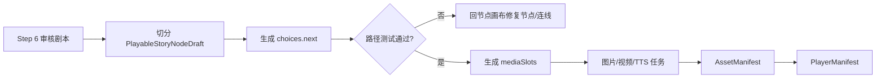

### 14.9 资产逻辑地图

| 资产编号 | 资产 | 挂载点 | 生成方式 | 存储 | 播放器字段 | 缺失策略 |
|---|---|---|---|---|---|---|
| ASSET-001 | 节点主图片 | `node.mediaSlots.image` | 第一阶段平面图文生图或手动上传；全景为后续可选 | MVP: STORE-004；生产: STORE-001 | `node.visualMode` + `node.projection` + `node.panorama` + `panoramaType:"image"` | palette fallback |
| ASSET-002 | 节点主视频 | `node.mediaSlots.video` | MVP 上传平面视频；商业化阶段图片生视频；全景视频后置 | MVP 小视频: STORE-004；大视频/生产: STORE-001 | `node.visualMode` + `node.projection` + `node.panorama` + `panoramaType:"video"` | 回退图片 |
| ASSET-003 | MiniMax 语音 | `line.voice` | TTS | MVP: STORE-004；生产: STORE-001 | `line.voiceSrc` | 静音显示文本 |
| ASSET-004 | BGM | node/global | 手动/音频生成 | MVP: STORE-004；生产: STORE-001 | 后续 audio manager | 可跳过 |
| ASSET-005 | 热点素材 | `hotspots[]` | 手动/AI 建议 | manifest | `hotspots` | 可跳过 |

资产状态流转：

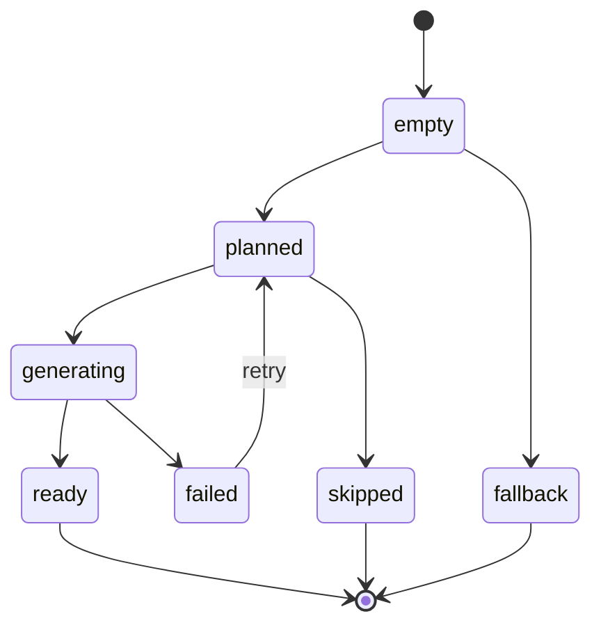

### 14.10 存储逻辑地图

| 存储编号 | 名称 | 用途 | 可用于 v0 | 可用于生产 | 风险 |
|---|---|---|---|---|---|
| STORE-001 | 对象存储/CDN | 大资产、生产资产、跨部署复用资产 | 后置/可选 | 是 | 需要配置 key 和域名 |
| STORE-002 | `packages/panorama-player/public/panoramas` | 模板 demo 和极小样例 | 是 | 仅 demo | 不适合项目生成资产 |
| STORE-003 | `.chasedream-build/<projectId>` | 临时构建目录 | 是 | 是 | 需要清理策略 |
| STORE-004 | Vercel deployment bundle | JS/CSS/manifest/MVP 轻量资产 | 是 | 可用于小资产 | 大视频不应放入 |
| STORE-005 | IndexedDB | 创作中间态 | 是 | 原型可用 | 不适合跨设备和大资产 |

资产落点规则：

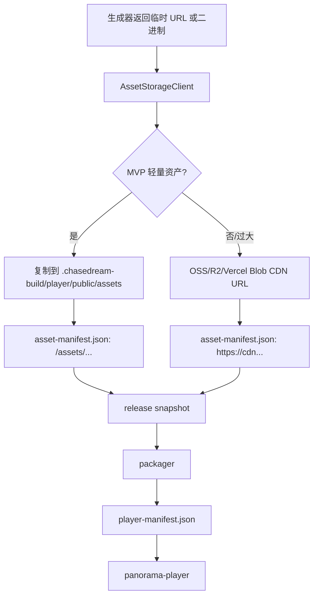

### 14.11 `panorama-player` 注入逻辑地图

当前模板静态读取：

```text
src/data/story.ts
src/data/characters.ts
public/panoramas/*
```

目标模板读取：

```text
src/data/generated/player-manifest.json
src/data/generated/story.json
src/data/generated/characters.json
remote CDN assets
or bundled /assets/*
```

转换关系：

| 当前模板字段 | 目标来源 | 转换责任 |
|---|---|---|
| `START_NODE_ID` | `playerManifest.startNodeId` | packager |
| `storyNodes` | `playerManifest.nodes` | packager |
| `characterProfiles` | `playerManifest.characters` | packager |
| `/panoramas/<file>` | CDN URL 或构建目录 URL | asset storage + packager |
| hardcoded metrics | `playerManifest.variables` + `playerManifest.variableGroups` | packager + player runtime |
| `choices[].next` | `PlayableStoryNodeDraft.choices[].next` | node-builder |
| `lines[].voiceSrc` | AssetManifest voice URL | asset pipeline |

### 14.12 一键部署逻辑地图

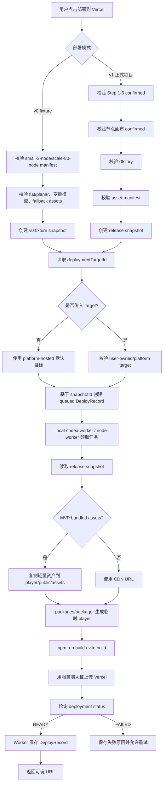

部署前阻塞项：

| 阻塞编号 | 条件 | 返回给用户 |
|---|---|---|
| BLOCK-001 | v1 正式项目 Step 6 未审核通过 | “还有未审核剧本，不能发布正式版” |
| BLOCK-002 | v1 正式项目节点画布未确认 | “请先确认节点画布里的文本、选项、资产槽位” |
| BLOCK-003 | `startNodeId` 不存在 | “起始节点缺失，请回节点画布修复” |
| BLOCK-004 | `choices.next` 指向不存在节点 | “存在断链选择，请回节点画布修复” |
| BLOCK-005 | MVP 静态包超出阈值 | “资产包过大，请切换对象存储/CDN 模式” |
| BLOCK-006 | Packager manifest 校验失败 | “播放器封装失败，查看字段错误” |
| BLOCK-007 | Vercel token 缺失 | “部署服务未配置 Vercel Token” |
| BLOCK-008 | Vercel 返回 failed | “部署失败，保留日志并可重试” |
| BLOCK-009 | 默认 `platform-hosted` target 不存在 | “平台托管部署目标未初始化” |
| BLOCK-010 | 用户自有 target 凭证失效 | “请在部署设置中重新验证 Vercel 授权” |
| BLOCK-011 | Deploy Worker 未运行 | “部署执行器未启动，请启动本机/Codex worker 或 Node Worker” |
| BLOCK-012 | v0 fixture 缺少 `small-3-node` 或 `scale-80-node` | “v0 验证数据不完整，请先生成 fixture manifest” |
| BLOCK-013 | v0 fixture 出现非 `flat/planar` 节点 | “第一个 demo 只验收平面图，请切回 flat/planar” |
| BLOCK-014 | 变量 effect/condition 引用未定义变量 | “播放器变量配置缺失，请修复 manifest variables” |

### 14.13 自进化逻辑地图

自进化不修改正在运行的播放器，也不自动覆盖创作结果。它只把创作过程和玩家反馈变成报告与候选建议。

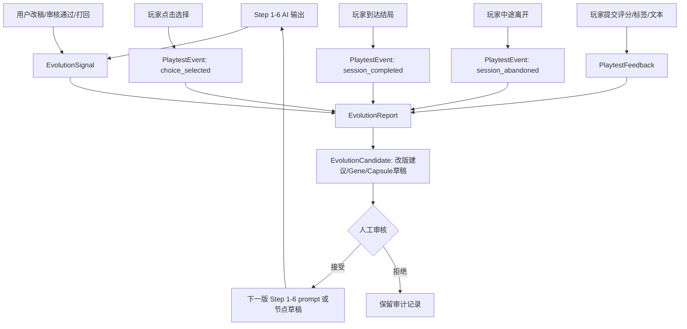

| 自进化编号 | 对象 | 输入 | 输出 | 自动应用 |
|---|---|---|---|---|
| EVO-001 | Step 1-6 文本能力 | AI 输出、用户改稿、审核结果 | prompt 改进、结构策略、候选 Gene/Capsule | 否 |
| EVO-002 | 玩家体验回流 | 选择路径、结局、停留/放弃点、评分、标签、文本反馈 | 体验报告、问题节点、改版建议 | 否 |
| EVO-003 | 图片/音频/视频资产 | 上传/生成结果、人工替换记录 | 只记录资产来源和质量备注 | 否，MVP 不做自动进化 |
| EVO-004 | 播放器模板 | 运行端事件和反馈 | 模板体验问题报告 | 否，模板不在线自改 |

数据与接口关系：

| 数据 | 来源 | 接口 | 消费者 |
|---|---|---|---|
| `EvolutionSignal` | Step 1-6、节点画布、玩家事件 | API-018/020 | report-builder |
| `PlaytestEvent` | `panorama-player` 匿名运行端 | API-018 | analytics、report-builder |
| `PlaytestFeedback` | 通关反馈表 | API-019 | report-builder |
| `EvolutionReport` | report-builder | API-020 | Studio 自进化报告页 |
| `EvolutionCandidate` | candidate-builder/Evolver | API-021/022 | 人工审核、下一版创作流程 |

EvoMap/Evolver 边界：

| 项 | MVP 决策 |
|---|---|
| Proxy | 不强依赖；未启动时仍可生成本地报告 |
| Hub 搜索 | 后续增强；MVP 可参考已有能力文档 |
| Hub 发布 | 默认关闭，必须人工确认 |
| Credit 消耗 | MVP 不自动下单、不自动购买、不启用 staking |
| 自动改稿 | 禁止；只能生成候选建议 |

### 14.14 v0/v0.5 Spike 逻辑地图

v0/v0.5 的目标是先证明平面图可玩链路，再验证自制全景上传、全景生成、发布架构和移动端交互这些容易误判的技术风险。不能把全景图作为第一阶段发布门槛。

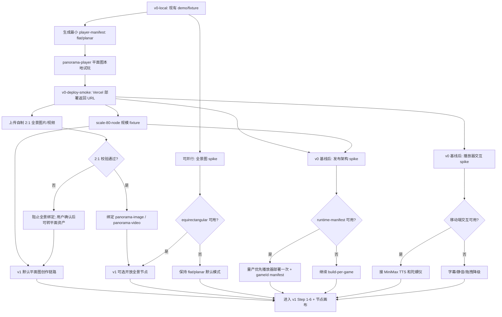

| Spike/验证项 | 前置依赖 | 输入 | 操作 | 输出 | 决策 |
|---|---|---|---|---|---|
| 自制全景上传 | 平面 v0 已可玩 | 用户自制 2:1 equirectangular 图片或视频 | 上传、校验比例、绑定节点、播放器预览 | `AssetManifestItem` panorama asset | 通过则开放人工全景节点；不通过则阻止全景绑定，用户确认后可转平面资产 |
| 全景图 spike | 可与 v0 并行 | 2-3 个 provider、同一批 prompt、2:1 样图 | 静态检查 + Three.js 球面加载 + 桌面/手机人工检查 | `PanoramaSpikeReport` | 是否开放全景节点；不影响平面图默认路径 |
| 发布架构 spike | v0 真实 manifest/player + `scale-80-node` | 同一份 `player-manifest.json` | build-per-game 与 runtime-manifest 各跑一遍 | `DeploymentArchitectureSpikeReport` | v1 默认发布架构 |
| 播放器交互 spike | v0 真实 player | 运行端 demo、音频、TTS、陀螺仪 | 真实浏览器矩阵验证 | `PlayerInteractionSpikeReport` | 开始手势、TTS 时序、陀螺仪降级策略 |

---

## 15. 推荐下一步

架构已经定为：

```text
前 6 步生成完整互动剧本
  -> 节点画布拆节点、连选择、逐节点确认文本/平面图片/视频/语音
  -> 全景图作为节点级可选模式，先支持自制 2:1 资产上传，生成能力等 spike 通过后再开放
  -> MVP 轻量资产随 Vercel 包部署
  -> 生产大资产切换对象存储/CDN
  -> packager 注入 packages/panorama-player
  -> platform-hosted Vercel 一键部署
  -> 返回可玩 URL
  -> 匿名玩家数据回流
  -> 自进化报告和候选改版建议
```

下一步不应先做视频生成 API、自进化或复杂部署系统，而应按层级拆风险：

1. 先做 Phase -1A：用 `small-3-node` 生成最小 `player-manifest.json`，明确写 `visualMode = "flat"`、`projection = "planar"`，让 `packages/panorama-player` 读取 manifest 并完成本地试玩；第一个 demo 不验收全景，也不先接服务端队列。
2. 同一条 v0-local 链路再跑 `scale-80-node`，记录 manifest 体积、bundle 体积、本地构建耗时、首次加载耗时和选择跳转性能。
3. 本地验收通过后再做 Phase -1B：用当前本机/Codex Vercel 配置跑一次部署 smoke，拿到真实可玩 URL；部署失败只修本地产物或部署脚本，不同时启动完整前六步。
4. v0 新增代码只做局部类型门禁：`player-manifest`、`packages/panorama-player`、`packages/packager` 必须类型/构建通过；主项目全量 `tsc` 既有债务另列清单，不阻断 v0 链接验证。
5. 全景图技术 spike 可以和 v0-local 并行。这里不是把图片拼成 3D 模型，而是把候选 2:1 图当作 equirectangular 球面内侧纹理加载，检查接缝、极点、人物形变、移动端观感；不通过就继续保持平面图默认模式。
6. 平面 demo 整体功能没问题后，再开放“自制全景上传”测试：用户上传 2:1 equirectangular 图片或视频，系统校验比例、绑定为 panorama 资产并播放，不调用生成 API；不符合 2:1 时阻止全景绑定，用户确认后才可转平面资产。
7. 基于 v0 真实 manifest/player 做播放器发布架构 spike：用 `small-3-node` 和 `scale-80-node` 对比 build-per-game 与 runtime-manifest，决定 v1 以后是每个游戏单独 build，还是播放器部署一次后按 `gameId` 拉 manifest。
8. 基于 v0 真实 player 做播放器交互 spike：验证“开始体验”手势、音频解锁、TTS 不叠加、iOS 陀螺仪授权和拖拽降级。
9. 进入 v1 前先完成运行时数值模型泛化：底层统一 `variables: Record<string, number>`，关系值、压力、职业等通过 `variableGroups` 展示。
10. spike 和变量模型确认后进入 v1：新增 `src/lib/creation-flow/types.ts`、`node-builder.ts`、`use-creation-flow-store.ts`，做 Step 1-6、节点画布、节点资产面板和 `.dfstory` export。
11. 做 `packages/panorama-player` 的 manifest 泛化，保留现有 Three.js 渲染器，但从 generated manifest 读取节点、角色、变量分组和资产。
12. 做 MVP bundled asset 模式：轻量图片、音频、上传的小视频复制进构建目录，随 Vercel 包部署；大资产和生产对象存储后置。
13. 接入 provider adapter：DeepSeek 用于 Step 1-6，Image 2 先用于平面图生成；只有全景 spike 通过后才开放批量全景图生成，MiniMax 用于 TTS，视频 API 继续待定，demo 阶段只上传视频。Provider key 缺失时只禁用对应生成按钮，手动上传、外部 URL、fallback accepted 和封装继续可用。
14. 批量生成前接入 `GenerationBudgetEstimate`，显示项目级总成本、节点数、对白数和预算上限。
15. 发布前接入 `SchemaConsistencyReport`，校验 `.dfstory`、asset-manifest、player-manifest 的节点、资产、跳转和语音引用。
16. 接入 `ReleaseSnapshot`：把 `.dfstory + asset-manifest + schema report` 固化成不可变发布输入，Packager 和 Deploy Worker 都只读 `snapshotId`。
17. 建立服务端 DB 落点：release snapshots、deploy records、deployment targets、playtest events、feedback、evolution reports、evolution candidates，并实现 Worker 原子 claim。
18. 接入 packager、platform-hosted Vercel 默认目标和 `local-codex-worker` 部署执行器；正式 MVP 再迁移到独立 Node Worker + queue。
19. 最后再接匿名 playtest events、通关反馈、自进化报告和候选改版建议；用户自有 Vercel target、OAuth、自定义域名、多平台部署、生产对象存储放到商业化阶段。

这条路径的关键是先证明“播放器模板 + flat manifest + 本地可玩”成立，再验证部署 smoke、自制全景上传、全景图生成、发布架构和移动端交互这些高风险点。确认平面底座可用以后，再投入完整前六步和节点画布；全景能力作为增强模式插入，不拖慢第一阶段。
