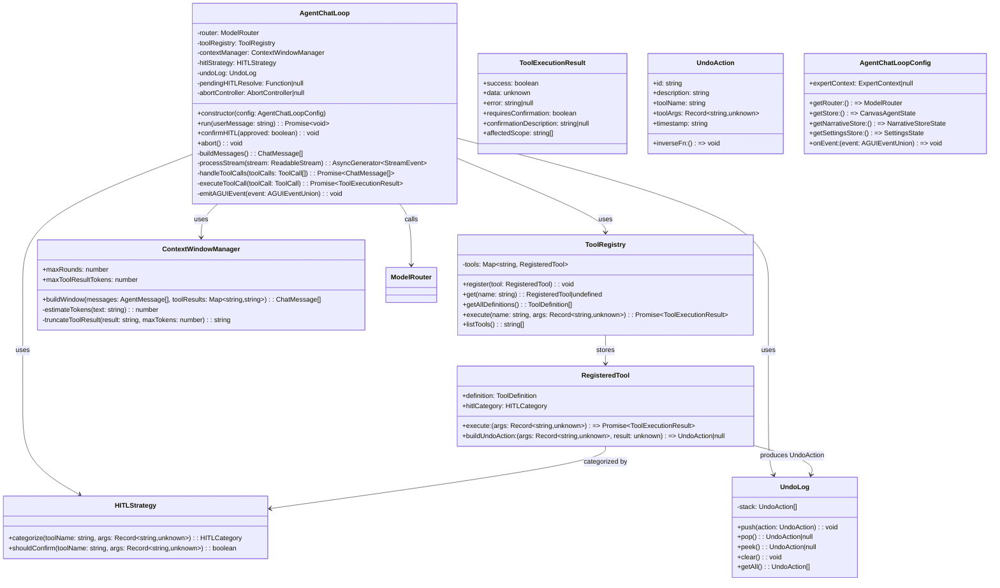
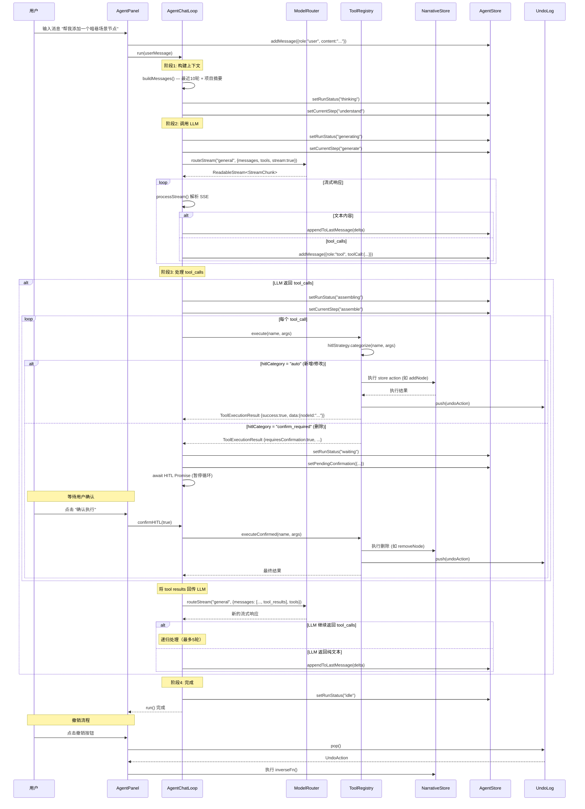
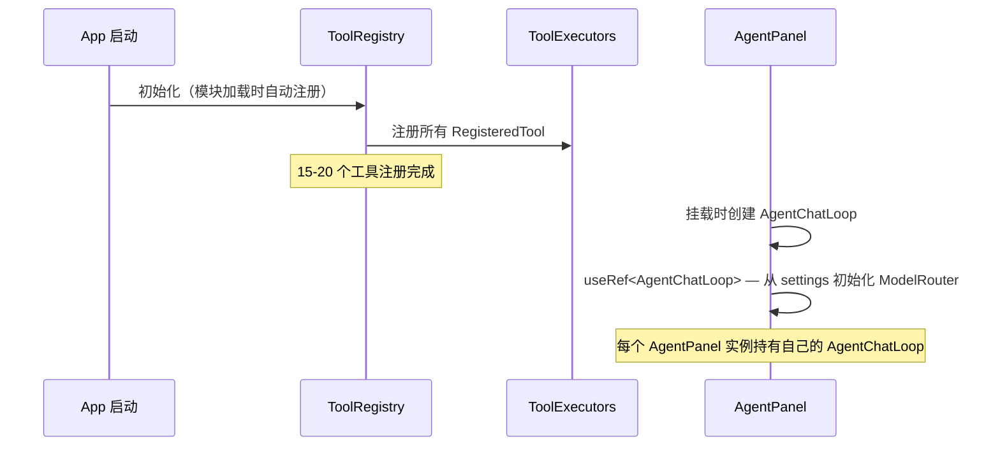
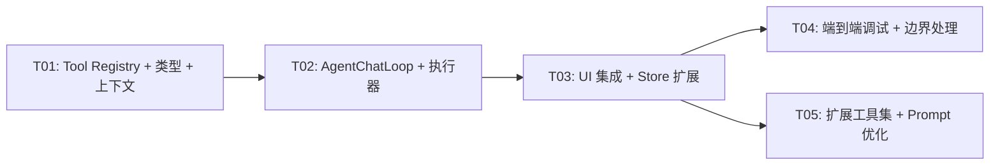

# ChaseDream Creator Studio — Phase 1 Agent 集成架构设计

> 版本：1.0 | 作者：架构师 高见远 | 日期：2025-07

---

## 目录

- [1. 实现方案与框架选型](#1-实现方案与框架选型)
- [2. 文件列表及相对路径](#2-文件列表及相对路径)
- [3. 数据结构与接口](#3-数据结构与接口)
- [4. 程序调用流程](#4-程序调用流程)
- [5. 任务列表](#5-任务列表)
- [6. 依赖包列表](#6-依赖包列表)
- [7. 共享知识（跨文件约定）](#7-共享知识跨文件约定)
- [8. 待明确事项](#8-待明确事项)

---

## 1. 实现方案与框架选型

### 1.1 核心技术挑战

| 挑战 | 分析 | 方案 |
|------|------|------|
| **Demo → 真实 LLM 流式替换** | `simulateAgentResponse()` 是纯前端 mock，无 API 调用；需替换为真实 SSE 流式调用，同时保持决策链 UI 的逐步展示 | 复用现有 `ModelRouter.routeStream()`，在 `AgentChatLoop` 中消费 SSE chunks 并逐步 `appendToLastMessage` |
| **Tool Calling 循环** | LLM 可能返回多个 `tool_calls`，需循环执行 → 结果回传 → 再次调用，直到 `finish_reason !== "tool_calls"` | 实现 `AgentChatLoop.runLoop()` 迭代器，每次迭代处理一轮 tool_calls |
| **HITL 确认机制** | 删除操作需确认，新增/修改自动执行但可撤销；需暂停循环等待用户操作 | 引入 `HITLStrategy` 分类器，对删除类工具返回 `requiresConfirmation: true`，循环 `await` 用户确认 Promise |
| **Internal Tool Registry** | 15-20 个工具需映射到 `useNarrativeStore` 的 Zustand actions；需统一参数校验和结果序列化 | 实现 `ToolRegistry` 注册表，每个工具声明 `ToolDefinition` + `execute` 函数 + `hitlCategory` |
| **上下文窗口管理** | 最近 10 轮 + 4K token 给工具调用结果 | `ContextWindowManager` 截断消息历史，对 tool result 做 token 估算和截断 |
| **API Key 安全** | 纯客户端渲染，不能硬编码 | 复用 `useSettingsStore.apiKeys`（已持久化到 localStorage），首次使用时检查并引导配置 |

### 1.2 框架与库选型

| 选型 | 理由 |
|------|------|
| **ModelRouter（已有）** | 完整的多提供商路由 + 流式 + ToolDefinition 类型；无需引入新库 |
| **Zustand（已有）** | 项目已全面使用 Zustand 作为状态管理；Tool Registry 直接调用 store actions |
| **no new npm packages** | Phase 1 不引入任何新的第三方依赖，完全基于已有能力实现 |

### 1.3 架构模式

采用 **Agent Loop + Tool Registry** 模式（参考 OpenAI Assistants API 设计）：

```
┌─────────────┐     ┌──────────────┐     ┌──────────────┐
│  AgentPanel  │────▶│ AgentChatLoop │────▶│ ModelRouter   │
│   (UI 层)    │◀────│  (控制循环)   │◀────│  (LLM 调用)   │
└─────────────┘     └──────┬───────┘     └──────────────┘
                           │
                    tool_calls │ tool_results
                           │
                    ┌──────▼───────┐
                    │  ToolRegistry │
                    │  (工具注册表)  │
                    └──────┬───────┘
                           │
              ┌────────────┼────────────┐
              │            │            │
     ┌────────▼───┐ ┌─────▼─────┐ ┌───▼────────┐
     │ Narrative   │ │  HITL      │ │  UndoLog   │
     │ Store Actions│ │  Checker   │ │  (撤销日志) │
     └────────────┘ └───────────┘ └────────────┘
```

**关键设计决策**：

1. **AgentChatLoop 是纯逻辑类**（非 React 组件），由 AgentPanel 通过 `useRef` 持有，通过回调函数更新 store
2. **ToolRegistry 是单例模块**（模块级 const），启动时注册所有工具，不依赖 React 生命周期
3. **HITL 通过 Promise 暂停循环**：当工具需要确认时，`AgentChatLoop` 创建一个 Promise 并等待；AgentPanel 的 `handleConfirm()` resolve 该 Promise
4. **撤销日志**：在 `useCanvasAgentStore` 中新增 `undoStack`，记录自动执行的工具调用的逆向操作

---

## 2. 文件列表及相对路径

### 2.1 新建文件

| 文件路径 | 职责 |
|----------|------|
| `src/lib/ai/agent-chat-loop.ts` | Agent 对话循环核心：管理 LLM 交互、tool_calls 迭代、流式输出、HITL 暂停 |
| `src/lib/ai/tool-registry.ts` | Internal Tool Registry：注册工具、执行工具、参数校验、HITL 分类 |
| `src/lib/ai/tool-definitions.ts` | 完整的 15-20 个工具定义（OpenAI function calling 格式的 ToolDefinition[]） |
| `src/lib/ai/tool-executors.ts` | 工具执行器实现：每个工具的 execute 函数，调用 narrativeStore actions |
| `src/lib/ai/context-window.ts` | 上下文窗口管理：消息截断、token 估算、tool result 压缩 |
| `src/lib/ai/agent-prompts.ts` | Agent 系统提示词：创作伙伴人格、工具使用指南、项目上下文注入 |
| `src/lib/ai/hitl-strategy.ts` | HITL 策略：按工具名+参数分类确认级别（auto / confirm / reject） |
| `src/lib/ai/undo-log.ts` | 撤销日志：记录自动执行的操作的逆向操作，支持批量撤销 |

### 2.2 修改文件

| 文件路径 | 修改内容 |
|----------|----------|
| `src/components/ui/AgentPanel.tsx` | 替换 `simulateAgentResponse` → `agentChatLoop.run()`；新增 `handleConfirm` resolve 逻辑；新增撤销按钮；移除 `generateContextualResponse` 和 `delay` 辅助函数 |
| `src/store/use-canvas-agent-store.ts` | 新增 `undoStack` 状态 + `pushUndoAction` / `popUndoAction` / `clearUndoStack` actions；`addMessage` 支持 `toolCallId` 字段 |
| `src/lib/ai/ag-ui-events.ts` | 将 `AGENT_TOOLS` 从 `const` 对象改为导出 `getAgentToolDefinitions(): ToolDefinition[]`；保留原 AGENT_TOOLS 向后兼容 |
| `src/lib/ai/index.ts` | 新增导出：`AgentChatLoop`, `ToolRegistry`, `ContextWindowManager` 等新模块 |
| `src/lib/ai/model-router.ts` | `routeStream()` 方法增加对 `tool_calls` delta 的流式解析支持（当前只处理 `content` delta） |

---

## 3. 数据结构与接口

### 3.1 类图



### 3.2 核心类型定义

```typescript
// ─── HITL 分类 ─────────────────────────────────────────

type HITLCategory = "auto" | "confirm_required" | "forbidden";

// auto: 新增/修改操作，自动执行，可撤销
// confirm_required: 删除操作，需用户确认
// forbidden: 不允许执行（Phase 1 预留）

// ─── 工具执行结果 ──────────────────────────────────────

interface ToolExecutionResult {
  success: boolean;
  data: unknown;            // 工具返回的数据（序列化为 JSON string 给 LLM）
  error: string | null;     // 执行错误信息
  requiresConfirmation: boolean;  // 是否需要 HITL 确认
  confirmationDescription: string | null;  // 确认描述
  affectedScope: string[];  // 影响范围（用于 HITL UI 展示）
}

// ─── AgentChatLoop 配置 ───────────────────────────────

interface AgentChatLoopConfig {
  /** 获取 ModelRouter 实例（延迟获取，因为依赖 settings） */
  getRouter: () => ModelRouter;
  /** 获取 Canvas Agent Store */
  getStore: () => CanvasAgentState;
  /** 获取 Narrative Store */
  getNarrativeStore: () => NarrativeStoreState;
  /** 获取 Settings Store */
  getSettingsStore: () => SettingsState;
  /** AG-UI 事件回调（驱动 UI 更新） */
  onEvent: (event: AGUIEventUnion) => void;
  /** 当前 Expert 上下文（可选） */
  expertContext?: ExpertContext | null;
}

// ─── 流式事件 ──────────────────────────────────────────

type StreamEvent =
  | { type: "text_delta"; delta: string }
  | { type: "tool_call_start"; toolCallId: string; toolName: string }
  | { type: "tool_call_args"; toolCallId: string; delta: string }
  | { type: "tool_call_end"; toolCallId: string }
  | { type: "done"; finishReason: string };
```

### 3.3 工具注册表示例

```typescript
// src/lib/ai/tool-executors.ts 中每个工具的注册格式

const addNodeTool: RegisteredTool = {
  definition: {
    type: "function",
    function: {
      name: "add_node",
      description: "在故事图谱中添加一个新节点",
      parameters: {
        type: "object",
        properties: {
          label: { type: "string", description: "节点标签" },
          nodeType: {
            type: "string",
            enum: ["scene", "choice", "condition", "qte", "ending_good", "ending_bad"],
            description: "节点类型"
          },
          content: { type: "string", description: "节点内容描述" },
        },
        required: ["label", "nodeType"],
      },
    },
  },
  execute: async (args) => {
    const store = useNarrativeStore.getState();
    const id = `node_${Date.now().toString(36)}`;
    store.addNode({ id, label: args.label, type: args.nodeType, content: args.content ?? "" });
    return { success: true, data: { nodeId: id }, error: null };
  },
  hitlCategory: "auto",  // 新增操作，自动执行
  buildUndoAction: (args, result) => ({
    id: `undo_${Date.now().toString(36)}`,
    description: `撤销添加节点「${args.label}」`,
    toolName: "add_node",
    toolArgs: args,
    inverseFn: () => useNarrativeStore.getState().removeNode((result as { nodeId: string }).nodeId),
    timestamp: new Date().toISOString(),
  }),
};

const removeNodeTool: RegisteredTool = {
  definition: { /* ... */ },
  execute: async (args) => {
    const store = useNarrativeStore.getState();
    const node = store.storyNodes.find(n => n.id === args.nodeId);
    if (!node) return { success: false, data: null, error: `节点 ${args.nodeId} 不存在` };
    // 不直接执行，而是返回需要确认的结果
    return {
      success: true,
      data: { node },
      error: null,
      requiresConfirmation: true,
      confirmationDescription: `即将删除节点「${node.label}」(${node.id})，相关边也会被移除`,
      affectedScope: ["节点图谱", "连接边"],
    };
  },
  hitlCategory: "confirm_required",  // 删除操作，需确认
  buildUndoAction: null,  // 确认后由 executeReal 生成
};
```

---

## 4. 程序调用流程

### 4.1 完整 Agent 交互时序图



### 4.2 初始化流程



---

## 5. 任务列表

### T01: 项目基础设施 — Tool Registry + 类型定义 + 上下文管理

**源文件**：
- `src/lib/ai/tool-registry.ts`（新建）
- `src/lib/ai/tool-definitions.ts`（新建）
- `src/lib/ai/context-window.ts`（新建）
- `src/lib/ai/hitl-strategy.ts`（新建）
- `src/lib/ai/undo-log.ts`（新建）
- `src/lib/ai/index.ts`（修改：新增导出）

**内容**：
- 定义 `RegisteredTool`、`ToolExecutionResult`、`HITLCategory`、`UndoAction` 等核心类型
- 实现 `ToolRegistry` 类（register / get / getAllDefinitions / execute）
- 实现 `ContextWindowManager`（buildWindow / estimateTokens / truncateToolResult）
- 实现 `HITLStrategy` 类（categorize / shouldConfirm）
- 实现 `UndoLog` 类（push / pop / clear / getAll）
- 编写 15-20 个工具的 `ToolDefinition[]`（OpenAI function calling 格式），从现有 `AGENT_TOOLS` 扩展
- 更新 `index.ts` 导出

**依赖**：无
**优先级**：P0
**预估时间**：1.5 天

---

### T02: Agent 核心循环 — AgentChatLoop + 工具执行器

**源文件**：
- `src/lib/ai/agent-chat-loop.ts`（新建）
- `src/lib/ai/tool-executors.ts`（新建）
- `src/lib/ai/agent-prompts.ts`（新建）
- `src/lib/ai/model-router.ts`（修改：routeStream 增强 tool_calls delta 解析）

**内容**：
- 实现 `AgentChatLoop` 类：
  - `run(userMessage)` — 完整对话循环
  - `processStream()` — SSE 流解析（text delta + tool_calls delta）
  - `handleToolCalls()` — 批量处理 tool_calls
  - `executeToolCall()` — 单个工具执行 + HITL 暂停
  - `confirmHITL()` — 用户确认后 resolve Promise
  - `abort()` — 中断循环
- 实现所有 15-20 个工具的 execute 函数（调用 narrativeStore actions）
- 实现系统提示词构建（创作伙伴人格 + 工具使用指南 + 项目上下文）
- 修改 `model-router.ts` 的 `routeStream()` 支持 `tool_calls` delta（当前只处理 `content` delta）
- 最大迭代轮次限制（5 轮 tool_calls）

**依赖**：T01
**优先级**：P0
**预估时间**：2 天

---

### T03: UI 集成 — AgentPanel 替换 + Store 扩展 + 撤销 UI

**源文件**：
- `src/components/ui/AgentPanel.tsx`（修改：替换 simulateAgentResponse）
- `src/store/use-canvas-agent-store.ts`（修改：新增 undoStack + confirmHITL resolve）
- `src/lib/ai/ag-ui-events.ts`（修改：新增 getAgentToolDefinitions()）

**内容**：
- **AgentPanel.tsx** 核心修改：
  - 移除 `simulateAgentResponse`、`generateContextualResponse`、`delay` 函数
  - 新增 `useRef<AgentChatLoop>` 实例化，从 `useSettingsStore` 获取 API Key 初始化 `ModelRouter`
  - `handleSend` 调用 `agentChatLoop.run(userText)` 替代 `simulateAgentResponse`
  - `handleConfirm` 调用 `agentChatLoop.confirmHITL(approved)` 替代当前 mock 逻辑
  - 新增撤销按钮 UI（调用 `undoLog.pop()` → 执行 `inverseFn()`）
  - 新增 API Key 缺失提示（当 settings 中无有效 API Key 时，引导用户前往设置页）
  - 移除 "Demo 模式" 文案
- **use-canvas-agent-store.ts** 修改：
  - 新增 `undoStack: UndoAction[]` 状态
  - 新增 `pushUndoAction`、`popUndoAction`、`clearUndoStack` actions
  - `AgentMessage` 类型新增 `toolCallId?: string` 字段
  - `handleAGUIEvent` 增加 `tool_call_args` 累积处理
- **ag-ui-events.ts** 修改：
  - 新增 `getAgentToolDefinitions(): ToolDefinition[]` 函数
  - 保留原 `AGENT_TOOLS` 对象向后兼容

**依赖**：T02
**优先级**：P0
**预估时间**：1.5 天

---

### T04: 端到端调试 + 边界处理 + 日志

**源文件**：
- `src/lib/ai/agent-chat-loop.ts`（修改：错误处理增强）
- `src/components/ui/AgentPanel.tsx`（修改：错误边界、重试逻辑）
- `src/store/use-canvas-agent-store.ts`（修改：错误状态完善）

**内容**：
- 网络错误重试（指数退避，最多 3 次）
- LLM 返回格式异常处理（tool_calls 参数 JSON 解析失败）
- 工具执行异常捕获和用户友好提示
- 流式中断处理（用户关闭面板 / 网络断开）
- 上下文窗口溢出保护（token 超限时截断最旧消息）
- 撤销栈容量限制（最多 50 条）
- API Key 无效时的引导流程
- 调试日志（开发模式下 console.log 完整调用链）
- 移除 `simulateAgentResponse` 和 `generateContextualResponse` 的所有引用

**依赖**：T03
**优先级**：P1
**预估时间**：1 天

---

### T05: 扩展工具集 + Prompt 优化

**源文件**：
- `src/lib/ai/tool-executors.ts`（修改：补充更多工具执行器）
- `src/lib/ai/tool-definitions.ts`（修改：补充更多工具定义）
- `src/lib/ai/agent-prompts.ts`（修改：优化系统提示词）

**内容**：
- 补充完整 20 个工具（Phase 1 基础 15 个 + 扩展 5 个）
- 包含只读工具（查询项目状态、检查一致性等，不触发撤销）
- 系统提示词调优：创作伙伴人格、称呼用户"你"、停顿 5s 建议逻辑
- 上下文注入：自动将当前项目摘要（角色列表、节点数量、世界规则等）注入 system prompt
- Expert 集成：根据当前 Expert 角色调整 system prompt 的专业领域

**依赖**：T03
**优先级**：P2
**预估时间**：1 天

---

### 任务依赖图



---

## 6. 依赖包列表

**Phase 1 不引入任何新的第三方 npm 包。** 所有实现基于项目现有依赖：

```
- zustand@^5.0.14: 状态管理（已有）
- zod@^4.3.6: 参数校验（已有，用于工具参数运行时校验）
- 无新增依赖
```

---

## 7. 共享知识（跨文件约定）

### 7.1 命名约定

| 约定 | 示例 |
|------|------|
| 工具名使用 `snake_case` | `add_node`, `edit_script`, `check_consistency` |
| 工具参数使用 `camelCase` | `nodeId`, `nodeType`, `checkType` |
| 工具 ID 前缀 `tool_` | `tool_add_node`, `tool_remove_node` |
| 消息 ID 前缀 `msg_` | `msg_m3abc_1`（已有约定） |
| 撤销动作 ID 前缀 `undo_` | `undo_m3abc_1` |
| HITL 请求 ID 前缀 `hitl_` | `hitl_m3abc_1` |

### 7.2 错误处理策略

| 场景 | 策略 |
|------|------|
| API Key 缺失 | 不调用 LLM，直接在 AgentPanel 显示引导消息，link 到设置页 |
| API 请求失败 | 指数退避重试 3 次，最终失败则 setRunStatus("error") + setErrorMessage() |
| 工具参数校验失败 | 返回 `ToolExecutionResult {success: false, error: "参数校验失败: ..."}` |
| 工具执行异常 | try-catch 包裹，返回 `ToolExecutionResult {success: false, error: message}` |
| 流式中断 | AbortController 取消，清理状态回 idle |
| tool_calls 循环超限 | 最多 5 轮，超出则终止并提示用户 "任务过于复杂，请分步操作" |

### 7.3 日志策略

```typescript
// 开发模式下详细日志
if (import.meta.env.DEV) {
  console.log(`[AgentChatLoop] tool_call: ${name}`, args);
  console.log(`[AgentChatLoop] tool_result:`, result);
  console.log(`[AgentChatLoop] stream_delta:`, delta);
}
```

### 7.4 API Key 管理

- **存储位置**：`useSettingsStore.apiKeys`（已通过 Zustand persist 持久化到 localStorage）
- **读取时机**：`AgentChatLoop` 构造时通过 `getSettingsStore()` 读取
- **变更响应**：每次 `run()` 调用时重新获取 settings，确保 API Key 变更后立即生效
- **安全注意**：API Key 仅存在于客户端内存和 localStorage，不会发送到任何第三方服务（除 LLM API 提供商）

### 7.5 上下文窗口策略

| 配置 | 值 |
|------|------|
| 保留最近对话轮数 | 10 轮（1 轮 = 1 次 user + 1 次 assistant + 可能的 tool 消息） |
| 工具结果最大 token | 4K token（约 8000 中文字符） |
| 工具结果截断策略 | 保留前 2000 + 后 2000 字符，中间用 `...[truncated]...` |
| System prompt 估算 | 约 1000-1500 token（工具定义 + 人格 + 项目摘要） |
| 总上下文预算 | 按 GPT-4o 128K 窗口，10 轮对话约 10-20K，项目摘要约 2-5K |

### 7.6 HITL 规则

| 操作类别 | HITL 行为 | 撤销 |
|----------|-----------|------|
| 新增（add_node, add_character, add_scene...） | 自动执行 | 可撤销（undo 删除） |
| 修改（update_node, edit_script...） | 自动执行 | 可撤销（undo 恢复原值） |
| 删除（remove_node, remove_edge...） | **需确认** | 确认后可撤销 |
| 只读（check_consistency, get_project_summary...） | 自动执行 | 无需撤销 |

### 7.7 Agent 人格

- 称呼用户为"你"
- 专业友好，类似创作伙伴
- 5 秒无操作时主动提供建议（Phase 1 预留接口，Phase 2 实现）
- 在执行操作前用自然语言说明即将做什么
- 操作完成后简要总结结果

---

## 8. 待明确事项

| # | 问题 | 影响范围 | 建议 |
|---|------|----------|------|
| 1 | **Agent 系统提示词的最终版本** — PM 写初稿还是 Eng 直接写？ | `agent-prompts.ts` | PRD 决策 Q-5 已确认为 "PM 写初稿 + Eng 优化"，需 PM 提供初稿 |
| 2 | **5 秒停顿建议的触发方式** — 是前端 setTimeout 还是 LLM 主动输出？ | AgentPanel / agent-prompts | Phase 1 建议先不做自动停顿，仅预留 `proactiveSuggest` 接口 |
| 3 | **工具执行失败时 LLM 是否应重试** — 是自动重试还是报告用户？ | AgentChatLoop | 建议将错误回传 LLM，让 LLM 决定是否换策略重试 |
| 4 | **撤销栈持久化** — 页面刷新后是否保留撤销能力？ | undo-log.ts | Phase 1 建议不持久化（刷新后撤销栈清空），Phase 2 考虑 |
| 5 | **多工具并发执行** — LLM 返回多个 tool_calls 时，顺序执行还是并发？ | AgentChatLoop | 建议顺序执行（避免 Zustand 状态冲突），但可以优化为只读工具并发 |
| 6 | **Expert 切换后对话历史是否保留** — 切换 Expert 时是否清空消息？ | AgentPanel | 建议保留，Expert 切换只影响 system prompt 和工具集 |
| 7 | **tool_definitions 的数量上限** — 20 个工具是否会超出 context window？ | context-window.ts | 20 个工具定义约 3000-4000 token，在 128K 窗口下可行；如切换到 32K 模型需裁剪 |
